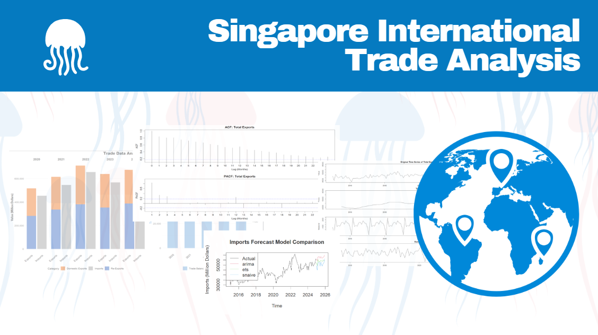

# Background Information

## Task Instructions

Download the **"Merchandise Trade by Region/Market"** dataset from the **Department of Statistics Singapore (DOS)** website. Select three data visualizations from **DOS \| SingStat Website - Singapore International Trade**, evaluate their strengths and weaknesses, and provide sketches for improved designs. Using **ggplot2 and other appropriate R packages**, recreate the enhanced versions of the three visualizations. Analyze the data using either time-series analysis or time-series forecasting methods, complementing the analysis with suitable data visualization techniques.

## Reading Guide

In order to reduce reading costs and highlight the key points, I have removed less important details here and focused on the main aspects of each section, as well as the content I wish to emphasize.

If detailed explanations are needed, you can refer to the code.

# Set Up the Environment

Use the following code to load the required R packages into the environment.

```{r}
#| code-fold: true
#| code-summary: "Show the code"

library(tsibble)
library(lubridate)
library(dplyr)
library(readr)
library(tidyverse)
library(patchwork)
library(ggplot2)
library(scales)
library(gridExtra)
library(tidyr)
library(readxl)
library(ggalluvial)
library(forecast)
library(zoo)
library(tseries)
```

# Learning and Beyond - Modifying Visual Design

## First Image - Trade Data Analysis

### Import Data

I transformed and prepared time series data for three datasets: "Re_Exports_Monthly.csv," "Imports_Monthly.csv," and "Domestic_Exports_Monthly.csv."

For each dataset, I: 1. Read the CSV file, skipped the first 10 rows, and limited the data to 160 rows. 2. Transposed the data so that rows became columns, and I assigned appropriate column names from the first row. 3. Converted all columns, except for the "Time" column, to numeric values. 4. Renamed the "Data Series" column to "Year-Month" and formatted it to show the year and month. 5. Converted the "Year-Month" column to a date format. 6. Transformed the data into a time series object (tsibble) indexed by the "Year-Month" column.

Finally, I removed the original datasets to clear the workspace.

```{r}
#| code-fold: true
#| code-summary: "Show the code"

Re_Exports <- read_csv("data/Re_Exports_Monthly.csv", 
                        skip = 10,      
                        n_max = 160)    

Re_Exports_transposed <- as.data.frame(t(Re_Exports))
Re_Exports_transposed <- rownames_to_column(Re_Exports_transposed, var = "Time")
rownames(Re_Exports_transposed) <- NULL

colnames(Re_Exports_transposed) <- as.character(Re_Exports_transposed[1, ])
Re_Exports_transposed <- Re_Exports_transposed[-1, ]

Re_Exports_transposed <- Re_Exports_transposed %>%
  mutate(across(-1, as.numeric))

Re_Exports_transposed <- Re_Exports_transposed %>%
  rename(`Year-Month` = `Data Series`) %>%
  mutate(`Year-Month` = yearmonth(`Year-Month`))

Re_Exports_transposed <- Re_Exports_transposed %>%
  mutate(`Year-Month` = as.Date(`Year-Month`))

Re_exports_ts <- Re_Exports_transposed %>%
  as_tsibble(index = `Year-Month`)

rm(Re_Exports, Re_Exports_transposed)


Imports <- read_csv("data/Imports_Monthly.csv", 
                        skip = 10,      
                        n_max = 160)    

Imports_transposed <- as.data.frame(t(Imports))
Imports_transposed <- rownames_to_column(Imports_transposed, var = "Time")
rownames(Imports_transposed) <- NULL

colnames(Imports_transposed) <- as.character(Imports_transposed[1, ])
Imports_transposed <- Imports_transposed[-1, ]

Imports_transposed <- Imports_transposed %>%
  mutate(across(-1, as.numeric))

Imports_transposed <- Imports_transposed %>%
  rename(`Year-Month` = `Data Series`) %>%
  mutate(`Year-Month` = yearmonth(`Year-Month`))

Imports_transposed <- Imports_transposed %>%
  mutate(`Year-Month` = as.Date(`Year-Month`))

Imports_ts <- Imports_transposed %>%
  as_tsibble(index = `Year-Month`)

rm(Imports, Imports_transposed)


Domestic_Exports <- read_csv("data/Domestic_Exports_Monthly.csv", 
                        skip = 10,      
                        n_max = 160)    

Domestic_Exports_transposed <- as.data.frame(t(Domestic_Exports))
Domestic_Exports_transposed <- rownames_to_column(Domestic_Exports_transposed, var = "Time")
rownames(Domestic_Exports_transposed) <- NULL

colnames(Domestic_Exports_transposed) <- as.character(Domestic_Exports_transposed[1, ])
Domestic_Exports_transposed <- Domestic_Exports_transposed[-1, ]

Domestic_Exports_transposed <- Domestic_Exports_transposed %>%
  mutate(across(-1, as.numeric))

Domestic_Exports_transposed <- Domestic_Exports_transposed %>%
  rename(`Year-Month` = `Data Series`) %>%
  mutate(`Year-Month` = yearmonth(`Year-Month`))

Domestic_Exports_transposed <- Domestic_Exports_transposed %>%
  mutate(`Year-Month` = as.Date(`Year-Month`))

Domestic_exports_ts <- Domestic_Exports_transposed %>%
  as_tsibble(index = `Year-Month`)

rm(Domestic_Exports, Domestic_Exports_transposed)
```

### Organize the Required Data

Here, I need to use import and export data from 2020 to 2024. I will organize the data and name the final dataset as trade_data_2020_2024.

I aggregated and merged data for the years 2020 to 2024 for three variables: Re-Exports, Domestic Exports, and Imports.

First, I calculated the annual sum of "Total All Markets" for each dataset (Re-Exports, Domestic Exports, and Imports) by year using the `aggregate()` function. I filtered the data for the years between 2020 and 2024, then renamed the resulting columns to reflect the corresponding export or import data for each year.

Next, I merged the three tables by "Year" to create a consolidated dataset. I renamed the columns to more descriptive names: "Domestic_Exports," "Re_Exports," and "Imports." I also calculated additional columns: 1. **Total_Exports**, which was the sum of Domestic Exports and Re-Exports. 2. **Trade_Balance**, which was the difference between Total Exports and Imports. 3. **Trade_Balance_YoY**, the year-over-year percentage change in Trade Balance, which I calculated by comparing each year’s trade balance with the previous year.

I formatted the YoY growth rate as a percentage with two decimal places. The first year had no YoY change, so I set it as NA. Finally, I displayed the merged dataset, which included the calculated columns for a clearer understanding of trade dynamics over the period from 2020 to 2024.

```{r}
#| code-fold: true
#| code-summary: "Show the code"

re_exports_by_year <- aggregate(
  `Total All Markets` ~ year(`Year-Month`), 
  data = subset(Re_exports_ts, year(`Year-Month`) >= 2020 & year(`Year-Month`) <= 2024), 
  FUN = function(x) sum(x, na.rm = TRUE)
)

names(re_exports_by_year) <- c("Year", "Re_Exports_by_Year")

exports_by_year <- aggregate(
  `Total All Markets` ~ year(`Year-Month`), 
  data = subset(Domestic_exports_ts, year(`Year-Month`) >= 2020 & year(`Year-Month`) <= 2024), 
  FUN = function(x) sum(x, na.rm = TRUE)
)

names(exports_by_year) <- c("Year", "Exports_by_Year")


imports_by_year <- aggregate(
  `Total All Markets` ~ year(`Year-Month`), 
  data = subset(Imports_ts, year(`Year-Month`) >= 2020 & year(`Year-Month`) <= 2024), 
  FUN = function(x) sum(x, na.rm = TRUE)
)

names(imports_by_year) <- c("Year", "Imports_by_Year")

# Merge the three tables by Year
trade_data_2020_2024 <- merge(exports_by_year, re_exports_by_year, by = "Year")
trade_data_2020_2024 <- merge(trade_data_2020_2024, imports_by_year, by = "Year")

# Rename the table with an English title
names(trade_data_2020_2024) <- c("Year", "Domestic_Exports", "Re_Exports", "Imports")

# Calculate total exports (Domestic Exports + Re-Exports)
trade_data_2020_2024$Total_Exports <- trade_data_2020_2024$Domestic_Exports + trade_data_2020_2024$Re_Exports

# Calculate trade balance (Total Exports - Imports)
trade_data_2020_2024$Trade_Balance <- trade_data_2020_2024$Total_Exports - trade_data_2020_2024$Imports

# Calculate YoY growth rate for Trade Balance
# Sort by year to ensure correct calculation
trade_data_2020_2024 <- trade_data_2020_2024[order(trade_data_2020_2024$Year), ]

# Calculate YoY change for Trade Balance
trade_data_2020_2024$Trade_Balance_YoY <- c(NA, 
                                          diff(trade_data_2020_2024$Trade_Balance) / 
                                            abs(trade_data_2020_2024$Trade_Balance[-nrow(trade_data_2020_2024)]) * 100)

# Format YoY as percentage with 2 decimal places
trade_data_2020_2024$Trade_Balance_YoY <- sprintf("%.2f%%", trade_data_2020_2024$Trade_Balance_YoY)

# First row will be NA since there's no previous year to compare
trade_data_2020_2024$Trade_Balance_YoY[1] <- NA

# Display the merged table
print(trade_data_2020_2024)
```

### Comment on the Original Image

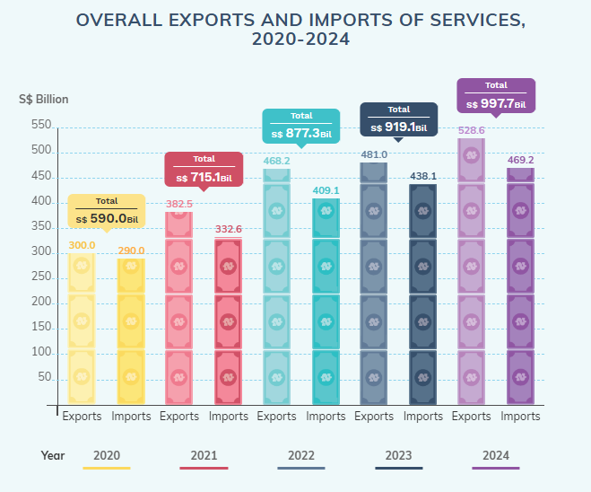

**Strengths:**

-   Clear color coding with distinct colors for each year
-   Straightforward title that clearly indicates the content (service exports and imports)
-   Direct data labels on the chart make it easy to read specific values
-   Simple structure organizing data by year
-   Bar chart format is appropriate for quantity comparisons

**Weaknesses:**

-   Lacks trade balance information (surplus/deficit)
-   No trend lines to show pattern development over time
-   Limited context about what's driving changes between years
-   No breakdown of service categories to understand composition
-   Horizontally spread layout makes year-to-year comparison less intuitive

### Direction for Modification & Sketch

-   Add trade balance calculations
-   Incorporate trend analysis
-   Segment services by category
-   Include year-over-year growth metrics
-   Consider a more comprehensive dashboard approach

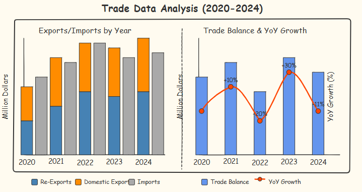

### Modified Image

```{r eval=FALSE, echo=TRUE}
#| code-fold: true
#| code-summary: "Show the code"
# Load required libraries

# Create a function to calculate year-over-year growth, replacing pct_change
calculate_yoy_growth <- function(x) {
  result <- numeric(length(x))
  result[1] <- NA  # First value has no YoY comparison, set to NA
  for (i in 2:length(x)) {
    if (is.na(x[i]) || is.na(x[i-1]) || x[i-1] == 0) {
      result[i] <- NA
    } else {
      result[i] <- ((x[i] - x[i-1]) / x[i-1]) * 100
    }
  }
  return(result)
}


# Ensure Trade_Balance is numeric, and calculate YoY growth
trade_data_2020_2024 <- trade_data_2020_2024 %>%
  mutate(
    Trade_Balance = as.numeric(Trade_Balance),
    Trade_Balance_YoY = calculate_yoy_growth(Trade_Balance)
  )

# PLOT 2: Exports vs Imports (Now as p1 - first plot)
# Prepare the data for plotting
# First, create a long format for the exports (Domestic and Re-exports)
exports_data <- trade_data_2020_2024 %>%
  select(Year, Domestic_Exports, Re_Exports) %>%
  pivot_longer(
    cols = c(Domestic_Exports, Re_Exports),
    names_to = "Category",
    values_to = "Value"
  ) %>%
  mutate(
    Type = "Exports",
    # Format the category names for better display
    Category = factor(Category, 
                      levels = c("Re_Exports", "Domestic_Exports"),
                      labels = c("Re-Exports", "Domestic Exports"))
  )

# Create data for imports
imports_data <- trade_data_2020_2024 %>%
  select(Year, Imports) %>%
  rename(Value = Imports) %>%
  mutate(
    Type = "Imports",
    Category = "Imports"
  )

# Combine both datasets
combined_data <- bind_rows(exports_data, imports_data)

# Convert Year to factor to ensure correct ordering
combined_data$Year <- factor(combined_data$Year)

# Create the plot (with slightly smaller text)
p1 <- ggplot(combined_data, aes(x = Type, y = Value, fill = Category)) +
  geom_col(position = "stack") +
  facet_grid(~ Year) +
  scale_fill_manual(values = c(
    "Domestic Exports" = "#ED7D31",  # Orange
    "Re-Exports" = "#4472C4",        # Blue
    "Imports" = "#A5A5A5"            # Gray
  )) +
  labs(
    title = NULL,
    x = NULL,
    y = "Value (Million Dollars)",
    fill = "Category"
  ) +
  scale_y_continuous(labels = comma) +
  theme_minimal() +
  theme(
    plot.title = element_text(hjust = 0.5, size = 14, face = "bold"),
    plot.subtitle = element_text(hjust = 0.5, size = 11),
    axis.text.x = element_text(size = 10, face = "bold", angle = 45, hjust = 1),
    axis.text.y = element_text(size = 9),
    strip.text = element_text(size = 11, face = "bold"),
    axis.title = element_text(size = 11, face = "bold"),
    legend.position = "bottom",
    legend.title = element_text(size = 10),
    legend.text = element_text(size = 9),
    panel.grid.major.x = element_blank()
  )

# PLOT 1: Trade Balance and YoY Growth (Now as p2 - second plot)
# Transform the data for better visualization
plot_data <- trade_data_2020_2024 %>%
  select(Year, Trade_Balance, Trade_Balance_YoY)

# Handle potential NA values
plot_data <- plot_data %>%
  mutate(
    Trade_Balance = if(any(is.na(Trade_Balance))) {
      replace(Trade_Balance, is.na(Trade_Balance), 0)
    } else {
      Trade_Balance
    }
  )

# Calculate the scaling factor for the secondary axis
y_range <- range(plot_data$Trade_Balance, na.rm = TRUE)
y2_range <- range(plot_data$Trade_Balance_YoY, na.rm = TRUE)

# Prevent cases where y2_range difference is 0 or NA
if(is.na(diff(y2_range)) || diff(y2_range) == 0) {
  # If YoY values are all NA or the same, set a default range
  y2_range <- c(-10, 10)
}

scale_factor <- diff(y_range) / diff(y2_range)

# Create the dual-axis plot (with slightly smaller text)
p2 <- ggplot(plot_data, aes(x = factor(Year))) +
  # Trade Balance bars
  geom_col(aes(y = Trade_Balance, fill = "Trade Balance"), 
           width = 0.6, alpha = 0.8) +
  
  # Add reference line for YoY 0% at x-axis level
  geom_hline(yintercept = y_range[1], linetype = "dashed", color = "#ED7D31", alpha = 0.7) +
  
  # YoY growth line (only if there are non-NA values)
  {if(any(!is.na(plot_data$Trade_Balance_YoY))) 
    geom_line(aes(y = Trade_Balance_YoY * scale_factor + y_range[1], 
                group = 1, color = "YoY Growth"), 
            size = 1.2)
  } +
  
  # YoY growth points (only if there are non-NA values)
  {if(any(!is.na(plot_data$Trade_Balance_YoY)))
    geom_point(aes(y = Trade_Balance_YoY * scale_factor + y_range[1], 
                 color = "YoY Growth"), 
             size = 3)
  } +
  
  # YoY labels on points
  geom_text(aes(y = Trade_Balance_YoY * scale_factor + y_range[1], 
                label = ifelse(is.na(Trade_Balance_YoY), "", 
                               paste0(format(Trade_Balance_YoY, digits = 1), "%"))),
            vjust = -0.8, size = 3, fontface = "bold") +
  
  # Set colors
  scale_fill_manual(values = c("Trade Balance" = "#5B9BD5")) +
  scale_color_manual(values = c("YoY Growth" = "#ED7D31")) +
  
  # Primary y-axis (Trade Balance)
  scale_y_continuous(
    name = "Trade Balance (Million Dollars)",
    labels = comma,
    sec.axis = sec_axis(~ (. - y_range[1]) / scale_factor, 
                         name = "YoY Growth (%)")
  ) +
  
  # Add title and labels
  labs(title = NULL,
       x = "Year") +
  
  # Customize theme
  theme_minimal() +
  theme(
    plot.title = element_text(hjust = 0.5, size = 14, face = "bold"),
    axis.text.x = element_text(size = 10, face = "bold", angle = 45, hjust = 1),
    axis.text.y = element_text(size = 9),
    axis.title = element_text(size = 11, face = "bold"),
    axis.title.y.left = element_text(color = "#5B9BD5", face = "bold"),
    axis.title.y.right = element_text(color = "#ED7D31", face = "bold"),
    legend.position = "bottom",
    legend.title = element_blank(),
    legend.text = element_text(size = 9),
    panel.grid.major.x = element_blank()
  ) +
  
  # Adjust legend
  guides(fill = guide_legend(order = 1), 
         color = guide_legend(order = 2))

# Combine the two plots side by side with one main title
# Adjusted to swap the order of plots (Exports/Imports first, then Trade Balance)
grid.arrange(p1, p2, ncol = 2, widths = c(1.2, 1), 
             top = grid::textGrob("Trade Data Analysis (2020-2024)", 
                                 gp = grid::gpar(fontsize = 16, fontface = "bold")))


```

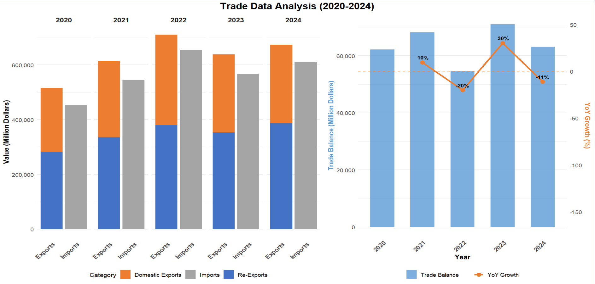

The right panel addresses a key weakness of the original chart by explicitly showing trade balance trends and year-over-year growth. The dramatic fluctuation in YoY growth - particularly the 30% surge in 2023 followed by an 11% contraction in 2024 - highlights potential volatility in the trading environment.

What's particularly revealing is the trade balance pattern from 2020-2024. After maintaining a positive trajectory through 2021, the sharp 20% decline in 2022 suggests a significant market disruption, possibly related to supply chain issues or changing global demand patterns. The remarkable recovery in 2023 (+30%) indicates exceptional resilience, perhaps through policy interventions or market adaptation.

The consistent trade surplus throughout the period demonstrates overall competitive strength in services, but the declining balance in 2024 despite maintained export levels signals potential challenges in cost management or shifting competitive dynamics.

## Second Image - Merchandise Trade Analysis

### Import Data

```{r}

Merchandise_Trade_By_Commodity <- read_excel("data/Merchandise_Trade_By_Commodity_Section_Current_Prices_Monthly.xlsx")    

```

### Organize the Required Data

I began by transposing the `Merchandise_Trade_By_Commodity` dataset to organize the data more effectively. After transposing, I added the time variable as a new column and removed the row names to ensure proper structuring. I then renamed the columns, converting them to characters, and removed the first row that was unnecessary for analysis.

Next, I converted the relevant columns to numeric values to facilitate further analysis. I renamed the time column to `Year-Month` and ensured it was in the correct date format. After that, I converted the data to a time series object (`tsibble`) using the `Year-Month` as the index.

For the year 2024, I aggregated the data by summing the values for each category and removed unnecessary columns to focus on relevant variables, such as imports and exports of chemicals, manufactured goods, machinery, and miscellaneous manufactured articles. I renamed the column for the year to make it clearer.

I then created a new dataset (`trade_data`) by selecting specific columns related to imports and exports for the year 2024. I rounded the values in millions to improve readability.

I also calculated the "Other Imports" and "Other Exports" by subtracting the sum of specific categories (e.g., chemicals, manufactured goods) from the total imports and exports.

Finally, I prepared a new dataset (`flow_data`) to visualize the data in terms of imports and exports. I calculated the percentage contribution of each category to total imports and exports. I also ordered the categories for exports in descending order to provide a more insightful presentation of the data.

```{r}
#| code-fold: true
#| code-summary: "Show the code"

Merchandise_Trade_By_Commodity_transposed <- as.data.frame(t(Merchandise_Trade_By_Commodity))
Merchandise_Trade_By_Commodity_transposed <- rownames_to_column(Merchandise_Trade_By_Commodity_transposed, var = "Time")
rownames(Merchandise_Trade_By_Commodity_transposed) <- NULL

colnames(Merchandise_Trade_By_Commodity_transposed) <- as.character(Merchandise_Trade_By_Commodity_transposed[1, ])
Merchandise_Trade_By_Commodity_transposed <- Merchandise_Trade_By_Commodity_transposed[-1, ]

Merchandise_Trade_By_Commodity_transposed <- Merchandise_Trade_By_Commodity_transposed %>%
  mutate(across(-1, as.numeric))

Merchandise_Trade_By_Commodity_transposed <- Merchandise_Trade_By_Commodity_transposed %>%
  rename(`Year-Month` = `Data Series`) %>%
  mutate(`Year-Month` = yearmonth(`Year-Month`))

Merchandise_Trade_By_Commodity_transposed <- Merchandise_Trade_By_Commodity_transposed %>%
  mutate(`Year-Month` = as.Date(`Year-Month`))

Merchandise_Trade_By_Commodity_ts <- Merchandise_Trade_By_Commodity_transposed %>%
  as_tsibble(index = `Year-Month`)

rm(Merchandise_Trade_By_Commodity, Merchandise_Trade_By_Commodity_transposed)

Merchandise_Trade_By_Commodity_year <- aggregate(. ~ year(`Year-Month`), 
  data = subset(Merchandise_Trade_By_Commodity_ts, year(`Year-Month`) == 2024), 
  FUN = function(x) sum(x, na.rm = TRUE)
)

Merchandise_Trade_By_Commodity_year <- Merchandise_Trade_By_Commodity_year %>%
  select(-`Year-Month`) %>% 
  rename(Year = `year(\`Year-Month\`)`)  


trade_data <- Merchandise_Trade_By_Commodity_year %>%
  filter(Year == 2024) %>%
  select(
    Year,
    Chemicals_Products_Imports = `Chemicals & Chemical Products_Imports`,
    Chemicals_Products_Exports = `Chemicals & Chemical Products_Exports`,
    Manufactured_Goods_Imports = `Manufactured Goods_Imports`,
    Manufactured_Goods_Exports = `Manufactured Goods_Exports`,
    Machinery_Transport_Imports = `Machinery & Transport Equipment_Imports`,
    Machinery_Transport_Exports = `Machinery & Transport Equipment_Exports`,
    Misc_Manufactured_Imports = `Miscellaneous Manufactured Articles_Imports`,
    Misc_Manufactured_Exports = `Miscellaneous Manufactured Articles_Exports`,
    Non_Oil_Imports, 
    Non_Oil_Exports
  )


trade_bil <- trade_data
cols_to_convert <- colnames(trade_bil)[-1]  
trade_bil[cols_to_convert] <- lapply(trade_bil[cols_to_convert], function(x) round(x / 1e6, 1))

trade_bil$Other_Imports <- trade_bil$Non_Oil_Imports - 
                         (trade_bil$Chemicals_Products_Imports + 
                          trade_bil$Manufactured_Goods_Imports + 
                          trade_bil$Machinery_Transport_Imports + 
                          trade_bil$Misc_Manufactured_Imports)

trade_bil$Other_Exports <- trade_bil$Non_Oil_Exports - 
                         (trade_bil$Chemicals_Products_Exports + 
                          trade_bil$Manufactured_Goods_Exports + 
                          trade_bil$Machinery_Transport_Exports + 
                          trade_bil$Misc_Manufactured_Exports)


flow_data <- data.frame(
  Direction = c(rep("Import", 5), rep("Export", 5)),
  Category = rep(c("Machinery & Transport Equipment", 
                   "Chemicals & Chemical Products",
                   "Misc. Manufactured Articles",
                   "Manufactured Goods",
                   "Other Categories"), 2),
  Value_Bil = c(
    trade_bil$Machinery_Transport_Imports,
    trade_bil$Chemicals_Products_Imports,
    trade_bil$Misc_Manufactured_Imports,
    trade_bil$Manufactured_Goods_Imports,
    trade_bil$Other_Imports,
    trade_bil$Machinery_Transport_Exports,
    trade_bil$Chemicals_Products_Exports,
    trade_bil$Misc_Manufactured_Exports,
    trade_bil$Manufactured_Goods_Exports,
    trade_bil$Other_Exports
  )
)

flow_data <- flow_data %>%
  group_by(Direction) %>%
  mutate(Percentage = round(Value_Bil / sum(Value_Bil) * 100, 1)) %>%
  ungroup()

flow_data$Category <- factor(
  flow_data$Category,
  levels = flow_data %>%
    filter(Direction == "Export") %>%
    arrange(desc(Value_Bil)) %>%
    pull(Category)
)

```

### Comment on the Original Image

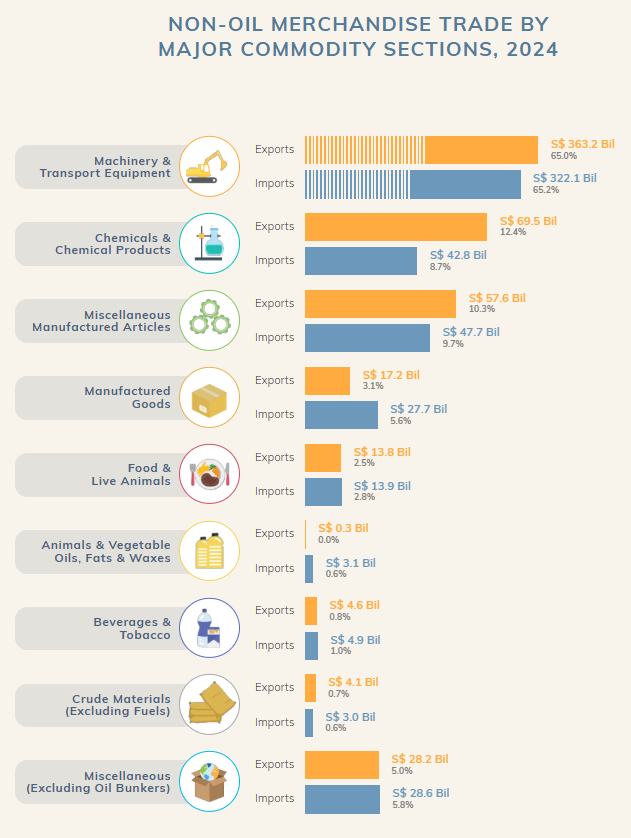

**Strengths**

-   Clean horizontal bar chart design with an intuitive left-to-right reading pattern.
-   Clear category labeling with illustrative icons for easier identification.
-   Distinct color coding differentiates exports (orange) and imports (blue).
-   Direct value labeling shows both monetary amounts and percentage contributions.
-   Logical organization by category size makes dominant sectors immediately visible.
-   Consistent formatting and proportional bars allow for direct visual comparison.

**Weaknesses**

-   No visualization of trade balances (surplus/deficit) for each commodity section.
-   Linear presentation obscures flow relationships between imports and exports.
-   Equal visual space is allocated to minor categories despite vast differences in importance.
-   Lack of visual hierarchy to emphasize the most economically significant categories.
-   No integrated visualization showing the overall import-export relationship.
-   Limited context about how categories connect in the broader trade ecosystem.

### Direction for Modification & Sketch

-   Transform the visualization into a **flow-based diagram** to show the relationships between export and import categories.
-   Use a **Sankey diagram** approach to visualize the magnitude and direction of trade flows.
-   Emphasize **proportionality** through the width of flow channels to better represent economic significance.
-   Integrate **both sides of trade** (exports and imports) into a unified visual system.
-   Focus visual attention on **major categories** while still representing the complete dataset.
-   Create a more intuitive representation of **trade balances** through flow visualization.

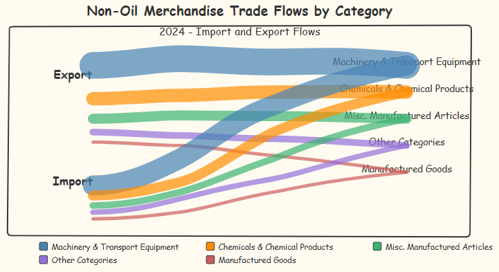

### Modified Image

```{r eval=FALSE, echo=TRUE}
#| code-fold: true
#| code-summary: "Show the code"

# Create custom color scheme
my_colors <- c(
  "Machinery & Transport Equipment" = "#1F77B4",
  "Chemicals & Chemical Products" = "#FF7F0E",
  "Misc. Manufactured Articles" = "#2CA02C",
  "Manufactured Goods" = "#D62728",
  "Other Categories" = "#9467BD"
)

# Create an alluvial-like diagram (similar to a Sankey diagram)
ggplot(flow_data, 
       aes(y = Value_Bil, axis1 = Direction, axis2 = Category)) +
  # Add alluvial layers
  geom_alluvium(aes(fill = Category), width = 0.4, alpha = 0.8) +
  
  # Add labels to the flows
  geom_text(
    stat = "alluvium",
    aes(label = paste0("S$", Value_Bil, " Bil\n(", Percentage, "%)")),
    size = 3.2, color = "white", fontface = "bold"
  ) +
  
  # Add axes
  geom_stratum(width = 0.3, fill = "white", color = "grey") +
  geom_text(stat = "stratum", aes(label = after_stat(stratum)), size = 3.5) +
  
  # Apply custom color scheme
  scale_fill_manual(values = my_colors) +
  
  # Format Y-axis
  scale_y_continuous(
    labels = function(x) paste0("S$", x, " Bil"),
    expand = expansion(mult = c(0, 0.1))  # Add space at the top
  ) +
  
  # Apply professional theme
  theme_minimal() +
  theme(
    # Grid lines
    panel.grid.major.x = element_blank(),
    panel.grid.minor = element_blank(),
    
    # Text style
    axis.text.y = element_text(size = 10),
    axis.text.x = element_text(face = "bold", size = 12),
    axis.title = element_blank(),
    
    # Legend style
    legend.title = element_blank(),
    legend.position = "bottom",
    legend.text = element_text(size = 10),
    
    # Title style
    plot.title = element_text(face = "bold", size = 14, hjust = 0.5),
    plot.subtitle = element_text(size = 12, hjust = 0.5, margin = margin(b = 15)),
    plot.caption = element_text(size = 8, hjust = 1, margin = margin(t = 15)),
    
    # Background
    plot.background = element_rect(fill = "white", color = NA),
    panel.background = element_rect(fill = "white", color = NA),
    
    # Margins
    plot.margin = margin(t = 30, r = 20, b = 20, l = 20)
  ) +
  
  # Add informative labels
  labs(
    title = "NON-OIL MERCHANDISE TRADE FLOWS BY CATEGORY",
    subtitle = "2024 - Import and Export Flows")


```

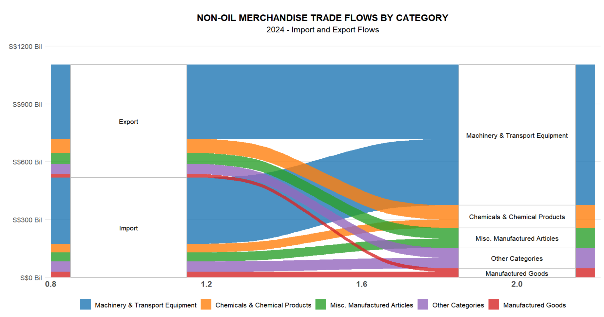

The visualization immediately communicates the overwhelming dominance of Machinery & Transport Equipment, which constitutes approximately 65% of both export and import activity.

However, the flow diagram reveals something the original chart couldn't: despite similar proportional representation on both sides, this sector generates a substantial positive trade balance, serving as the primary engine of the country's trade surplus. The diagram exposes critical structural imbalances across categories.

While Machinery and Chemicals establish strong positive trade balances, Manufactured Goods show a significant deficit. This pattern suggests an economy specialized in capital equipment and chemical production but dependent on imported consumer goods - possibly indicating advanced industrial capabilities but underdeveloped consumer goods manufacturing.

The visual representation highlights the concerning concentration of export value in just three categories (Machinery, Chemicals, and Miscellaneous Manufactured Articles), which collectively represent nearly 90% of export revenue.

This concentration points to potential economic vulnerability should global demand shift in these specific sectors, a risk factor completely obscured in the original chart.

## Third Image - Exports Commodity Analysis

### Import Data

```{r}
Domestic_Exports_By_Commodity <- read_excel("data/Domestic_Exports_By_Commodity_Division_Monthly.xlsx")    

```

### Organize the Required Data

I worked on transforming and analyzing data related to domestic exports by commodity. First, I transposed the dataset and converted it into a proper format, making the time variable more accessible. I ensured that the "Year-Month" column was correctly formatted by converting it into a date type and then created a time series object for further analysis.

I then aggregated the data by year, specifically focusing on 2024, summing up the values for each commodity. After that, I reshaped the dataset into a long format, making it easier to work with different commodity groups. I categorized the commodities into specific groups, such as Food and Agriculture, Raw Materials, Energy Products, and others, based on predefined criteria.

Once the commodities were grouped, I summarized the data by calculating the total value for each group and the percentage contribution of each group to the total export value. I then arranged the groups in descending order based on their total export value.

Finally, I created a new dataset, `Domestic_Exports_By_Group`, which contained the summarized export data for each commodity group. This dataset provided insights into the major export groups and their relative contributions, laying the foundation for further analysis or visualization.

```{r}
#| code-fold: true
#| code-summary: "Show the code"

Domestic_Exports_By_Commodity_transposed <- as.data.frame(t(Domestic_Exports_By_Commodity))
Domestic_Exports_By_Commodity_transposed <- rownames_to_column(Domestic_Exports_By_Commodity_transposed, var = "Time")
rownames(Domestic_Exports_By_Commodity_transposed) <- NULL

colnames(Domestic_Exports_By_Commodity_transposed) <- as.character(Domestic_Exports_By_Commodity_transposed[1, ])
Domestic_Exports_By_Commodity_transposed <- Domestic_Exports_By_Commodity_transposed[-1, ]

Domestic_Exports_By_Commodity_transposed <- Domestic_Exports_By_Commodity_transposed %>%
  mutate(across(-1, as.numeric))

Domestic_Exports_By_Commodity_transposed <- Domestic_Exports_By_Commodity_transposed %>%
  rename(`Year-Month` = `Data Series`) %>%
  mutate(`Year-Month` = yearmonth(`Year-Month`))

Domestic_Exports_By_Commodity_transposed <- Domestic_Exports_By_Commodity_transposed %>%
  mutate(`Year-Month` = as.Date(`Year-Month`))

Domestic_Exports_By_Commodity_ts <- Domestic_Exports_By_Commodity_transposed %>%
  as_tsibble(index = `Year-Month`)

rm(Domestic_Exports_By_Commodity, Domestic_Exports_By_Commodity_transposed)


Domestic_Exports_By_Commodity_year <- aggregate(. ~ year(`Year-Month`), 
  data = subset(Domestic_Exports_By_Commodity_ts, year(`Year-Month`) == 2024), 
  FUN = function(x) sum(x, na.rm = TRUE)
)

Domestic_Exports_By_Commodity_year <- Domestic_Exports_By_Commodity_year %>%
  select(-`Year-Month`) %>%   
  rename(Year = `year(\`Year-Month\`)`) 

commodity_cols <- names(Domestic_Exports_By_Commodity_year)[
  !names(Domestic_Exports_By_Commodity_year) %in% 
    c("Year", "Total Domestic Exports", "commodity_group")
]

Domestic_Exports_Long <- pivot_longer(
  Domestic_Exports_By_Commodity_year,
  cols = all_of(commodity_cols),
  names_to = "commodity",
  values_to = "value"
)


Domestic_Exports_Long$commodity_group <- NA

# Food and Agriculture
Domestic_Exports_Long$commodity_group[
  Domestic_Exports_Long$commodity %in% c(
    "Fish, Seafood (Excl Marine Mammals) & Preparations",
    "Cereals & Cereal Preparations",
    "Vegetables & Fruit",
    "Coffee, Tea, Cocoa, Spices & Manufactures",
    "Beverages",
    "Tobacco & Manufactures",
    "Crude Animal & Vegetable Materials Nes"
  )
] <- "Food and Agriculture"

# Raw Materials
Domestic_Exports_Long$commodity_group[
  Domestic_Exports_Long$commodity %in% c(
    "Crude Rubber",
    "Crude Fertilizers & Minerals (Excl Division 56 Coal Petroleum & Precious Stones)",
    "Metalliferous Ores & Metal Scrap"
  )
] <- "Raw Materials"

# Energy Products
Domestic_Exports_Long$commodity_group[
  Domestic_Exports_Long$commodity %in% c(
    "Coal, Coke & Briquettes",
    "Petroleum & Products & Related Materials",
    "Gas",
    "Oil Bunkers"
  )
] <- "Energy Products"

# Oils and Fats
Domestic_Exports_Long$commodity_group[
  Domestic_Exports_Long$commodity %in% c(
    "Fixed Vegetable Fats & Oils Crude Refined Or Fractionated",
    "Animal Or Vegetable Fats & Oils Processed Waxes Of Animal Or Vegetable Origin Inedible Mixtures Or Preparations Of Animal Or Vegetable Fats Or Oils Nes"
  )
] <- "Oils and Fats"

# Chemicals and Pharmaceuticals
Domestic_Exports_Long$commodity_group[
  Domestic_Exports_Long$commodity %in% c(
    "Organic Chemicals",
    "Medicinal & Pharmaceutical Products",
    "Essential Oils & Resinoids & Perfume Materials; Toilet Polishing & Cleansing Preparations",
    "Plastics In Primary Forms",
    "Plastics In Non-Primary Forms",
    "Rubber Manufactures Nes"
  )
] <- "Chemicals and Pharmaceuticals"

# Manufacturing Supplies
Domestic_Exports_Long$commodity_group[
  Domestic_Exports_Long$commodity %in% c(
    "Paper, Paperboard & Articles Of Paper Pulp Of Paper Or Of Paperboard",
    "Textile, Yarn, Fabrics Made-Up Articles Nes & Related Products",
    "Non-Metallic Mineral Manufactures Nes"
  )
] <- "Manufacturing Supplies"

# Metals
Domestic_Exports_Long$commodity_group[
  Domestic_Exports_Long$commodity %in% c(
    "Iron & Steel",
    "Non-Ferrous Metals",
    "Manufactures Of Metals Nes"
  )
] <- "Metals"

# Machinery and Electronics
Domestic_Exports_Long$commodity_group[
  Domestic_Exports_Long$commodity %in% c(
    "Office Machines & Automatic Data-Processing Machines",
    "Telecommunications & Sound-Recording & Reproducing Apparatus & Equipment",
    "Electrical Machinery Apparatus & Appliances Nes & Electrical Parts Thereof"
  )
] <- "Machinery and Electronics"

# Consumer Goods
Domestic_Exports_Long$commodity_group[
  Domestic_Exports_Long$commodity %in% c(
    "Articles Of Apparel & Clothing Accessories"
  )
] <- "Consumer Goods"

# Precision Instruments and Misc Manufacturing
Domestic_Exports_Long$commodity_group[
  Domestic_Exports_Long$commodity %in% c(
    "Professional Scientific & Controlling Instruments & Apparatus Nes",
    "Photographic Apparatus Equipment & Supplies & Optical Goods Nes; Watches & Clocks",
    "Miscellaneous Manufactured Articles Nes"
  )
] <- "Precision Instruments"


export_by_group <- Domestic_Exports_Long %>%
  group_by(commodity_group) %>%
  summarize(value = sum(value, na.rm = TRUE)) %>%
  ungroup() %>%
  filter(!is.na(commodity_group))  

total_value <- sum(export_by_group$value)


export_by_group <- export_by_group %>%
  mutate(percentage = value / total_value * 100) %>%
  arrange(desc(value))


export_by_group$commodity_group <- factor(
  export_by_group$commodity_group,
  levels = export_by_group$commodity_group[order(-export_by_group$value)]
)


Domestic_Exports_By_Group <- export_by_group


```

### Comment on the Original Image

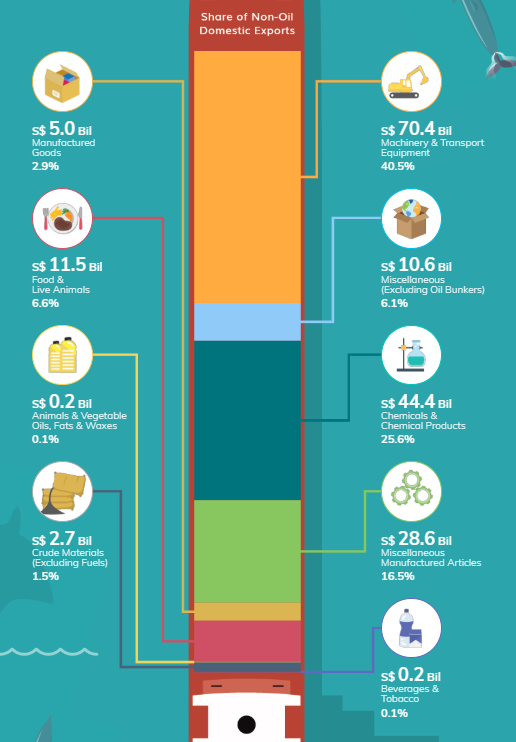

**Strengths:**

-   Visually engaging Sankey diagram approach showing the flow of exports by category
-   Creative design with nautical theme connecting to international trade concept
-   Clear icons representing each commodity group enhance recognition
-   Direct labeling of monetary values and percentage contributions
-   Color-coded flows help track connections between categories
-   Proportional visualization of relative importance through width of flows

**Weaknesses:**

-   Unconventional layout may require learning curve for some viewers
-   Complex flow paths sometimes cross or overlap, potentially creating confusion
-   Vertical orientation makes precise value comparison between categories difficult
-   Limited context about overall export patterns or key insights
-   Some small-value categories are difficult to distinguish visually
-   Background elements might distract from the data presentation

### Direction for Modification & Sketch

-   Transform into a treemap visualization to clearly show hierarchical relationships

-   Create distinct size-proportional blocks for immediate visual comparison

-   Implement a more organized layout with strategic nesting of related categories

-   Focus on clear, direct value labeling within each category block

-   Use a consistent color scheme that enhances category differentiation

-   Simplify the design to focus attention on the data rather than decorative elements

    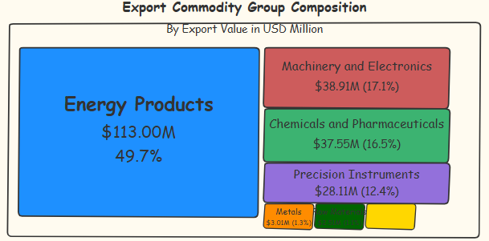

### Modified Image

```{r eval=FALSE, echo=TRUE}
#| code-fold: true
#| code-summary: "Show the code"


group_colors <- c(
  "Energy Products" = "#2C7BB6",
  "Machinery and Electronics" = "#D7301F",
  "Chemicals and Pharmaceuticals" = "#1A9850",
  "Precision Instruments" = "#756BB1",
  "Metals" = "#FD8D3C",
  "Raw Materials" = "#31A354",
  "Food and Agriculture" = "#FDCC8A",
  "Manufacturing Supplies" = "#636363",
  "Consumer Goods" = "#FFFFBF",
  "Oils and Fats" = "#8C96C6"
)

# Create the treemap with enhanced professional styling
treemap_plot <- ggplot(Domestic_Exports_By_Group, 
                      aes(area = value, 
                          fill = commodity_group, 
                          label = paste0(commodity_group, "\n", 
                                        dollar(value/1e6, suffix = "M", prefix = "$"), 
                                        "\n", 
                                        percent(percentage/100, accuracy = 0.1)))) +
  geom_treemap(color = "white", size = 0.5) +
  geom_treemap_text(colour = "white", 
                   place = "centre",
                   size = 0.5,
                   fontface = "bold",
                   min.size = 0.1,
                   grow = TRUE) +
  scale_fill_manual(values = group_colors) +
  labs(title = "Export Commodity Group Composition",
       subtitle = "By Export Value in USD Million") +
  theme_minimal() +
  theme(
    legend.position = "none",
    plot.title = element_text(face = "bold", size = 16, hjust = 0.5),
    plot.subtitle = element_text(size = 12, hjust = 0.5, margin = margin(b = 20)),
    plot.caption = element_text(size = 8, hjust = 1, margin = margin(t = 10)),
    plot.background = element_rect(fill = "white", color = NA),
    plot.margin = margin(20, 20, 20, 20)
  )

# To add a proper border around the entire visualization
treemap_plot <- treemap_plot +
  coord_cartesian(clip = "off") +
  annotate("rect", xmin = -Inf, xmax = Inf, ymin = -Inf, ymax = Inf,
           color = "gray80", fill = NA, size = 0.5)

# Display the treemap
print(treemap_plot)


```

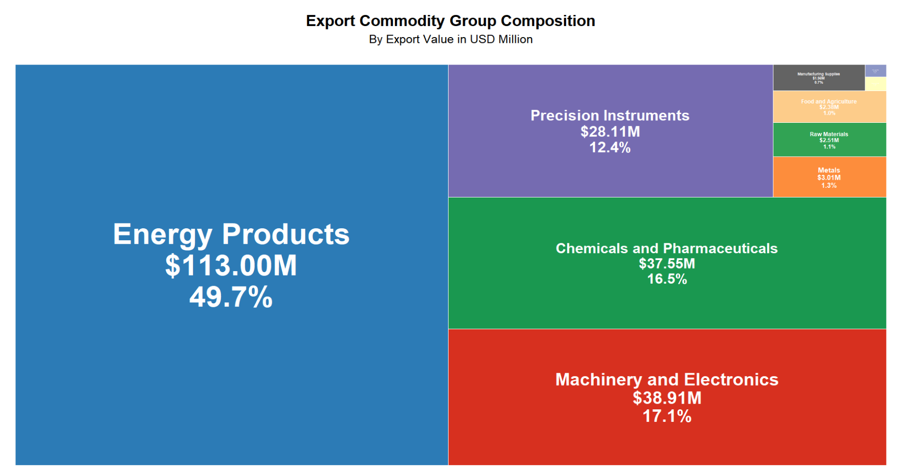

Most notable in the visualization is the dominant position of Energy Products, comprising 49.7% of all export value at \$113 million. This significant concentration indicates a heavy reliance on energy exports as a key economic driver, which could create vulnerability to fluctuations in global energy markets. The large visual block representing this category effectively illustrates this concentration in a way that numbers alone cannot convey.

The visualization also shows a fairly balanced distribution across three secondary export categories: Machinery and Electronics (17.1%), Chemicals and Pharmaceuticals (16.5%), and Precision Instruments (12.4%). When combined with Energy Products, these four categories account for 95.7% of total export value, demonstrating a highly specialized export economy. The nested elements within these categories provide further detail about subcategory composition.

The treemap reveals minimal contributions from traditional sectors such as Food and Agriculture (1.0%) and Raw Materials (1.1%), suggesting an economy that has moved away from primary production toward higher-value manufacturing and energy exports. This composition indicates an advanced stage of economic development but also potential vulnerability to disruptions in specific sectors.

## Time-Series Analysis

### Organize the Required Data

I worked on processing and analyzing trade data from 2015 to 2024, focusing on domestic exports, re-exports, and imports. I began by aggregating the data monthly for each category, creating separate datasets for re-exports, domestic exports, and imports, and then merging them into a single dataset. I calculated the total exports and trade balance, and derived the month-over-month percentage change for the trade balance.

Next, I adjusted the dataset by ensuring the correct date format, renaming columns for clarity, and sorting the data by date. I split the data into three periods: pre-COVID, during COVID, and post-COVID. I also created time series objects for total exports, segmenting the data by these periods.

For each period, I calculated the mean and standard deviation of total exports to compare the trends across the different phases of the pandemic. This allowed me to assess the impact of COVID-19 on trade performance by analyzing the differences in export values before, during, and after the pandemic.

```{r eval=FALSE, echo=TRUE}
#| code-fold: true
#| code-summary: "Show the code"


reexp_monthly <- aggregate(
  `Total All Markets` ~ format(`Year-Month`, "%Y-%m-01"), 
  data = subset(Re_exports_ts, year(`Year-Month`) >= 2015 & year(`Year-Month`) <= 2024), 
  FUN = function(x) sum(x, na.rm = TRUE)
)

names(reexp_monthly) <- c("Date_YM", "ReExp_Value")
reexp_monthly$Date_YM <- as.Date(reexp_monthly$Date_YM)

domexp_monthly <- aggregate(
  `Total All Markets` ~ format(`Year-Month`, "%Y-%m-01"), 
  data = subset(Domestic_exports_ts, year(`Year-Month`) >= 2015 & year(`Year-Month`) <= 2024), 
  FUN = function(x) sum(x, na.rm = TRUE)
)

names(domexp_monthly) <- c("Date_YM", "DomExp_Value")
domexp_monthly$Date_YM <- as.Date(domexp_monthly$Date_YM)

imp_monthly <- aggregate(
  `Total All Markets` ~ format(`Year-Month`, "%Y-%m-01"), 
  data = subset(Imports_ts, year(`Year-Month`) >= 2015 & year(`Year-Month`) <= 2024), 
  FUN = function(x) sum(x, na.rm = TRUE)
)

names(imp_monthly) <- c("Date_YM", "Import_Value")
imp_monthly$Date_YM <- as.Date(imp_monthly$Date_YM)

trade_data_longterm <- merge(domexp_monthly, reexp_monthly, by = "Date_YM")
trade_data_longterm <- merge(trade_data_longterm, imp_monthly, by = "Date_YM")

trade_data_longterm$Total_Exp_Value <- trade_data_longterm$DomExp_Value + trade_data_longterm$ReExp_Value

trade_data_longterm$Trade_Bal <- trade_data_longterm$Total_Exp_Value - trade_data_longterm$Import_Value

trade_data_longterm <- trade_data_longterm[order(trade_data_longterm$Date_YM), ]

trade_data_longterm$Trade_Bal_MoM_Pct <- c(NA, 
                                    diff(trade_data_longterm$Trade_Bal) / 
                                    abs(trade_data_longterm$Trade_Bal[-nrow(trade_data_longterm)]) * 100)

trade_data_longterm$Trade_Bal_MoM_Pct <- round(trade_data_longterm$Trade_Bal_MoM_Pct, 2)

print(trade_data_longterm)

trade_data_longterm$Date_YM <- as.character(trade_data_longterm$Date_YM)

trade_data_longterm$Date <- as.Date(trade_data_longterm$Date_YM)


if(sum(is.na(trade_data_longterm$Date)) > 0) {

  trade_data_longterm$Date <- as.Date(trade_data_longterm$Date_YM, format="%Y-%m-%d")

}


names(trade_data_longterm)[names(trade_data_longterm) == "DomExp_Value"] <- "Domestic_Exports"
names(trade_data_longterm)[names(trade_data_longterm) == "ReExp_Value"] <- "Re_Exports"
names(trade_data_longterm)[names(trade_data_longterm) == "Import_Value"] <- "Imports"
names(trade_data_longterm)[names(trade_data_longterm) == "Total_Exp_Value"] <- "Total_Exports"
names(trade_data_longterm)[names(trade_data_longterm) == "Trade_Bal"] <- "Trade_Balance"


trade_data_longterm <- trade_data_longterm %>%
  arrange(Date)


pre_covid_data <- trade_data_longterm[trade_data_longterm$Date < as.Date("2020-01-01"), ]
covid_data <- trade_data_longterm[trade_data_longterm$Date >= as.Date("2020-01-01") & 
                                trade_data_longterm$Date <= as.Date("2021-12-01"), ]
post_covid_data <- trade_data_longterm[trade_data_longterm$Date > as.Date("2021-12-01"), ]


start_date <- min(trade_data_longterm$Date, na.rm=TRUE)
start_year <- as.numeric(format(start_date, "%Y"))
start_month <- as.numeric(format(start_date, "%m"))

ts_total_exports <- ts(trade_data_longterm$Total_Exports, 
                     start=c(start_year, start_month), 
                     frequency=12)


if(start_year <= 2019 && nrow(covid_data) > 0 && nrow(post_covid_data) > 0) {

  pre_covid_end_year <- 2019
  pre_covid_end_month <- 12
  
  covid_start_year <- 2020
  covid_start_month <- 1
  covid_end_year <- min(2021, as.numeric(format(max(covid_data$Date, na.rm=TRUE), "%Y")))
  covid_end_month <- as.numeric(format(max(covid_data$Date[format(covid_data$Date, "%Y") == as.character(covid_end_year)], na.rm=TRUE), "%m"))
  
  post_covid_start_year <- as.numeric(format(min(post_covid_data$Date, na.rm=TRUE), "%Y"))
  post_covid_start_month <- as.numeric(format(min(post_covid_data$Date, na.rm=TRUE), "%m"))
  

  pre_covid <- window(ts_total_exports, 
                     end=c(pre_covid_end_year, pre_covid_end_month))
  print(paste(start(pre_covid)[1], start(pre_covid)[2], "-", end(pre_covid)[1], end(pre_covid)[2]))
  
  covid_period <- window(ts_total_exports, 
                        start=c(covid_start_year, covid_start_month), 
                        end=c(covid_end_year, covid_end_month))
  print(paste(start(covid_period)[1], start(covid_period)[2], "-", end(covid_period)[1], end(covid_period)[2]))
  
  post_covid <- window(ts_total_exports, 
                      start=c(post_covid_start_year, post_covid_start_month))
  print(paste(start(post_covid)[1], start(post_covid)[2], "-", end(post_covid)[1], end(post_covid)[2]))
  

  pre_covid_mean <- mean(pre_covid, na.rm=TRUE)
  covid_period_mean <- mean(covid_period, na.rm=TRUE)
  post_covid_mean <- mean(post_covid, na.rm=TRUE)
  
  pre_covid_sd <- sd(pre_covid, na.rm=TRUE)
  covid_period_sd <- sd(covid_period, na.rm=TRUE)
  post_covid_sd <- sd(post_covid, na.rm=TRUE)
  
  
}

```

### Basic Chart

```{r eval=FALSE, echo=TRUE}
#| code-fold: true
#| code-summary: "Show the code"

trade_plot <- ggplot(trade_data_longterm, aes(x=Date)) +
  geom_line(aes(y=Total_Exports, color="Total Exports")) +
  geom_line(aes(y=Domestic_Exports, color="Domestic Exports")) +
  geom_line(aes(y=Re_Exports, color="Re-Exports")) +
  geom_line(aes(y=Imports, color="Imports")) +
  labs(title="Trade Trends (2015-2024)",
       y="Value (Million Dollars)",
       color="Data Series") +
  scale_color_manual(values=c("Total Exports"="blue", 
                            "Domestic Exports"="green", 
                            "Re-Exports"="purple", 
                            "Imports"="red")) +
  theme_minimal()

# Add COVID-19 marker line (if data range is sufficient)
if(any(trade_data_longterm$Date >= as.Date("2020-03-01"))) {
  trade_plot <- trade_plot +
    geom_vline(xintercept=as.Date("2020-03-01"), 
              linetype="dashed", color="darkred") +
    annotate("text", x=as.Date("2020-03-15"), 
             y=max(trade_data_longterm$Imports, na.rm=TRUE) * 0.95, 
             label="COVID-19", color="darkred", angle=90, hjust=0.5,vjust=1)
}

# Output the chart
print(trade_plot)
```

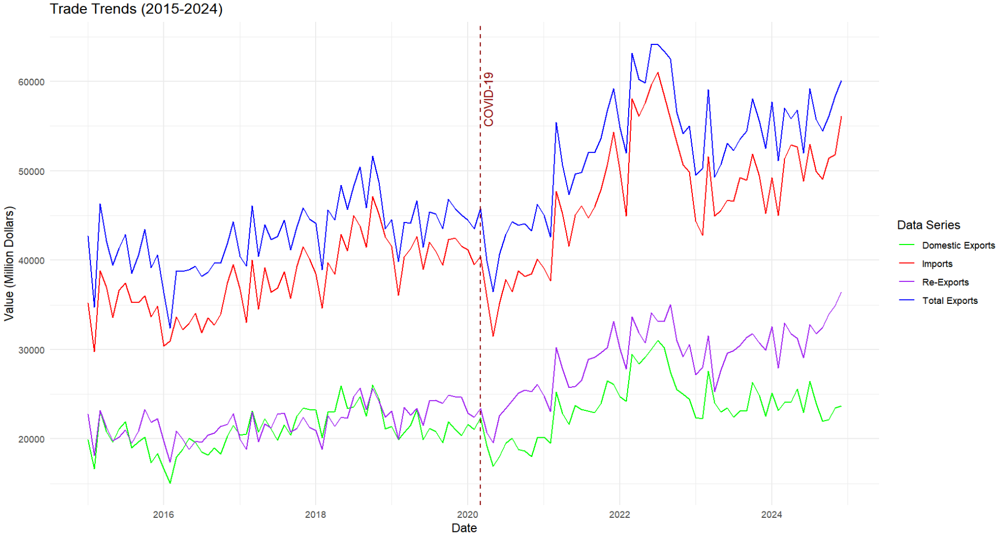

Key points from the trade trends (2015-2024) visualization:

1.  Four metrics tracked: Domestic Exports, Imports, Re-Exports, and Total Exports, all showing general upward trends over the decade.
2.  COVID-19 (early 2020) caused significant disruption with sharp declines across all categories, particularly imports.
3.  Strong post-COVID recovery (2021-2022) with steeper growth curves than pre-pandemic.
4.  Recent divergent patterns (2022-2024): Total Exports and Re-Exports growing strongly, while Domestic Exports show concerning decline.
5.  Widening gap between Total Exports and Domestic Exports indicates structural shift toward intermediary trade rather than domestic production.
6.  Trade balance remained positive throughout, with Total Exports consistently exceeding Imports despite market disruptions.
7.  Rising Re-Exports coupled with declining Domestic Exports suggests potential challenges in local production capacity or international competitiveness.

### ACF & PACF Analysis

```{r eval=FALSE, echo=TRUE}
#| code-fold: true
#| code-summary: "Show the code"

# 1. Create a Custom ACF/PACF Plot Function (Using Integer Lag Values)
custom_acf_plot <- function(series, series_name, lag_months = 24) {
  # Ensure there are no NA values
  series <- na.omit(series)
  
  # Set the layout for ACF and PACF plots
  par(mfrow = c(2, 1), mar = c(4, 4, 2, 2), mgp = c(2, 0.7, 0))
  
  # Compute ACF and PACF values
  acf_values <- acf(series, lag.max = lag_months, plot = FALSE)
  pacf_values <- pacf(series, lag.max = lag_months, plot = FALSE)
  
  # Create a custom ACF plot (integer axis)
  plot(0:lag_months, acf_values$acf, type = "h", 
       xlab = "Lag (Months)", ylab = "ACF", 
       main = paste("ACF:", series_name),
       ylim = c(min(acf_values$acf) - 0.1, 1), 
       xaxt = "n")  # Disable default x-axis
  
  # Add a custom x-axis (integer labels)
  axis(1, at = 0:lag_months, labels = 0:lag_months)
  
  # Add horizontal lines for significance levels
  abline(h = 0, col = "black")
  abline(h = c(-1.96/sqrt(length(series)), 1.96/sqrt(length(series))), 
         col = "blue", lty = 2)
  
  # Create a custom PACF plot (integer axis)
  plot(1:lag_months, pacf_values$acf, type = "h", 
       xlab = "Lag (Months)", ylab = "PACF", 
       main = paste("PACF:", series_name),
       ylim = c(min(pacf_values$acf) - 0.1, max(pacf_values$acf) + 0.1),
       xaxt = "n")  # Disable default x-axis
  
  # Add a custom x-axis (integer labels)
  axis(1, at = 1:lag_months, labels = 1:lag_months)
  
  # Add horizontal lines
  abline(h = 0, col = "black")
  abline(h = c(-1.96/sqrt(length(series)), 1.96/sqrt(length(series))), 
         col = "blue", lty = 2)
}

# 2. Create Time Series Objects for Each Series (If Not Created Previously)
# Ensure there are no NA values and that data is valid
ts_total_exports <- ts(na.omit(trade_data_longterm$Total_Exports), 
                      start = c(start_year, start_month), 
                      frequency = 12)
ts_domestic_exports <- ts(na.omit(trade_data_longterm$Domestic_Exports), 
                         start = c(start_year, start_month), 
                         frequency = 12)
ts_re_exports <- ts(na.omit(trade_data_longterm$Re_Exports), 
                   start = c(start_year, start_month), 
                   frequency = 12)
ts_imports <- ts(na.omit(trade_data_longterm$Imports), 
                start = c(start_year, start_month), 
                frequency = 12)
ts_trade_balance <- ts(na.omit(trade_data_longterm$Trade_Balance), 
                      start = c(start_year, start_month), 
                      frequency = 12)

# 3. Analyze Time Series Patterns Over the Entire Period

# ACF/PACF Analysis for Total Exports
custom_acf_plot(ts_total_exports, "Total Exports")

# ACF/PACF Analysis for Domestic Exports
custom_acf_plot(ts_domestic_exports, "Domestic Exports")

# ACF/PACF Analysis for Re-Exports
custom_acf_plot(ts_re_exports, "Re-Exports")

# ACF/PACF Analysis for Imports
custom_acf_plot(ts_imports, "Imports")

# ACF/PACF Analysis for Trade Balance
custom_acf_plot(ts_trade_balance, "Trade Balance")

```

::: panel-tabset
## ACF & PACF of Total Exports

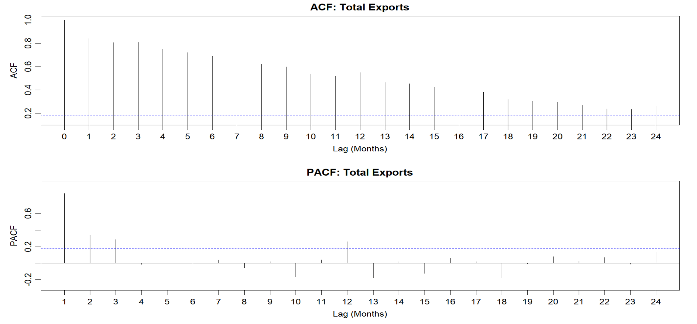

The ACF plot shows a slowly decaying pattern, starting near 1.0 at lag 0 and gradually diminishing across the 24-month period. All values exceed the significance threshold (blue dotted line at 0.2) until around lag 21-22. This slow decay pattern is typical of non-stationary time series with strong persistence, suggesting either trend components or high-order autoregressive processes.

The PACF plot shows significant spikes primarily at lags 1, 2, and 3, with most subsequent values falling within the significance bands (±0.2). There's a smaller significant spike around lag 12, suggesting a possible annual seasonal component in the export data.

The combination of slowly decaying ACF and sharp cutoff after lag 3 in the PACF strongly indicates an AR(3) model would be appropriate for forecasting. The statistically significant partial autocorrelation at these first three lags suggests that export values are directly influenced by their values from the previous three months.

## ACF & PACF of Domestic Exports

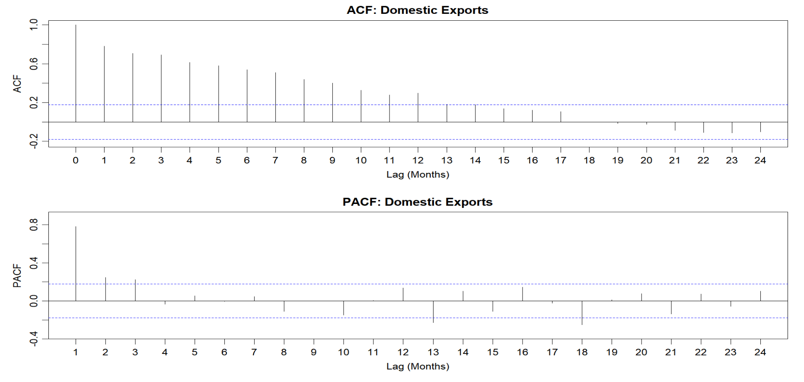

The ACF plot shows a gradual decay pattern starting from 1.0 at lag 0 and diminishing over time. Values remain above the significance threshold (blue dotted line at approximately 0.2) until around lag 17-18. This slow decay pattern suggests strong persistence in the time series, indicating either trend components or high-order autoregressive processes in domestic export data.

The PACF plot shows significant positive spikes at lags 1, 2, and 3 (with values around 0.8, 0.2, and 0.2 respectively). Most subsequent lags fall within the significance bands (±0.2), with some negative values at lags 13 and 18. The sharp cutoff after lag 3 is a classic indicator of an AR(3) process.

## ACF & PACF of Re-Exports

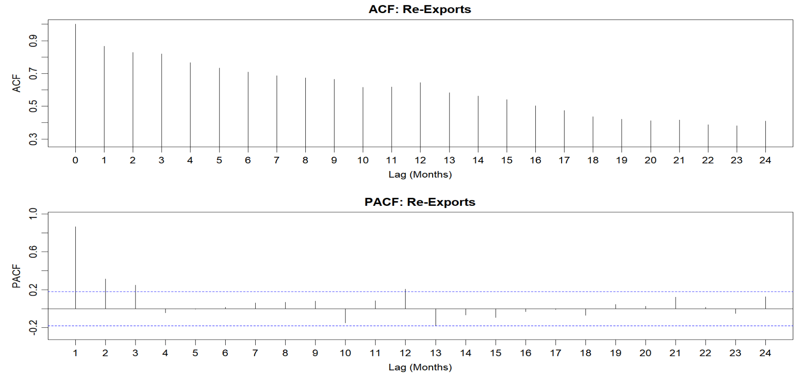

The ACF plot shows an extremely slow decay starting from approximately 1.0 at lag 0 and declining very gradually through all 24 lags. Even at lag 24, the autocorrelation remains above 0.4, which is much higher than the previous export types. No significance threshold line is visible in this ACF plot, but all values would clearly exceed typical significance levels. This exceptionally slow decay suggests a highly persistent, likely non-stationary time series with strong long-term memory.

The PACF plot shows a different pattern compared to the previous export types. There's a significant spike at lag 1 (around 0.8), followed by smaller significant spikes at lags 2 and 3. Additionally, there's another notable spike at lag 12, suggesting a potential annual seasonal component. The blue dotted significance lines are at approximately ±0.2.

## ACF & PACF of Imports

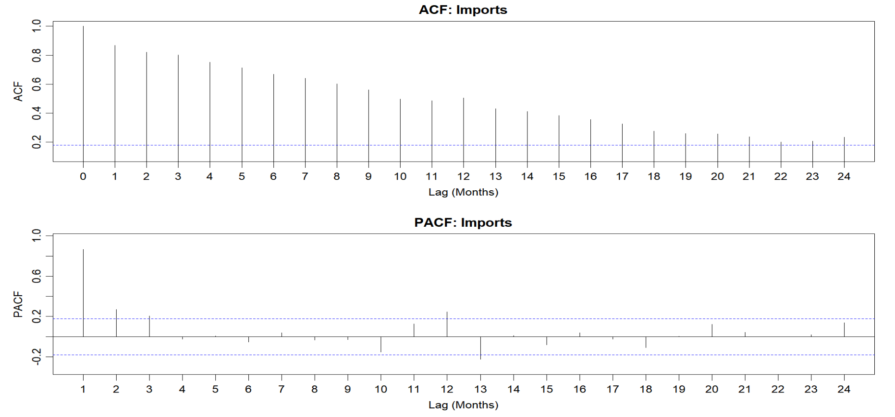

The ACF plot shows a gradual decay pattern starting at 1.0 for lag 0 and decreasing steadily across all 24 lags. All values remain above the significance threshold (blue dotted line at approximately 0.2) until around lag 21-22. This slow decay pattern indicates strong persistence in the imports time series, suggesting non-stationarity and potentially long-term trend components.

The PACF plot displays significant positive spikes at lags 1, 2, and 3, with values of approximately 0.8, 0.2, and 0.1 respectively. Additional significant spikes appear at lags 12 and 24, strongly suggesting annual seasonality in import patterns. The significance bands are marked at ±0.2 by blue dotted lines.

## ACF & PACF of Treade Balance

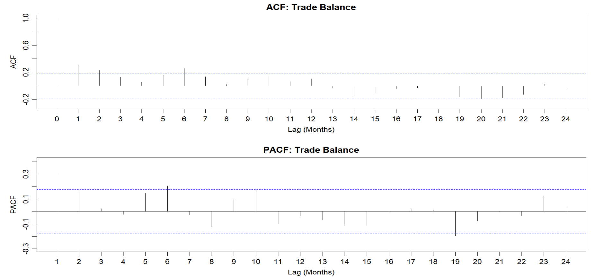

The ACF plot displays a sharp drop after lag 0 (which is 1.0 by definition). Only the first few lags (approximately lags 1-6) show values above the significance threshold (blue dotted line at 0.2), with the values quickly diminishing to near zero. After lag 15, some negative autocorrelations appear, particularly around lags 19-22, suggesting possible cyclical behavior or negative feedback in the trade balance.

The PACF plot shows a more complex pattern with scattered significant spikes. There's a significant positive spike at lag 1 (around 0.3), and smaller significant spikes at lags 2, 5, 6, 10, and 23. Some negative spikes appear at lags 8, 12, 14, 16, and 19. The significance bands are at approximately ±0.2.
:::

### Seasonal Patterns and Decompose Time Series

```{r eval=FALSE, echo=TRUE}
#| code-fold: true
#| code-summary: "Show the code"

# Analyze Seasonal Patterns and Decompose Time Series
# Ensure the time series length is sufficient for decomposition
if(length(ts_total_exports) >= 24) {
  # Decompose time series into trend, seasonal, and remainder components
  decomp_total_exports <- decompose(ts_total_exports)
  
  # Save current graphic parameters
  old_par <- par(no.readonly = TRUE)
  
  # Plot decomposition results
  par(mfrow = c(4, 1), mar = c(2, 4, 2, 2))
  plot(decomp_total_exports$x, main = "Original Time Series of Total Exports", ylab = "Value")
  plot(decomp_total_exports$trend, main = "Trend", ylab = "Trend")
  plot(decomp_total_exports$seasonal, main = "Seasonal", ylab = "Seasonal")
  plot(decomp_total_exports$random, main = "Random", ylab = "Random")
  
} 


# Analyze Seasonal Patterns and Decompose Time Series
# Ensure the time series length is sufficient for decomposition
if(length(ts_imports) >= 24) {
  # Decompose time series into trend, seasonal, and remainder components
  decomp_imports <- decompose(ts_imports)
  
  # Save current graphic parameters
  old_par <- par(no.readonly = TRUE)
  
  # Plot decomposition results
  par(mfrow = c(4, 1), mar = c(2, 4, 2, 2))
  plot(decomp_imports$x, main = "Original Time Series of Imports", ylab = "Value")
  plot(decomp_imports$trend, main = "Trend", ylab = "Trend")
  plot(decomp_imports$seasonal, main = "Seasonal", ylab = "Seasonal")
  plot(decomp_imports$random, main = "Random", ylab = "Random")
  
} 
```

::: panel-tabset
## Total Exports

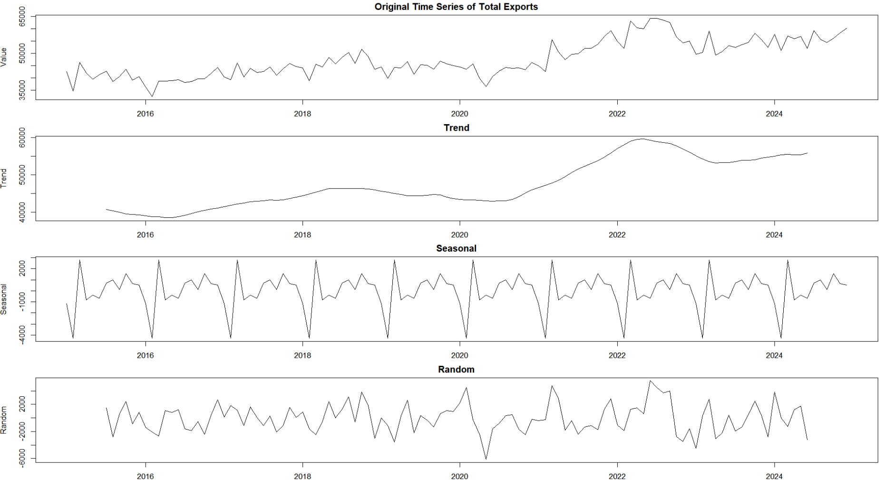

The decomposition of Total Exports reveals:

-   **Original Time Series:** Exports range from 35,000 to 65,000 units, with an overall upward trend and significant fluctuations, especially a step increase around 2021-2022.
-   **Trend Component:** Shows gradual growth from 2016 to 2018, stability from 2018 to 2020, substantial growth from 2020 to 2022, a slight decline in late 2022/early 2023, and renewed growth into 2024.
-   **Seasonal Component:** Displays a clear, repeating annual pattern with sharp drops to around -4,000 units and recoveries to +2,000 units, indicating strong seasonality.
-   **Random Component:** Residual fluctuations range between -5,000 and +3,000 units, with higher volatility during 2020, reflecting pandemic disruptions.

This decomposition supports the earlier ACF/PACF analysis, confirming the need for differencing and seasonal adjustments in time series modeling.

## Imports

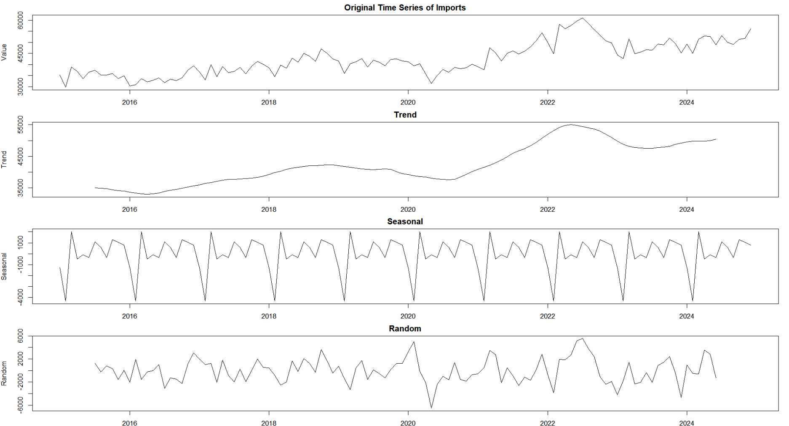

The time series decomposition of Imports (2015-2024) shows striking similarities to Total Exports:

-   **Original Time Series**: Imports range from 30,000 to 60,000 units with an upward trend and a notable step increase around 2021-2022.
-   **Trend Component**: Displays a dip in 2016, gradual growth until 2018, pandemic-related decline in 2020, significant growth from 2020-2022, a dip in late 2022/early 2023, and recovery into 2024.
-   **Seasonal Component**: Exhibits a recurring pattern with drops to -4,000 units and recoveries to +1,000 units, showing stable seasonality.
-   **Random Component**: Fluctuates between -5,000 and +6,000 units, with a significant negative spike in 2020 and volatility spikes in 2022.

The similarity suggests both imports and exports are influenced by the same macroeconomic factors, sharing synchronized trade cycles and pandemic-related disruptions. This reinforces the need for multivariate time series modeling for forecasting.
:::

### Comparison of Seasonal Patterns Before, During, and After COVID-19

```{r eval=FALSE, echo=TRUE}
#| code-fold: true
#| code-summary: "Show the code"


# Analyzing COVID-19 Impact on Seasonal Patterns
cat("\nAnalysis of COVID-19 Impact on Seasonal Patterns:\n")

# Ensure sufficient data points for analysis
if(start_year <= 2019 && nrow(covid_data) > 0) {
  # Split data into pre-COVID, during-COVID, and post-COVID periods
  pre_covid_ts <- window(ts_total_exports, end = c(2019, 12))
  during_covid_ts <- window(ts_total_exports, start = c(2020, 1), end = c(2021, 12))
  post_covid_ts <- window(ts_total_exports, start = c(2022, 1))
  
  # Ensure all time series have sufficient length
  if(length(pre_covid_ts) >= 12 && length(during_covid_ts) >= 12 && length(post_covid_ts) >= 12) {
    # Decompose the three time series
    pre_covid_decomp <- decompose(pre_covid_ts)
    during_covid_decomp <- decompose(during_covid_ts)
    post_covid_decomp <- decompose(post_covid_ts)
    
    # Extract seasonal components
    pre_covid_seasonal <- pre_covid_decomp$seasonal
    during_covid_seasonal <- during_covid_decomp$seasonal
    post_covid_seasonal <- post_covid_decomp$seasonal
    
    # Extract first 12 months of each seasonal pattern for comparison
    pre_covid_seasonal_pattern <- pre_covid_seasonal[1:12]
    during_covid_seasonal_pattern <- during_covid_seasonal[1:12]
    post_covid_seasonal_pattern <- post_covid_seasonal[1:12]
    
    # Create dataframe for easier plotting
    seasonal_comparison <- data.frame(
      Month = 1:12,
      PreCOVID = as.numeric(pre_covid_seasonal_pattern),
      DuringCOVID = as.numeric(during_covid_seasonal_pattern),
      PostCOVID = as.numeric(post_covid_seasonal_pattern)
    )
    
    # Convert to long format for ggplot
    seasonal_comparison_long <- reshape2::melt(seasonal_comparison, 
                                             id.vars = "Month", 
                                             variable.name = "Period", 
                                             value.name = "Seasonal")
    
    # Plot seasonal comparison using ggplot2
    seasonal_plot <- ggplot(seasonal_comparison_long, aes(x = Month, y = Seasonal, color = Period)) +
      geom_line() +
      labs(title = "Comparison of Seasonal Patterns Before, During, and After COVID-19",
           y = "Seasonal Component",
           color = "Period") +
      scale_color_manual(values = c("PreCOVID" = "blue", "DuringCOVID" = "red", "PostCOVID" = "green"),
                         labels = c("PreCOVID" = "Pre-COVID (before 2020)", 
                                   "DuringCOVID" = "During COVID (2020-2021)", 
                                   "PostCOVID" = "Post-COVID (2022 onwards)")) +
      theme_minimal() +
      scale_x_continuous(breaks = 1:12, labels = month.abb)
    
    print(seasonal_plot)
    
    # Calculate correlations between seasonal patterns
    cor_pre_during <- cor(pre_covid_seasonal_pattern, during_covid_seasonal_pattern)
    cor_pre_post <- cor(pre_covid_seasonal_pattern, post_covid_seasonal_pattern)
    cor_during_post <- cor(during_covid_seasonal_pattern, post_covid_seasonal_pattern)
    
    cat("Correlation between pre-COVID and during-COVID seasonal patterns:", cor_pre_during, "\n")
    cat("Correlation between pre-COVID and post-COVID seasonal patterns:", cor_pre_post, "\n")
    cat("Correlation between during-COVID and post-COVID seasonal patterns:", cor_during_post, "\n")
    
    # Calculate changes in seasonal amplitude
    amplitude_pre <- max(pre_covid_seasonal_pattern) - min(pre_covid_seasonal_pattern)
    amplitude_during <- max(during_covid_seasonal_pattern) - min(during_covid_seasonal_pattern)
    amplitude_post <- max(post_covid_seasonal_pattern) - min(post_covid_seasonal_pattern)
    
    cat("\nSeasonal amplitude changes:\n")
    cat("Pre-COVID seasonal amplitude:", amplitude_pre, "\n")
    cat("During-COVID seasonal amplitude:", amplitude_during, "\n")
    cat("Post-COVID seasonal amplitude:", amplitude_post, "\n")
    cat("Percentage change during COVID compared to pre-COVID:", 
        round((amplitude_during - amplitude_pre) / amplitude_pre * 100, 2), "%\n")
    cat("Percentage change post-COVID compared to pre-COVID:", 
        round((amplitude_post - amplitude_pre) / amplitude_pre * 100, 2), "%\n")
    
  } else {
    cat("Warning: Insufficient time series length for one or more periods to perform seasonal comparison analysis\n")
  }
} else {
  cat("Warning: Insufficient data range to compare pre and post-COVID periods\n")
}
```

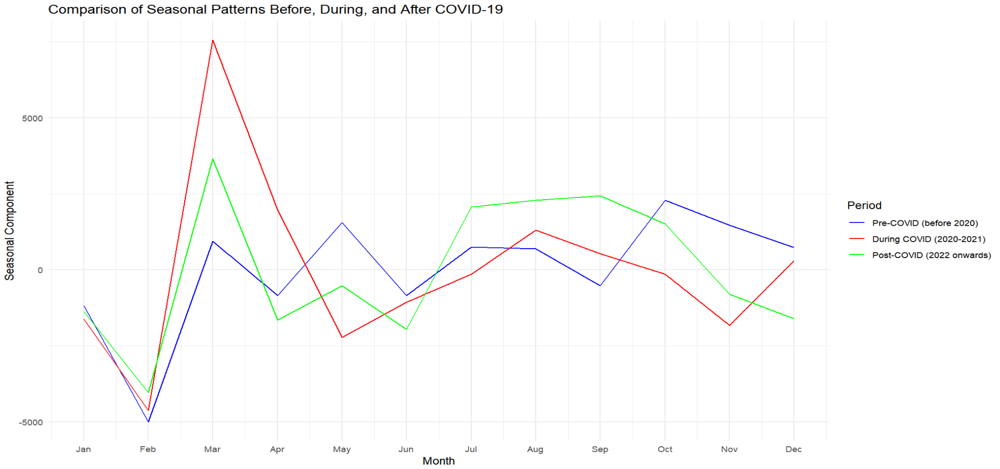

-   **Dramatic March spike during COVID**: A significant spike in March 2020-2021 (+8000 units) compared to pre-COVID (\~1500) and post-COVID (\~4000), likely due to panic buying and trade adjustments during the pandemic.
-   **February seasonal low**: All periods show February as a consistent seasonal low (\~-5000 units), indicating a persistent seasonal pattern.
-   **Shifted seasonal patterns**:
    -   Pre-COVID: Secondary peak in June and stronger October-November activity.
    -   During COVID: March spike, followed by deeper May-June troughs.
    -   Post-COVID: Recovery with stronger July-September activity.
-   **Recovery evolution**: Post-COVID shows a new seasonal pattern, with stronger first-quarter recovery (March) and enhanced summer activity (July-September), but weaker year-end performance.
-   **Pattern volatility**: The COVID period shows extreme fluctuations, while post-COVID patterns are moderating but not returning to pre-pandemic stability.

### Annual Growth Rates Analysis

```{r eval=FALSE, echo=TRUE}
#| code-fold: true
#| code-summary: "Show the code"

# Analyze Growth Rates Over Different Periods
cat("\nGrowth Rate Analysis Over Different Periods:\n")

# Use dplyr to calculate annual averages and growth rates
# Ensure the Date column is correct and add Year and Month columns
trade_data_longterm <- trade_data_longterm %>%
  mutate(year = format(Date, "%Y"),
         month = format(Date, "%m"))

# Group by year and calculate annual averages
annual_averages <- trade_data_longterm %>%
  group_by(year) %>%
  summarize(
    Avg_Total_Exports = mean(Total_Exports, na.rm = TRUE),
    Avg_Domestic_Exports = mean(Domestic_Exports, na.rm = TRUE),
    Avg_Re_Exports = mean(Re_Exports, na.rm = TRUE),
    Avg_Imports = mean(Imports, na.rm = TRUE),
    Avg_Trade_Balance = mean(Trade_Balance, na.rm = TRUE)
  )

# Calculate year-over-year growth rates
annual_growth <- annual_averages %>%
  mutate(
    Total_Exports_Growth = (Avg_Total_Exports / lag(Avg_Total_Exports) - 1) * 100,
    Domestic_Exports_Growth = (Avg_Domestic_Exports / lag(Avg_Domestic_Exports) - 1) * 100,
    Re_Exports_Growth = (Avg_Re_Exports / lag(Avg_Re_Exports) - 1) * 100,
    Imports_Growth = (Avg_Imports / lag(Avg_Imports) - 1) * 100
  )

# Display annual growth rates
cat("\nAnnual Growth Rates (%):\n")
print(annual_growth[, c("year", "Total_Exports_Growth", "Domestic_Exports_Growth", 
                      "Re_Exports_Growth", "Imports_Growth")])

# Create annual growth rate visualization with faceted line graphs
# Convert data to long format for ggplot
growth_data_long <- annual_growth %>%
  select(year, Total_Exports_Growth, Domestic_Exports_Growth, Re_Exports_Growth, Imports_Growth) %>%
  reshape2::melt(id.vars = "year", variable.name = "Variable", value.name = "Growth") %>%
  na.omit()  # Remove NA values

# Create faceted line plot for growth rates
faceted_line_plot <- ggplot(growth_data_long, aes(x = year, y = Growth, color = Variable, group = Variable)) +
  geom_line(linewidth = 1) +
  geom_point(size = 2) +
  facet_wrap(~ Variable, labeller = labeller(Variable = c(
    "Total_Exports_Growth" = "Total Exports",
    "Domestic_Exports_Growth" = "Domestic Exports",
    "Re_Exports_Growth" = "Re-Exports",
    "Imports_Growth" = "Imports"
  ))) +
  labs(title = "Annual Growth Rates of Trade Variables",
       y = "Growth Rate (%)",
       x = "Year") +
  theme_minimal() +
  geom_hline(yintercept = 0, linetype = "dashed", color = "gray50") +
  theme(axis.text.x = element_text(angle = 45, hjust = 1),
        legend.position = "none",
        strip.text = element_text(face = "bold"),
        panel.grid.minor = element_blank()) +
  scale_color_brewer(palette = "Set1")

print(faceted_line_plot)
```

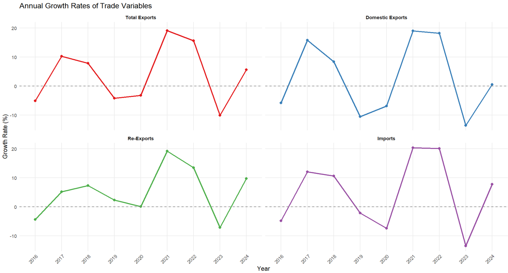

-   **Pandemic Impact (2020-2021)**: All categories saw dramatic growth spikes in 2021 (15-20%), following the minimal or negative growth in 2020 due to the pandemic.
-   **Synchronized Cycles**: The variables follow similar cycles: moderate growth (2017-2018), slowdown (2019-2020), recovery (2021), decline (2022-2023), and recovery (2024).
-   **Volatility Differences**: Domestic Exports and Imports are more volatile, with extreme swings, while Total Exports show more stability.
-   **2023 Contraction**: All variables contracted in 2023, especially Imports and Domestic Exports, likely due to the global slowdown and supply chain issues.
-   **Recovery Trends**: Positive growth returns in early 2024, with Imports and Re-Exports recovering faster than Domestic Exports.
-   **Domestic vs. Re-Export Differences**: Domestic Exports show more extreme growth and contractions, indicating greater sensitivity to economic changes than Re-Exports.

### Time Series Forecasting - Multiple Model Comparison

```{r eval=FALSE, echo=TRUE}
#| code-fold: true
#| code-summary: "Show the code"

# Time Series Forecasting - Multiple Model Comparison
cat("\nTime Series Forecasting - Multiple Model Comparison:\n")

if(require("forecast")) {
  forecast_periods <- 12
  
  # Create lists to store models and forecast results
  models_exports <- list()
  forecasts_exports <- list()
  accuracy_exports <- list()
  
  models_imports <- list()
  forecasts_imports <- list()
  accuracy_imports <- list()
  
  models_trade_balance <- list()
  forecasts_trade_balance <- list()
  accuracy_trade_balance <- list()
  
  # 1. ARIMA Models
  cat("\n1. ARIMA Models:\n")
  
  # Exports ARIMA
  models_exports$arima <- tryCatch({
    auto.arima(ts_total_exports)
  }, error = function(e) {
    cat("Exports ARIMA model error:", e$message, "\n")
    return(NULL)
  })
  
  if(!is.null(models_exports$arima)) {
    forecasts_exports$arima <- forecast(models_exports$arima, h = forecast_periods)
    cat("Exports ARIMA model summary:\n")
    print(summary(models_exports$arima))
  }
  
  # Imports ARIMA
  models_imports$arima <- tryCatch({
    auto.arima(ts_imports)
  }, error = function(e) {
    cat("Imports ARIMA model error:", e$message, "\n")
    return(NULL)
  })
  
  if(!is.null(models_imports$arima)) {
    forecasts_imports$arima <- forecast(models_imports$arima, h = forecast_periods)
    cat("Imports ARIMA model summary:\n")
    print(summary(models_imports$arima))
  }
  
  # Trade Balance ARIMA
  models_trade_balance$arima <- tryCatch({
    auto.arima(ts_trade_balance)
  }, error = function(e) {
    cat("Trade Balance ARIMA model error:", e$message, "\n")
    return(NULL)
  })
  
  if(!is.null(models_trade_balance$arima)) {
    forecasts_trade_balance$arima <- forecast(models_trade_balance$arima, h = forecast_periods)
    cat("Trade Balance ARIMA model summary:\n")
    print(summary(models_trade_balance$arima))
  }
  
  # 2. Exponential Smoothing Models (ETS)
  cat("\n2. Exponential Smoothing Models (ETS):\n")
  
  # Exports ETS
  models_exports$ets <- tryCatch({
    ets(ts_total_exports)
  }, error = function(e) {
    cat("Exports ETS model error:", e$message, "\n")
    return(NULL)
  })
  
  if(!is.null(models_exports$ets)) {
    forecasts_exports$ets <- forecast(models_exports$ets, h = forecast_periods)
    cat("Exports ETS model summary:\n")
    print(summary(models_exports$ets))
  }
  
  # Imports ETS
  models_imports$ets <- tryCatch({
    ets(ts_imports)
  }, error = function(e) {
    cat("Imports ETS model error:", e$message, "\n")
    return(NULL)
  })
  
  if(!is.null(models_imports$ets)) {
    forecasts_imports$ets <- forecast(models_imports$ets, h = forecast_periods)
    cat("Imports ETS model summary:\n")
    print(summary(models_imports$ets))
  }
  
  # Trade Balance ETS
  models_trade_balance$ets <- tryCatch({
    ets(ts_trade_balance)
  }, error = function(e) {
    cat("Trade Balance ETS model error:", e$message, "\n")
    return(NULL)
  })
  
  if(!is.null(models_trade_balance$ets)) {
    forecasts_trade_balance$ets <- forecast(models_trade_balance$ets, h = forecast_periods)
    cat("Trade Balance ETS model summary:\n")
    print(summary(models_trade_balance$ets))
  }
  
  # 3. Seasonal Naive Models
  cat("\n3. Seasonal Naive Models:\n")
  
  # Determine seasonal frequency, default is 12 (monthly data)
  freq <- frequency(ts_total_exports)
  
  # Exports SNaive
  models_exports$snaive <- "snaive" # Just a marker, not an actual model object
  forecasts_exports$snaive <- tryCatch({
    snaive(ts_total_exports, h = forecast_periods)
  }, error = function(e) {
    cat("Exports Seasonal Naive model error:", e$message, "\n")
    return(NULL)
  })
  
  # Imports SNaive
  models_imports$snaive <- "snaive"
  forecasts_imports$snaive <- tryCatch({
    snaive(ts_imports, h = forecast_periods)
  }, error = function(e) {
    cat("Imports Seasonal Naive model error:", e$message, "\n")
    return(NULL)
  })
  
  # Trade Balance SNaive
  models_trade_balance$snaive <- "snaive"
  forecasts_trade_balance$snaive <- tryCatch({
    snaive(ts_trade_balance, h = forecast_periods)
  }, error = function(e) {
    cat("Trade Balance Seasonal Naive model error:", e$message, "\n")
    return(NULL)
  })
  
  # Model Comparison
  cat("\nModel Comparison - Accuracy Assessment:\n")
  
  # Calculate training set accuracy for each model
  cat("\nExports Model Comparison:\n")
  if(length(forecasts_exports) > 0) {
    # Extract accuracy metrics for each model
    for(model_name in names(forecasts_exports)) {
      if(!is.null(forecasts_exports[[model_name]])) {
        accuracy_exports[[model_name]] <- accuracy(forecasts_exports[[model_name]])
      }
    }
    
    # Create comparison table
    accuracy_table_exports <- do.call(rbind, lapply(names(accuracy_exports), function(model) {
      data.frame(
        Model = model,
        RMSE = accuracy_exports[[model]]["Training set", "RMSE"],
        MAE = accuracy_exports[[model]]["Training set", "MAE"],
        MAPE = accuracy_exports[[model]]["Training set", "MAPE"],
        AIC = if(model == "arima") AIC(models_exports$arima) else 
              if(model == "ets") AIC(models_exports$ets) else NA,
        BIC = if(model == "arima") BIC(models_exports$arima) else 
              if(model == "ets") BIC(models_exports$ets) else NA
      )
    }))
    
    print(accuracy_table_exports)
    
    # Plot forecast comparison
    if(length(forecasts_exports) > 1) {
      # Prepare plot data
      plot_data <- ts_total_exports
      for(model_name in names(forecasts_exports)) {
        if(!is.null(forecasts_exports[[model_name]])) {
          # Add each model's forecast to the chart
          plot_data <- cbind(plot_data, forecasts_exports[[model_name]]$mean)
        }
      }
      
      # Modify column names
      colnames(plot_data) <- c("Actual", names(forecasts_exports))
      
      # Draw comparison plot
      plot(plot_data, plot.type = "single", col = 1:(1+length(forecasts_exports)),
           main = "Exports Forecast Model Comparison",
           xlab = "Time", ylab = "Exports (Million Dollars)")
      legend("topleft", colnames(plot_data), col = 1:(1+length(forecasts_exports)), lty = 1)
    }
  }
  
  # Imports Model Comparison
  cat("\nImports Model Comparison:\n")
  if(length(forecasts_imports) > 0) {
    # Extract accuracy metrics for each model
    for(model_name in names(forecasts_imports)) {
      if(!is.null(forecasts_imports[[model_name]])) {
        accuracy_imports[[model_name]] <- accuracy(forecasts_imports[[model_name]])
      }
    }
    
    # Create comparison table
    accuracy_table_imports <- do.call(rbind, lapply(names(accuracy_imports), function(model) {
      data.frame(
        Model = model,
        RMSE = accuracy_imports[[model]]["Training set", "RMSE"],
        MAE = accuracy_imports[[model]]["Training set", "MAE"],
        MAPE = accuracy_imports[[model]]["Training set", "MAPE"],
        AIC = if(model == "arima") AIC(models_imports$arima) else 
              if(model == "ets") AIC(models_imports$ets) else NA,
        BIC = if(model == "arima") BIC(models_imports$arima) else 
              if(model == "ets") BIC(models_imports$ets) else NA
      )
    }))
    
    print(accuracy_table_imports)
    
    # Plot forecast comparison
    if(length(forecasts_imports) > 1) {
      # Prepare plot data
      plot_data <- ts_imports
      for(model_name in names(forecasts_imports)) {
        if(!is.null(forecasts_imports[[model_name]])) {
          # Add each model's forecast to the chart
          plot_data <- cbind(plot_data, forecasts_imports[[model_name]]$mean)
        }
      }
      
      # Modify column names
      colnames(plot_data) <- c("Actual", names(forecasts_imports))
      
      # Draw comparison plot
      plot(plot_data, plot.type = "single", col = 1:(1+length(forecasts_imports)),
           main = "Imports Forecast Model Comparison",
           xlab = "Time", ylab = "Imports (Million Dollars)")
      legend("topleft", colnames(plot_data), col = 1:(1+length(forecasts_imports)), lty = 1)
    }
  }
  
  # Trade Balance Model Comparison
  cat("\nTrade Balance Model Comparison:\n")
  if(length(forecasts_trade_balance) > 0) {
    # Extract accuracy metrics for each model
    for(model_name in names(forecasts_trade_balance)) {
      if(!is.null(forecasts_trade_balance[[model_name]])) {
        accuracy_trade_balance[[model_name]] <- accuracy(forecasts_trade_balance[[model_name]])
      }
    }
    
    # Create comparison table
    accuracy_table_trade_balance <- do.call(rbind, lapply(names(accuracy_trade_balance), function(model) {
      data.frame(
        Model = model,
        RMSE = accuracy_trade_balance[[model]]["Training set", "RMSE"],
        MAE = accuracy_trade_balance[[model]]["Training set", "MAE"],
        MAPE = accuracy_trade_balance[[model]]["Training set", "MAPE"],
        AIC = if(model == "arima") AIC(models_trade_balance$arima) else 
              if(model == "ets") AIC(models_trade_balance$ets) else NA,
        BIC = if(model == "arima") BIC(models_trade_balance$arima) else 
              if(model == "ets") BIC(models_trade_balance$ets) else NA
      )
    }))
    
    print(accuracy_table_trade_balance)
    
    # Plot forecast comparison
    if(length(forecasts_trade_balance) > 1) {
      # Prepare plot data
      plot_data <- ts_trade_balance
      for(model_name in names(forecasts_trade_balance)) {
        if(!is.null(forecasts_trade_balance[[model_name]])) {
          # Add each model's forecast to the chart
          plot_data <- cbind(plot_data, forecasts_trade_balance[[model_name]]$mean)
        }
      }
      
      # Modify column names
      colnames(plot_data) <- c("Actual", names(forecasts_trade_balance))
      
      # Draw comparison plot
      plot(plot_data, plot.type = "single", col = 1:(1+length(forecasts_trade_balance)),
           main = "Trade Balance Forecast Model Comparison",
           xlab = "Time", ylab = "Trade Balance (Million Dollars)")
      legend("topleft", colnames(plot_data), col = 1:(1+length(forecasts_trade_balance)), lty = 1)
    }
  }
  
  # Cross-validation comparison (if data is sufficient)
  cat("\nModel Cross-Validation Comparison (Exports):\n")
  tryCatch({
    # Cross-validation for ARIMA model
    if(!is.null(models_exports$arima)) {
      cv_arima <- tsCV(ts_total_exports, function(x, h) forecast(auto.arima(x), h = h), h = 1)
      cat("ARIMA model cross-validation RMSE:", sqrt(mean(cv_arima^2, na.rm = TRUE)), "\n")
    }
    
    # Cross-validation for ETS model
    if(!is.null(models_exports$ets)) {
      cv_ets <- tsCV(ts_total_exports, function(x, h) forecast(ets(x), h = h), h = 1)
      cat("ETS model cross-validation RMSE:", sqrt(mean(cv_ets^2, na.rm = TRUE)), "\n")
    }
    
    # Cross-validation for Seasonal Naive model
    cv_snaive <- tsCV(ts_total_exports, snaive, h = 1)
    cat("Seasonal Naive model cross-validation RMSE:", sqrt(mean(cv_snaive^2, na.rm = TRUE)), "\n")
  }, error = function(e) {
    cat("Error during cross-validation process:", e$message, "\n")
  })
  
} else {
  cat("Warning: The forecast package is not installed, cannot perform time series forecasting and model comparison\n")}

```

::: panel-tabset
## Exports Forecast Model Comparison

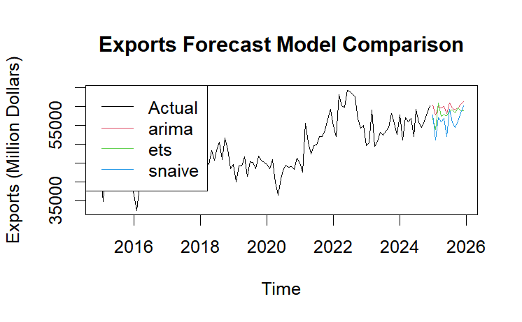

Key observations:

-   Historical export data ranges from 35,000 to 60,000 million dollars, with stability from 2016-2019, a dip in early 2020 (likely COVID-related), strong growth from mid-2020 to 2022, and stabilization in 2023-2024 (50,000-58,000 million dollars).
-   All models project continued export growth through 2026, reaching around 60,000 million dollars.
-   The ARIMA model shows steady growth with moderate seasonal variations, ETS is similar but with less volatility, and SNAIVE has more pronounced seasonal patterns.

The alignment across models suggests confidence in ongoing export growth with less volatility than during the pandemic.

## Imports Forecast Model Comparison

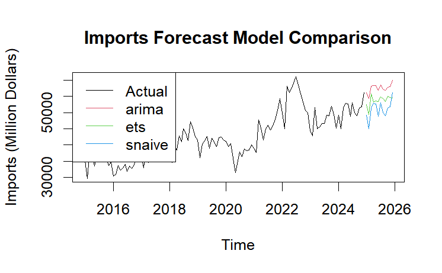

Key observations:

-   Historical imports data ranges from 30,000 to 55,000 million dollars, with stability from 2016-2019, a dip in early 2020 (COVID-related), strong growth from mid-2020 to 2022, and moderation in 2023-2024 (45,000-50,000 million dollars).
-   All models project continued growth through 2026, with differences:
    -   ARIMA forecasts steady growth to 55,000 million dollars.
    -   ETS predicts moderate growth to 52,000 million dollars.
    -   SNAIVE shows more seasonality and conservative growth.

## Trade Balance Forecast Model Comparison

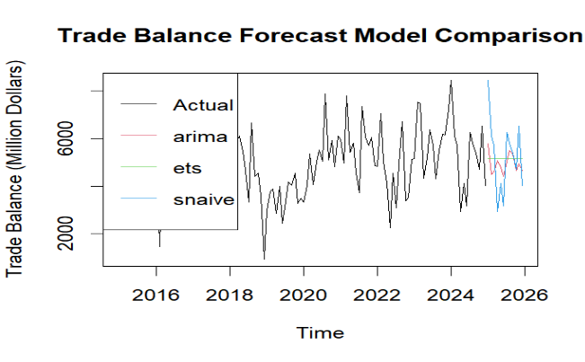

Key observations:

-   **Historical Data**: Trade Balance shows significant volatility, ranging from 1,000 to 8,500 million dollars, with a major dip in early 2018, substantial volatility from 2020-2023 due to pandemic disruptions, and a peak in late 2023/early 2024 around 8,500 million dollars.
-   **Forecasts**:
    -   SNAIVE model projects the highest volatility, reflecting recent seasonal patterns.
    -   ARIMA and ETS models show more moderate, stable forecasts.
-   **Projections**: All models predict Trade Balance will remain in the 3,000-6,500 million dollar range through 2026, with no return to the low values seen in 2018, suggesting continued trade surplus despite fluctuations.

## Key Findings - Time Series Forecasting Models Comparison

Best Models by Trade Component

-   **Exports**: ETS(M,N,A) outperforms with lower RMSE (2,545 vs 3,110) and MAPE (4.33% vs 5.03%)
-   **Imports**: ETS(M,N,A) superior with RMSE of 2,384 vs ARIMA's 2,848
-   **Trade Balance**: ARIMA(2,0,2)(1,0,1)\[12\] slightly better with RMSE of 1,214 vs 1,304

Critical Points

-   **Model Accuracy**:
    -   Exports/Imports: Strong forecasting accuracy (MAPE 4-5%)
    -   Trade Balance: Higher uncertainty (MAPE \>20%)
-   **Cross-Validation**:
    -   Both ARIMA and ETS significantly outperform Seasonal Naive
    -   ETS maintains edge over ARIMA (RMSE: 3,117 vs 3,280)
-   **Seasonal Patterns**:
    -   Significant seasonality in exports and imports
    -   Trade balance shows weaker seasonal effects
-   Practical Applications
    -   Use ETS models for individual trade components (exports/imports)
    -   Consider ARIMA for trade balance forecasting
    -   Higher confidence in exports/imports forecasts than trade balance
:::

# Conclusion

## Data Visualization Improvements

The analysis transformed three original trade visualizations with enhanced alternatives:

1.  **Trade Balance Dashboard**: Created a dual-panel visualization displaying exports vs imports by year alongside trade balance trends, revealing significant fluctuations (30% surge in 2023 followed by 11% contraction in 2024).
2.  **Trade Flow Diagram**: Replaced a simple bar chart with a Sankey-like flow visualization that revealed structural insights, particularly the dominance of Machinery & Transport Equipment (65% of both exports and imports) and critical sector imbalances.
3.  **Export Composition Treemap**: Transformed a complex Sankey diagram into a hierarchical treemap that clearly showed export concentration, with Energy Products (49.7%), Machinery and Electronics (17.1%), and Chemicals (16.5%) comprising most exports.

## Time Series Analysis Findings

1.  **COVID-19 Impact**:
    -   Significant disruption in early 2020 across all trade categories
    -   Strong post-COVID recovery (2021-2022) with steeper growth curves
    -   Permanent changes to seasonal trade patterns, particularly a strong March spike
2.  **Seasonal Patterns**:
    -   Consistent February seasonal low across all periods
    -   Post-COVID pattern shows stronger first-quarter recovery and summer activity
3.  **Growth Analysis**:
    -   All categories experienced dramatic growth spikes in 2021 (15-20%)
    -   Synchronized trade cycles with greater volatility in Domestic Exports and Imports
    -   2023 showed contraction across all variables, especially Imports and Domestic Exports
4.  **Trade Balance Trends**:
    -   Maintained positive trajectory through 2021
    -   Sharp 20% decline in 2022 suggesting significant market disruption
    -   Remarkable recovery in 2023 (+30%) indicating exceptional resilience

## Forecasting Models

Multiple models (ARIMA, ETS, Seasonal Naive) were compared, with key findings:

1.  **Model Performance**:
    -   ETS models outperformed for exports and imports (MAPE 4-5%)
    -   ARIMA slightly better for trade balance forecasting
    -   Higher uncertainty in trade balance predictions (MAPE \>20%)
2.  **Future Projections**:
    -   All models predict continued export growth through 2026
    -   Trade Balance expected to remain in the 3,000-6,500 million dollar range
    -   No return to the low trade balance values seen in 2018

The analysis demonstrates Singapore's resilient trade position despite recent volatility, with a highly specialized export economy vulnerable to disruptions in specific sectors.
