## 1. Introduction

This document presents a Multiple Linear Regression (MLR) analysis of property prices, examining various factors that influence real estate values. The analysis aims to identify key determinants of property prices and develop a predictive model.

```{r setup, echo=TRUE, eval=FALSE}
#| code-fold: true
#| code-summary: "Load required packages"

# Core packages
library(shiny)       # Shiny application framework
library(shinydashboard) # Dashboard interface
library(DT)          # Interactive data tables
library(ggplot2)     # Data visualization
library(dplyr)       # Data manipulation
library(tidyr)       # Data tidying
library(corrplot)    # Correlation matrix visualization
library(car)         # VIF calculation and regression diagnostics
library(GGally)      # Scatterplot matrices
library(MASS)        # Various statistical functions including BoxCox transformation
library(scales)      # Scale tools for improved visualization
library(plotly)      # Interactive charts
library(RColorBrewer) # Color schemes
library(readxl)      # Read Excel files
```

```{r load_data, echo=TRUE, eval=FALSE}
#| code-fold: true
#| code-summary: "Load dataset"

Property_data <- read_excel("data/Property_Price_and_Green_Index.xlsx")

glimpse(Property_data)
```

## 2. Data Preprocessing

The dataset requires preprocessing to ensure it's suitable for regression analysis, including handling missing values, converting categorical variables, and examining distributions.

```{r preprocessing, echo=TRUE, eval=FALSE}
#| code-fold: true
#| code-summary: "Data preprocessing functions"

# Data preprocessing function
preprocess_data <- function(data) {
  # Create a copy to avoid modifying the original
  df <- data %>% as.data.frame()
  
  # Convert season variables to factors
  df <- df %>%
    mutate(
      Spring = as.factor(Spring),
      Fall = as.factor(Fall),
      Winter = as.factor(Winter),
      Heating = as.factor(Heating),
      `Top Univ.` = as.factor(`Top Univ.`)
    )
  
  # Check for missing values
  missing_summary <- colSums(is.na(df))
  
  # Handle missing values if any
  if(any(missing_summary > 0)) {
    # Fill numeric variables with median
    for(col in names(df)) {
      if(is.numeric(df[[col]]) && sum(is.na(df[[col]])) > 0) {
        df[[col]][is.na(df[[col]])] <- median(df[[col]], na.rm = TRUE)
      }
    }
  }
  
  return(list(
    data = df,
    missing_summary = missing_summary
  ))
}

# Function to create a visualization sample for faster plotting
create_viz_sample <- function(data, n = 10000) {
  if(nrow(data) > n) {
    return(data[sample(nrow(data), n), ])
  } else {
    return(data)
  }
}

# Assuming Property_data is already loaded
# Process the data (using full dataset)
processed <- preprocess_data(Property_data)
data <- processed$data

# Create visualization sample
viz_data <- create_viz_sample(data)

# Display missing values summary
cat("Missing values summary:\n")
if(sum(processed$missing_summary) == 0) {
  cat("No missing values in the dataset.\n")
} else {
  print(processed$missing_summary[processed$missing_summary > 0])
}

# Basic data summary (based on full dataset)
cat("\nData summary (full dataset):\n")
summary(data)
```

## 3. Exploratory Data Analysis

Before building the model, we need to explore the distributions of key variables and identify potential issues.

```{r missing_values_plot, echo=TRUE, eval=FALSE}
#| code-fold: true
#| code-summary: "Missing values visualization"

# Plot missing values visualization
missing_plot <- function(data) {
  missing_data <- data.frame(
    variable = names(data),
    count = colSums(is.na(data)),
    percent = colSums(is.na(data)) / nrow(data) * 100
  )
  
  ggplot(missing_data, aes(x = reorder(variable, -percent), y = percent)) +
    geom_bar(stat = "identity", fill = "steelblue") +
    geom_text(aes(label = sprintf("%.1f%%", percent)), 
              vjust = -0.5, size = 3) +
    theme_minimal() +
    labs(title = "Missing Values by Variable",
         x = "Variables",
         y = "Percentage (%)") +
    theme(axis.text.x = element_text(angle = 45, hjust = 1))
}

# Generate and display missing values plot (if any)
if(sum(processed$missing_summary) > 0) {
  missing_viz <- missing_plot(Property_data)  # Using full dataset for accurate percentages
  print(missing_viz)
}
```

```{r distribution_plots, echo=TRUE, eval=FALSE}
#| code-fold: true
#| code-summary: "Variable distribution analysis"

# Function to visualize variable distributions
plot_distribution <- function(data, variable, full_data = NULL) {
  var_data <- data[[variable]]
  
  # Calculate statistics from full dataset if provided
  if(!is.null(full_data)) {
    full_var_data <- full_data[[variable]]
    mean_val <- mean(full_var_data, na.rm = TRUE)
    median_val <- median(full_var_data, na.rm = TRUE)
    skew_val <- skewness(full_var_data, na.rm = TRUE)
    kurt_val <- kurtosis(full_var_data, na.rm = TRUE)
  } else {
    mean_val <- mean(var_data, na.rm = TRUE)
    median_val <- median(var_data, na.rm = TRUE)
    skew_val <- skewness(var_data, na.rm = TRUE)
    kurt_val <- kurtosis(var_data, na.rm = TRUE)
  }
  
  # Create histogram with density curve
  ggplot(data.frame(value = var_data), aes(x = value)) +
    geom_histogram(aes(y = ..density..), bins = 30, fill = "lightblue", color = "darkblue", alpha = 0.7) +
    geom_density(color = "red", linewidth = 1) +
    geom_vline(xintercept = mean_val, color = "darkgreen", linetype = "dashed", linewidth = 1) +
    geom_vline(xintercept = median_val, color = "purple", linetype = "dashed", linewidth = 1) +
    theme_minimal() +
    labs(title = paste("Distribution of", variable),
         subtitle = paste("Skewness:", round(skew_val, 2), "| Kurtosis:", round(kurt_val, 2)),
         x = variable,
         y = "Density",
         caption = paste("Mean (green):", round(mean_val, 2), "| Median (purple):", round(median_val, 2),
                         ifelse(!is.null(full_data), "\nStatistics calculated on full dataset", "")))
}

# Visualize the distribution of target variable (Property Prices)
price_dist <- plot_distribution(viz_data, "Property Prices", full_data = data)
print(price_dist)

# Visualize distributions of numeric variables
numeric_vars <- names(data)[sapply(data, is.numeric)]
for(var in numeric_vars[1:5]) {  # Show first 5 variables as example
  dist_plot <- plot_distribution(viz_data, var, full_data = data)
  print(dist_plot)
}
```

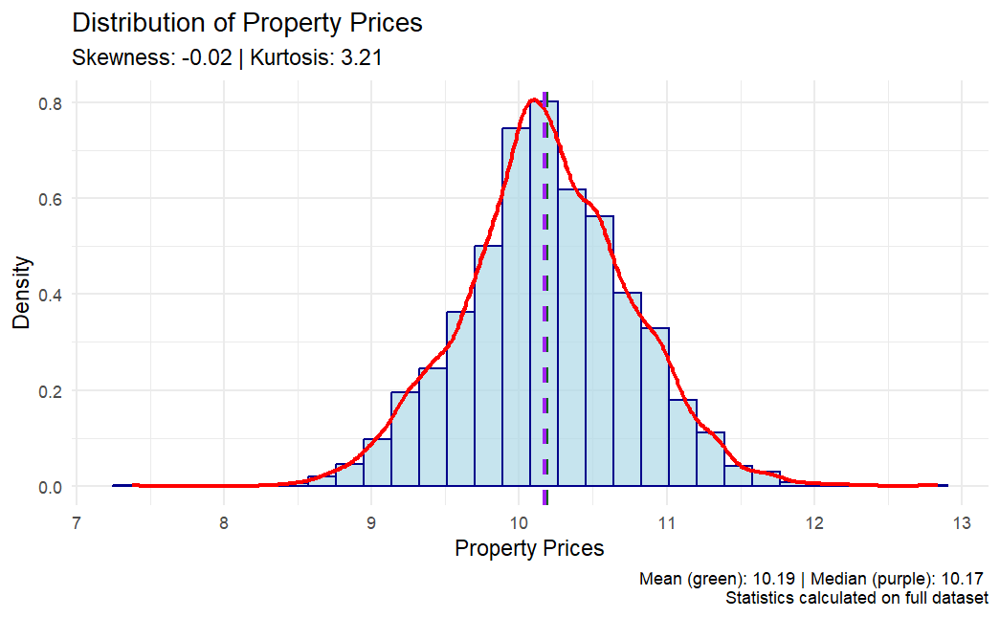

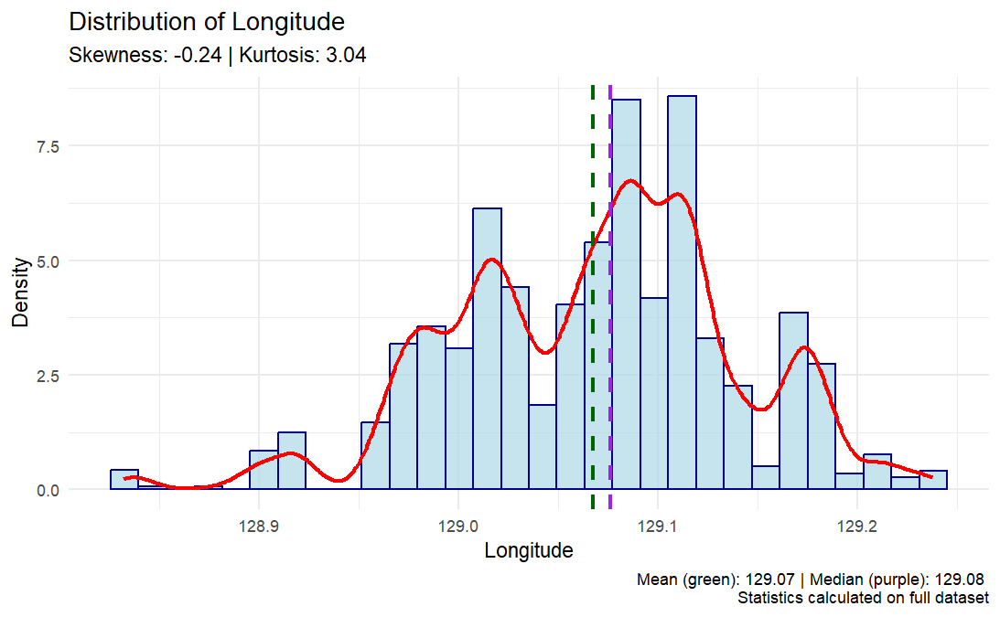

## 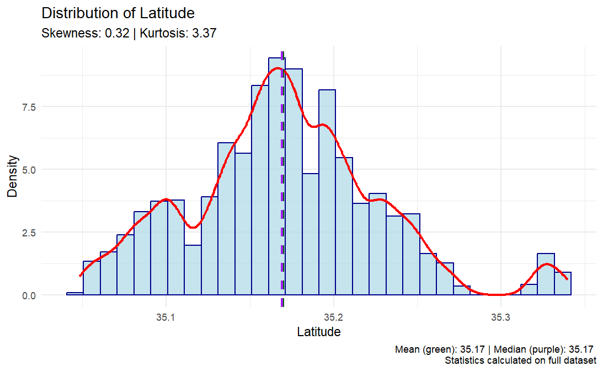

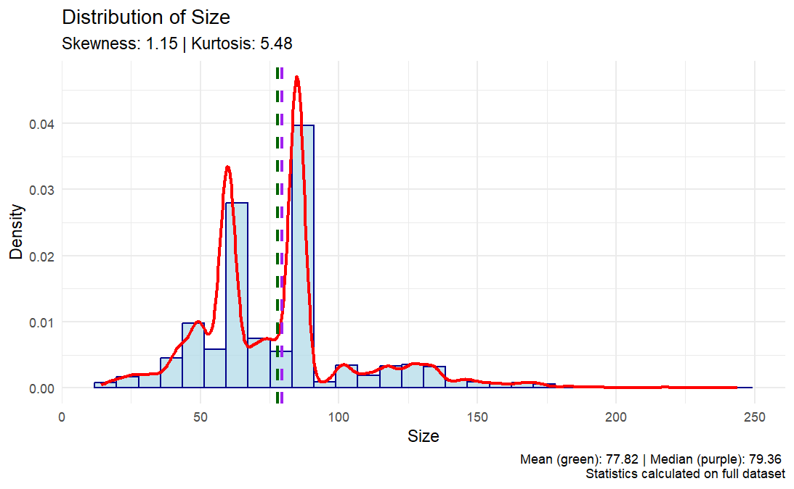

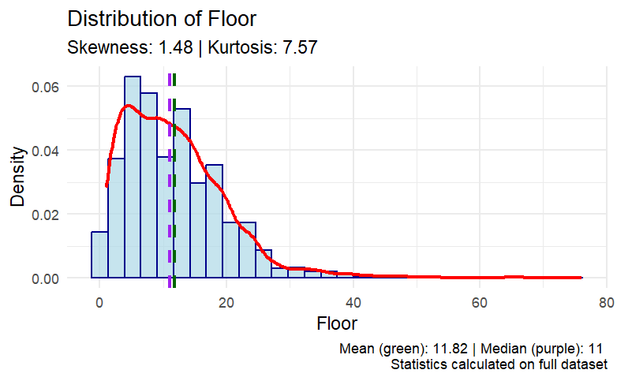

## 4. Variable Transformation

Property prices typically follow a right-skewed distribution. Transforming the target variable can improve model performance by creating more linear relationships with predictors.

```{r transform_variables, echo=TRUE, eval=FALSE}
#| code-fold: true
#| code-summary: "Target variable transformation"

# Simplified transform_variable function without complex Box-Cox
transform_variable <- function(data, variable, method) {
  # Get the data
  var_data <- data[[variable]]
  
  if(method == "log") {
    # Log transformation
    if(min(var_data, na.rm = TRUE) <= 0) {
      const <- abs(min(var_data, na.rm = TRUE)) + 1
      transformed <- log(var_data + const)
      name <- paste0("log(", variable, " + ", const, ")")
    } else {
      transformed <- log(var_data)
      name <- paste0("log(", variable, ")")
    }
  } else if(method == "sqrt") {
    # Square root transformation
    if(min(var_data, na.rm = TRUE) < 0) {
      const <- abs(min(var_data, na.rm = TRUE)) + 1
      transformed <- sqrt(var_data + const)
      name <- paste0("sqrt(", variable, " + ", const, ")")
    } else {
      transformed <- sqrt(var_data)
      name <- paste0("sqrt(", variable, ")")
    }
  } else if(method == "boxcox") {
    # Simple Box-Cox approximation
    if(min(var_data, na.rm = TRUE) <= 0) {
      # Handle non-positive values
      const <- abs(min(var_data, na.rm = TRUE)) + 1
      temp_data <- var_data + const
      
      # Use simple log as Box-Cox approximation
      transformed <- log(temp_data)
      name <- paste0("log(", variable, " + ", const, ")")
    } else {
      # Use log as simplified Box-Cox
      transformed <- log(var_data)
      name <- paste0("log(", variable, ")")
    }
  } else {
    # No transformation
    transformed <- var_data
    name <- variable
  }
  
  return(list(
    transformed = transformed,
    name = name,
    original = var_data
  ))
}

# Calculate transformations on full dataset
cat("\nCalculating transformations on full dataset...\n")
transformations <- c("original", "log", "sqrt", "boxcox")
price_transforms <- lapply(transformations, function(method) {
  if(method == "original") {
    return(list(
      transformed = data$`Property Prices`,
      name = "Original",
      original = data$`Property Prices`
    ))
  } else {
    return(transform_variable(data, "Property Prices", method))
  }
})

# Create sample transforms for visualization
viz_transforms <- list()
for(i in seq_along(price_transforms)) {
  # Get sample of original and transformed values for visualization
  idx <- sample(length(price_transforms[[i]]$original), 
                min(10000, length(price_transforms[[i]]$original)))
  
  viz_transforms[[i]] <- list(
    transformed = price_transforms[[i]]$transformed[idx],
    name = price_transforms[[i]]$name,
    original = price_transforms[[i]]$original[idx]
  )
}

# Combine transformations into a data frame for plotting
transform_df <- data.frame(
  original = viz_transforms[[1]]$original
)

for(i in seq_along(viz_transforms)) {
  transform_df[[viz_transforms[[i]]$name]] <- viz_transforms[[i]]$transformed
}

# Create comparison plots
transform_long <- reshape2::melt(transform_df, id.vars = NULL)

ggplot(transform_long, aes(x = value, fill = variable)) +
  geom_density(alpha = 0.5) +
  facet_wrap(~ variable, scales = "free") +
  theme_minimal() +
  labs(title = "Comparison of Transformations for Property Prices",
       subtitle = "Based on sample data, transformations calculated on full dataset",
       x = "Value", y = "Density", fill = "Transformation")

# Apply the best transformation (log in this case) to Property Prices
cat("\nApplying log transformation to full dataset...\n")
data$LogPrice <- transform_variable(data, "Property Prices", "log")$transformed

# Compare the original and transformed distributions using sample
viz_compare <- data.frame(
  value = c(viz_data$`Property Prices`, 
            transform_variable(viz_data, "Property Prices", "log")$transformed),
  type = factor(rep(c("Original", "Log-transformed"), each = nrow(viz_data)))
)

ggplot(viz_compare, aes(x = value, fill = type)) +
  geom_density(alpha = 0.5) +
  facet_wrap(~ type, scales = "free") +
  theme_minimal() +
  labs(title = "Original vs. Log-transformed Property Prices",
       subtitle = "Sample visualization, transformation parameters from full dataset",
       x = "Value", y = "Density", fill = "")

cat("\nData preparation complete. Full dataset has", nrow(data), "rows and", ncol(data), "columns.\n")
cat("Log-transformed target variable added as 'LogPrice'.\n")
```

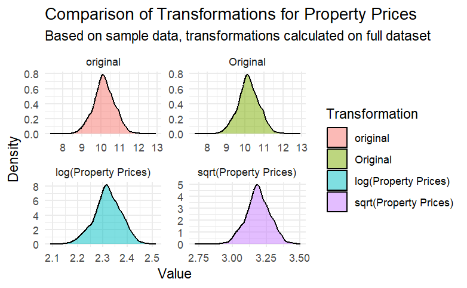

## 5. MLR Pre-Check Functions

Before building the regression model, several checks are necessary to ensure valid analysis, including multicollinearity assessment, outlier detection, and linearity verification.

```{r mlr_precheck_setup, echo=TRUE, eval=FALSE}
#| code-fold: true
#| code-summary: "MLR pre-check setup"

# Load required packages for MLR pre-checks
library(dplyr)
library(ggplot2)
library(corrplot)
library(car)
library(GGally)
library(gridExtra)
library(nortest)

# Function to create a visualization sample for faster plotting
create_viz_sample <- function(data, n = 10000) {
  if(nrow(data) > n) {
    return(data[sample(nrow(data), n), ])
  } else {
    return(data)
  }
}

# Create visualization sample 
viz_data <- create_viz_sample(data)

cat("Starting MLR pre-check analysis...\n")
cat("Full dataset has", nrow(data), "rows and", ncol(data), "columns.\n")
cat("Visualization sample has", nrow(viz_data), "rows.\n")
```

### 5.1 Multicollinearity Check

```{r multicollinearity_check, echo=TRUE, eval=FALSE}
#| code-fold: true
#| code-summary: "Multicollinearity check functions"

# Function to check multicollinearity
check_multicollinearity <- function(data, threshold = 0.7) {
  cat("Calculating correlation matrix on full dataset...\n")
  
  # Select only numeric variables
  numeric_data <- data %>% select_if(is.numeric)
  
  # Calculate correlation matrix
  cor_matrix <- cor(numeric_data, use = "pairwise.complete.obs")
  
  # Find highly correlated variables
  high_cor <- which(abs(cor_matrix) > threshold & abs(cor_matrix) < 1, arr.ind = TRUE)
  high_cor_pairs <- data.frame(
    var1 = rownames(cor_matrix)[high_cor[,1]],
    var2 = colnames(cor_matrix)[high_cor[,2]],
    correlation = cor_matrix[high_cor]
  )
  
  # Sort by absolute correlation value
  high_cor_pairs$abs_corr <- abs(high_cor_pairs$correlation)
  high_cor_pairs <- high_cor_pairs[order(-high_cor_pairs$abs_corr), ]
  high_cor_pairs$abs_corr <- NULL
  
  cat("Correlation analysis complete.\n")
  
  return(list(
    correlation_matrix = cor_matrix,
    high_correlation_pairs = high_cor_pairs
  ))
}

# Plot correlation matrix
plot_correlation_matrix <- function(cor_matrix) {
  cat("Generating correlation plot...\n")
  corrplot(cor_matrix, method = "color", 
           type = "upper", 
           tl.col = "black",
           tl.srt = 45,
           addCoef.col = "black",
           number.cex = 0.7,
           diag = FALSE,
           col = colorRampPalette(c("#6D9EC1", "white", "#E46726"))(200),
           title = "Correlation Matrix of Numeric Variables")
  cat("Correlation plot generated.\n")
}
```

### 5.2 VIF Analysis

```{r vif_analysis, echo=TRUE, eval=FALSE}
#| code-fold: true
#| code-summary: "VIF analysis functions"

# Function to calculate VIF
calculate_vif <- function(formula, data) {
  cat("Calculating VIF values using full dataset...\n")
  model <- lm(formula, data = data)
  vif_values <- car::vif(model)
  
  vif_df <- data.frame(
    Variable = names(vif_values),
    VIF = as.numeric(vif_values)
  )
  
  cat("VIF calculation complete.\n")
  return(vif_df)
}

# Plot VIF values
plot_vif <- function(vif_df, threshold = 5) {
  cat("Generating VIF plot...\n")
  p <- ggplot(vif_df, aes(x = reorder(Variable, VIF), y = VIF)) +
    geom_bar(stat = "identity", fill = ifelse(vif_df$VIF > threshold, "red", "steelblue")) +
    geom_hline(yintercept = threshold, linetype = "dashed", color = "red") +
    geom_text(aes(label = sprintf("%.2f", VIF)), hjust = -0.1) +
    coord_flip() +
    theme_minimal() +
    labs(title = "Variance Inflation Factors",
         subtitle = paste("Values above", threshold, "indicate potential multicollinearity"),
         x = "Variables", y = "VIF")
  cat("VIF plot generated.\n")
  return(p)
}
```

### 5.3 Outlier Detection

```{r outlier_detection, echo=TRUE, eval=FALSE}
#| code-fold: true
#| code-summary: "Outlier detection functions"

# Function to check for outliers
check_outliers <- function(data) {
  cat("Detecting outliers on full dataset...\n")
  # Select only numeric variables
  numeric_data <- data %>% select_if(is.numeric)
  
  # Use IQR method to detect outliers
  outliers_summary <- sapply(numeric_data, function(x) {
    q1 <- quantile(x, 0.25, na.rm = TRUE)
    q3 <- quantile(x, 0.75, na.rm = TRUE)
    iqr <- q3 - q1
    lower_bound <- q1 - 1.5 * iqr
    upper_bound <- q3 + 1.5 * iqr
    sum(x < lower_bound | x > upper_bound, na.rm = TRUE)
  })
  
  result <- data.frame(
    variable = names(outliers_summary),
    outlier_count = outliers_summary,
    percentage = (outliers_summary / nrow(data)) * 100
  )
  cat("Outlier detection complete.\n")
  return(result)
}

# Create boxplot for a variable
create_boxplot <- function(data, variable) {
  cat("Creating boxplot for", variable, "...\n")
  p <- ggplot(data, aes(y = .data[[variable]])) +
    geom_boxplot(fill = "lightblue", outlier.color = "red", outlier.size = 3) +
    theme_minimal() +
    labs(title = paste("Box Plot of", variable),
         subtitle = "Red points indicate potential outliers",
         x = "",
         y = variable)
  return(p)
}
```

### 5.4 Linearity Check

```{r linearity_check, echo=TRUE, eval=FALSE}
#| code-fold: true
#| code-summary: "Linearity check function"

# Function to check linearity assumptions with scatter plots
check_linearity <- function(data, dependent_var, independent_vars) {
  plots <- list()
  
  # Remove backticks if present for display purposes
  display_dep_var <- gsub("`", "", dependent_var)
  
  for(var in independent_vars) {
    cat("Checking linearity for", display_dep_var, "vs", gsub("`", "", var), "...\n")
    # Handle variable names with spaces properly
    y_var <- if(grepl(" ", dependent_var) && !grepl("`", dependent_var)) paste0("`", dependent_var, "`") else dependent_var
    x_var <- if(grepl(" ", var) && !grepl("`", var)) paste0("`", var, "`") else var
    
    p <- ggplot(data, aes_string(x = x_var, y = y_var)) +
      geom_point(alpha = 0.3) +
      geom_smooth(method = "loess", color = "red") +
      geom_smooth(method = "lm", color = "blue") +
      theme_minimal() +
      labs(title = paste("Relationship between", display_dep_var, "and", gsub("`", "", var)),
           subtitle = "Blue = linear fit, Red = loess smoothing")
    
    plots[[var]] <- p
  }
  
  cat("Linearity checks complete.\n")
  return(plots)
}
```

## 6. MLR Analysis Execution

### 6.1 Correlation Analysis

```{r correlation_analysis, echo=TRUE, eval=FALSE}
#| code-fold: true
#| code-summary: "Correlation analysis execution"

# 1. CORRELATION ANALYSIS
cat("\n--- CORRELATION ANALYSIS ---\n")
mc_result <- check_multicollinearity(data)

# Display correlation matrix
plot_correlation_matrix(mc_result$correlation_matrix)

# Display highly correlated variable pairs
cat("\nHighly correlated variable pairs (|r| > 0.7):\n")
if(nrow(mc_result$high_correlation_pairs) == 0) {
  cat("No highly correlated variable pairs found.\n")
} else {
  print(mc_result$high_correlation_pairs)
}
```

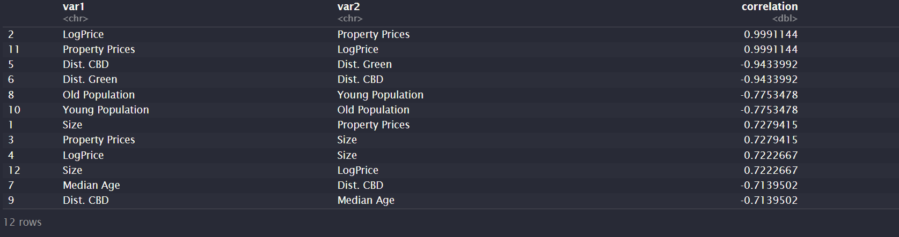

### 6.2 VIF Analysis

```{r vif_analysis_execution, echo=TRUE, eval=FALSE}
#| code-fold: true
#| code-summary: "VIF analysis execution"

# 2. VIF ANALYSIS
cat("\n--- VIF ANALYSIS ---\n")
# Define formula for initial model - use LogPrice if available, otherwise use Property Prices
target_var <- if("LogPrice" %in% names(data)) "LogPrice" else "`Property Prices`"
cat("Using", target_var, "as the target variable\n")

# Define formula for initial model
initial_formula <- as.formula(paste(target_var, "~ Size + Floor + `Highest floor` + 
                             Units + Parking + Year + `Dist. Subway` + 
                             `Dist. CBD` + `Pop. Density` + `Higher Degree`"))

# Calculate and plot VIF
vif_result <- calculate_vif(initial_formula, data)
cat("\nVIF Results:\n")
print(vif_result)
vif_plot <- plot_vif(vif_result)
print(vif_plot)
```

```{r high_vif_analysis, echo=TRUE, eval=FALSE}
#| code-fold: true
#| code-summary: "High VIF analysis (optional)"

# Identify variables with high VIF for potentially removing
high_vif_vars <- vif_result$Variable[vif_result$VIF > 5]
if(length(high_vif_vars) > 0) {
  cat("\nVariables with high VIF (>5):", paste(high_vif_vars, collapse=", "), "\n")
  cat("Consider removing these variables to reduce multicollinearity.\n")
  
  # Example of creating a reduced model formula without the highest VIF variable
  if(length(high_vif_vars) > 0) {
    highest_vif_var <- vif_result$Variable[which.max(vif_result$VIF)]
    cat("\nCreating a reduced model by removing", highest_vif_var, "...\n")
    
    reduced_formula <- as.formula(paste(target_var, "~", 
                                      paste(setdiff(vif_result$Variable, highest_vif_var), 
                                            collapse = " + ")))
    
    reduced_vif <- calculate_vif(reduced_formula, data)
    cat("\nVIF Results after removing", highest_vif_var, ":\n")
    print(reduced_vif)
    reduced_vif_plot <- plot_vif(reduced_vif)
    print(reduced_vif_plot)
  }
}
```

### 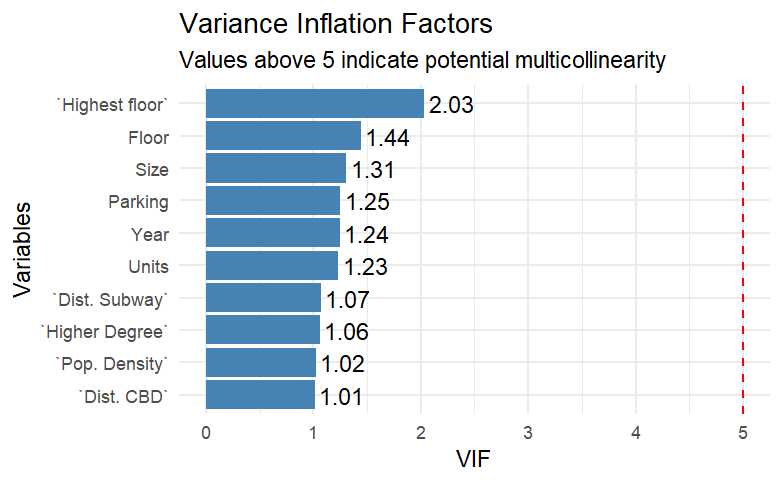

### 6.3 Outlier Detection

```{r outlier_detection_execution, echo=TRUE, eval=FALSE}
#| code-fold: true
#| code-summary: "Outlier detection execution"

# 3. OUTLIER DETECTION
cat("\n--- OUTLIER DETECTION ---\n")
outliers <- check_outliers(data)
cat("\nOutlier Detection Summary (sorted by count):\n")
print(outliers[order(-outliers$outlier_count), ])

# Create boxplots for key variables using sample data
cat("\nGenerating boxplots for key variables...\n")
key_vars <- c("Property Prices", "Size", "Floor", "Units", "Dist. Subway")
if("LogPrice" %in% names(data)) {
  key_vars <- c(key_vars, "LogPrice")
}

boxplots <- list()
for(var in key_vars) {
  boxplots[[var]] <- create_boxplot(viz_data, var)
  print(boxplots[[var]])
}
```

### 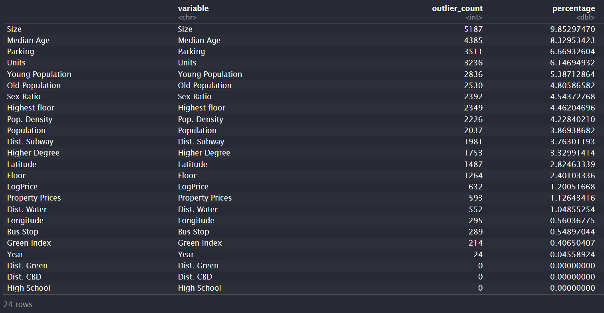

### 6.4 Linearity Checks

```{r linearity_checks_original, echo=TRUE, eval=FALSE}
#| code-fold: true
#| code-summary: "Linearity checks - original variables"

# 4. LINEARITY CHECKS
cat("\n--- LINEARITY CHECKS ---\n")
# Check linearity for key variables using sample data
indep_vars <- c("Size", "Floor", "Year", "Dist. Subway", "Dist. CBD")

cat("\nChecking linearity with original Property Prices...\n")
linearity_original <- check_linearity(viz_data, "Property Prices", indep_vars)
for(i in seq_along(linearity_original)) {
  print(linearity_original[[i]])
}
```

```{r linearity_checks_log, echo=TRUE, eval=FALSE}
#| code-fold: true
#| code-summary: "Linearity checks - log-transformed variables"

# Linearity checks with log-transformed target
if("LogPrice" %in% names(data)) {
  cat("\nChecking linearity with log-transformed Property Prices (LogPrice)...\n")
  linearity_log <- check_linearity(viz_data, "LogPrice", indep_vars)
  for(i in seq_along(linearity_log)) {
    print(linearity_log[[i]])
  }
  
  # Compare linear fit of original vs transformed
  cat("\nComparing linearity improvement with log transformation...\n")
  for(i in seq_along(indep_vars)) {
    var <- indep_vars[i]
    var_display <- gsub("`", "", var)
    p1 <- linearity_original[[i]] + ggtitle(paste("Original:", var_display, "vs Property Prices"))
    p2 <- linearity_log[[i]] + ggtitle(paste("Log-transformed:", var_display, "vs LogPrice"))
    comparison <- gridExtra::grid.arrange(p1, p2, ncol = 2)
    print(comparison)
  }
}
```

```{r scatterplot_matrix, echo=TRUE, eval=FALSE}
#| code-fold: true
#| code-summary: "Scatterplot matrix"

# 5. SCATTERPLOT MATRIX (using sample data)
cat("\n--- SCATTERPLOT MATRIX ---\n")
cat("Creating scatterplot matrix (this may take a while)...\n")
key_vars_for_pairs <- c("Property Prices", "Size", "Floor", "Dist. Subway", "Pop. Density")
if("LogPrice" %in% names(viz_data)) {
  key_vars_for_pairs[1] <- "LogPrice"  # Replace Property Prices with LogPrice if available
}
pairs_plot <- GGally::ggpairs(viz_data[, key_vars_for_pairs])
print(pairs_plot)

cat("\nMLR pre-check analysis complete!\n")
```

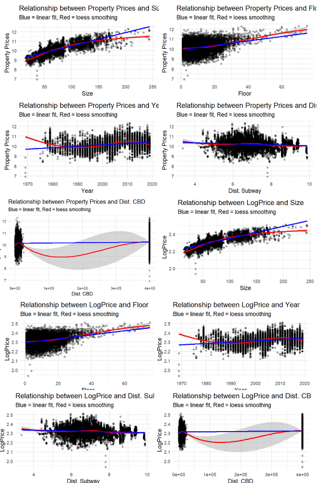

## 7. Final Model Fitting

Based on the pre-check analysis, a final model is developed with carefully selected variables.

```{r final_model, echo=TRUE, eval=FALSE}
#| code-fold: true
#| code-summary: "Final model fitting"

# 7. RECOMMENDED FINAL MODEL
cat("\n--- RECOMMENDED FINAL MODEL ---\n")
# Based on analysis, suggest a final model
if("LogPrice" %in% names(data)) {
  # Create a final model including significant predictors
  model_formula <- paste("LogPrice ~ Size + Floor + Units + Parking + Year +",
                        "`Dist. Subway` + `Dist. CBD` + `Pop. Density` +",
                        "`Higher Degree` + Spring + Fall + Winter")
  
  cat("Recommended model formula based on analysis:\n")
  cat(model_formula, "\n\n")
  
  # Fit the final model
  cat("Fitting final model...\n")
  final_model <- lm(as.formula(model_formula), data = data)
  
  # Display model summary
  cat("\nFinal Model Summary:\n")
  print(summary(final_model))
  
  # Calculate adjusted R-squared
  cat("\nAdjusted R-squared:", summary(final_model)$adj.r.squared, "\n")
  
  # Display ANOVA table
  cat("\nANOVA Table:\n")
  print(anova(final_model))
} else {
  cat("No log-transformed target variable (LogPrice) found. Consider creating one before fitting the final model.\n")
}
```

## 8. Model Diagnostics

Diagnostic checks ensure that the model meets regression assumptions.

```{r residual_plots, echo=TRUE, eval=FALSE}
#| code-fold: true
#| code-summary: "Residual plots"

# Check residuals
cat("\n--- FINAL MODEL DIAGNOSTICS ---\n")

# Create residual plots
cat("Generating residual plots...\n")

# Setting a larger plotting area with smaller margins before creating plots
par(mfrow = c(2, 2), mar = c(4, 4, 2, 1))  # Reduce margins
plot(final_model)

# Reset plotting parameters
par(mfrow = c(1, 1), mar = c(5, 4, 4, 2) + 0.1)  # Reset to default margins
```

```{r diagnostic_tests, echo=TRUE, eval=FALSE}
#| code-fold: true
#| code-summary: "Statistical diagnostic tests"

# Shapiro-Wilk test on a sample of residuals (since dataset is large)
residuals_sample <- sample(residuals(final_model), min(5000, length(residuals(final_model))))
sw_test <- shapiro.test(residuals_sample)
cat("\nShapiro-Wilk normality test on residuals (sample):\n")
print(sw_test)

# Check for heteroscedasticity with Breusch-Pagan test
cat("\nBreusch-Pagan test for heteroscedasticity:\n")
bp_test <- car::ncvTest(final_model)
print(bp_test)
```

## 9. Variable Importance Analysis

```{r variable_importance, echo=TRUE, eval=FALSE}
#| code-fold: true
#| code-summary: "Variable importance analysis"

# Load the lm.beta package for standardized coefficients
if(!require(lm.beta)) install.packages("lm.beta")
library(lm.beta)

# Variable importance
cat("\nVariable Importance (standardized coefficients):\n")
std_coef <- lm.beta::lm.beta(final_model)
print(std_coef)

# Plot variable importance
coef_df <- data.frame(
  Variable = names(std_coef$standardized.coefficients),
  Importance = abs(std_coef$standardized.coefficients)
)
coef_df <- coef_df[-1, ]  # Remove intercept

importance_plot <- ggplot(coef_df, aes(x = reorder(Variable, Importance), y = Importance)) +
  geom_bar(stat = "identity", fill = "steelblue") +
  coord_flip() +
  theme_minimal() +
  labs(title = "Variable Importance in Final Model",
       subtitle = "Based on standardized coefficients",
       x = "Variables",
       y = "Absolute Standardized Coefficient")

print(importance_plot)
```

## 10. Model Prediction Accuracy

```{r prediction_accuracy, echo=TRUE, eval=FALSE}
#| code-fold: true
#| code-summary: "Prediction accuracy assessment"

# Prediction accuracy assessment using 10% of data
cat("\nAssessing prediction accuracy on random sample...\n")
set.seed(123)  # For reproducibility
sample_indices <- sample(nrow(data), nrow(data) * 0.1)
test_data <- data[sample_indices, ]
predicted_values <- predict(final_model, newdata = test_data)

# Calculate RMSE and MAE
rmse <- sqrt(mean((test_data$LogPrice - predicted_values)^2))
mae <- mean(abs(test_data$LogPrice - predicted_values))

cat("Root Mean Square Error (RMSE):", rmse, "\n")
cat("Mean Absolute Error (MAE):", mae, "\n")

# Convert back to original scale for interpretation
rmse_original <- mean((exp(test_data$LogPrice) - exp(predicted_values))^2)
mae_original <- mean(abs(exp(test_data$LogPrice) - exp(predicted_values)))

cat("Mean Squared Error on original scale:", rmse_original, "\n")
cat("Mean Absolute Error on original scale:", mae_original, "\n")
```

```{r prediction_plot, echo=TRUE, eval=FALSE}
#| code-fold: true
#| code-summary: "Prediction plot"

# Prediction plot
prediction_df <- data.frame(
  Actual = test_data$LogPrice,
  Predicted = predicted_values
)

prediction_plot <- ggplot(prediction_df, aes(x = Actual, y = Predicted)) +
  geom_point(alpha = 0.3) +
  geom_abline(intercept = 0, slope = 1, color = "red", linetype = "dashed") +
  theme_minimal() +
  labs(title = "Actual vs. Predicted Values",
       subtitle = "Red line indicates perfect prediction",
       x = "Actual LogPrice",
       y = "Predicted LogPrice")

print(prediction_plot)
```

## 11. Final Model Equation and Conclusion

```{r final_equation, echo=TRUE, eval=FALSE}
#| code-fold: true
#| code-summary: "Final model equation"

# Final model equation
cat("\nFinal MLR Model Equation:\n")
coef_values <- coef(final_model)
equation <- paste("LogPrice =", round(coef_values[1], 4))

for (i in 2:length(coef_values)) {
  var_name <- names(coef_values)[i]
  coef_value <- coef_values[i]
  
  if (coef_value >= 0) {
    equation <- paste(equation, "+", round(coef_value, 4), "*", var_name)
  } else {
    equation <- paste(equation, round(coef_value, 4), "*", var_name)
  }
}

cat(equation, "\n")
cat("\nMLR analysis complete!\n")
```

## 12. Shiny Dashboard UI Design

Based on the provided screenshots, the Shiny Dashboard application has been designed with the following components:

### 12.1 Overall Layout

-   Header with "Property Price" title and menu toggle
-   Green themed sidebar for MLR model building
-   Main panel with tabbed interface for different analysis aspects

### 12.2 Sidebar Components

-   **MLR Model Builder** section
-   Variable selection panels organized by categories:
    -   Property Characteristics (Size, Floor, Units, Parking, Year)
    -   Location Variables (Dist. Subway, Dist. CBD, Pop. Density)
    -   Demographic Variables (Higher Degree)
    -   Seasonal Variables (Spring, Fall, Winter)
-   Model Settings section with:
    -   VIF Threshold slider (default set to 5)
    -   Target Variable Transformation radio buttons (Original, Log Transform, Square Root)
-   Action buttons:
    -   "Run MLR Analysis" button
    -   "Use Recommended Model" button

### 12.3 Main Panel Tabs

-   **Model Summary**: Displays regression equation, coefficients table, and model fit statistics
-   **Variable Importance**: Shows standardized coefficients in a bar chart format
-   **Multicollinearity**: Presents correlation matrix and VIF analysis
-   **Model Diagnostics**: Shows residual plots and diagnostic test results

### 12.4 Visualization Components

1.  **Model Diagnostics Tab**:
    -   Residuals vs Fitted plot showing model fit
    -   Normal Q-Q plot for assessing normality
    -   Scale-Location plot for checking homoscedasticity
    -   Residuals histogram
    -   Diagnostic test results for normality and heteroscedasticity
    -   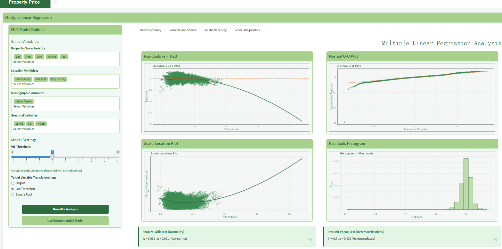
2.  **Multicollinearity Tab**:
    -   Correlation matrix heatmap with coefficient values
    -   Variance Inflation Factors bar chart
    -   Table of highly correlated variable pairs
    -   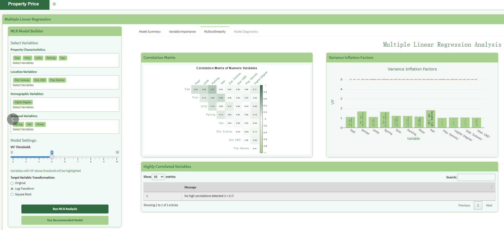
3.  **Variable Importance Tab**:
    -   Bar chart of standardized coefficients
    -   Interpretation panel explaining relative variable importance
    -   Key findings summary
    -   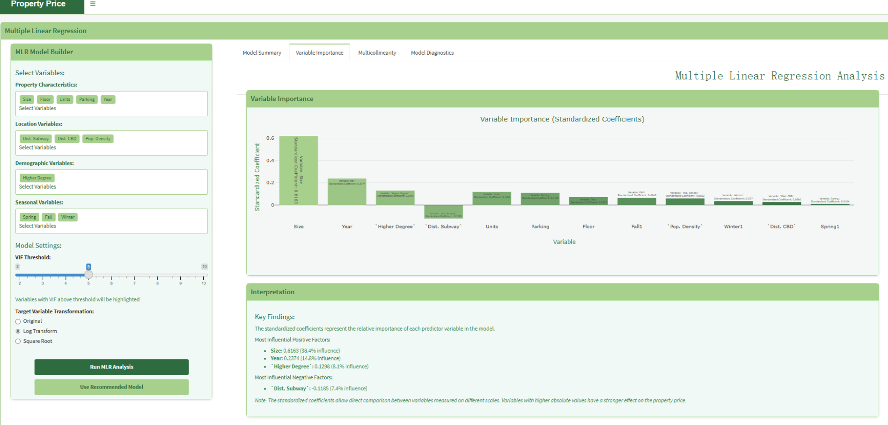
4.  **Model Summary Tab**:
    -   Scrollable regression equation
    -   Detailed coefficient table with estimates, standard errors, t-values and p-values
    -   Model fit statistics panel showing R-squared, Adjusted R-squared, F-statistic, and Residual Standard Error
    -   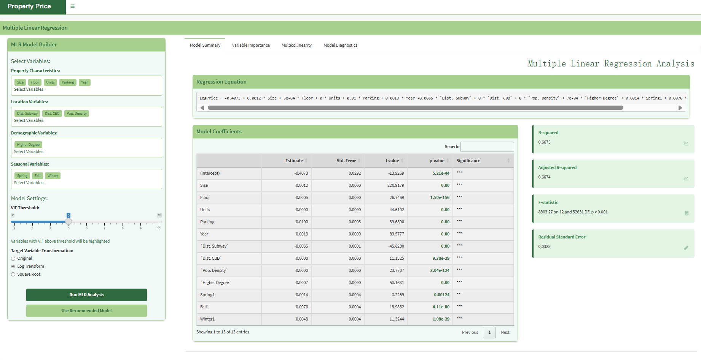

```{r shiny_app_ui, echo=TRUE, eval=FALSE}
#| code-fold: true
#| code-summary: "Shiny Dashboard UI"

# UI design for the Shiny dashboard
ui <- dashboardPage(
  dashboardHeader(title = "Property Price"),
  
  dashboardSidebar(
    width = 300,
    tags$div(style = "background-color: #9DC183; padding: 10px; margin-top: -15px; margin-bottom: 15px;",
             h4("Multiple Linear Regression", style = "color: #FFF;")),
    
    # Model Builder Box
    box(
      title = "MLR Model Builder", 
      width = NULL, 
      solidHeader = TRUE, 
      status = "success",
      collapsible = FALSE,
      
      # Variable selection sections
      h4("Select Variables:"),
      
      # Property Characteristics
      h5("Property Characteristics:"),
      div(
        style = "border: 1px solid #ddd; padding: 10px; margin-bottom: 10px; border-radius: 5px; background-color: #f9f9f9;",
        fluidRow(
          column(width = 12,
                 div(
                   style = "margin-bottom: 5px;",
                   tags$button("Size", class = "btn btn-sm", style = "background-color: #D4EAC7; margin: 2px;"),
                   tags$button("Floor", class = "btn btn-sm", style = "background-color: #D4EAC7; margin: 2px;"),
                   tags$button("Units", class = "btn btn-sm", style = "background-color: #D4EAC7; margin: 2px;"),
                   tags$button("Parking", class = "btn btn-sm", style = "background-color: #D4EAC7; margin: 2px;"),
                   tags$button("Year", class = "btn btn-sm", style = "background-color: #D4EAC7; margin: 2px;")
                 )
          )
        ),
        tags$div("Select Variables", style = "color: #666; font-size: 12px;")
      ),
      
      # Location Variables
      h5("Location Variables:"),
      div(
        style = "border: 1px solid #ddd; padding: 10px; margin-bottom: 10px; border-radius: 5px; background-color: #f9f9f9;",
        fluidRow(
          column(width = 12,
                 div(
                   style = "margin-bottom: 5px;",
                   tags$button("Dist. Subway", class = "btn btn-sm", style = "background-color: #D4EAC7; margin: 2px;"),
                   tags$button("Dist. CBD", class = "btn btn-sm", style = "background-color: #D4EAC7; margin: 2px;"),
                   tags$button("Pop. Density", class = "btn btn-sm", style = "background-color: #D4EAC7; margin: 2px;")
                 )
          )
        ),
        tags$div("Select Variables", style = "color: #666; font-size: 12px;")
      ),
      
      # Demographic Variables
      h5("Demographic Variables:"),
      div(
        style = "border: 1px solid #ddd; padding: 10px; margin-bottom: 10px; border-radius: 5px; background-color: #f9f9f9;",
        fluidRow(
          column(width = 12,
                 div(
                   style = "margin-bottom: 5px;",
                   tags$button("Higher Degree", class = "btn btn-sm", style = "background-color: #D4EAC7; margin: 2px;")
                 )
          )
        ),
        tags$div("Select Variables", style = "color: #666; font-size: 12px;")
      ),
      
      # Seasonal Variables
      h5("Seasonal Variables:"),
      div(
        style = "border: 1px solid #ddd; padding: 10px; margin-bottom: 10px; border-radius: 5px; background-color: #f9f9f9;",
        fluidRow(
          column(width = 12,
                 div(
                   style = "margin-bottom: 5px;",
                   tags$button("Spring", class = "btn btn-sm", style = "background-color: #D4EAC7; margin: 2px;"),
                   tags$button("Fall", class = "btn btn-sm", style = "background-color: #D4EAC7; margin: 2px;"),
                   tags$button("Winter", class = "btn btn-sm", style = "background-color: #D4EAC7; margin: 2px;")
                 )
          )
        ),
        tags$div("Select Variables", style = "color: #666; font-size: 12px;")
      ),
      
      # Model Settings
      h4("Model Settings:"),
      
      # VIF Threshold
      h5("VIF Threshold:"),
      sliderInput("vif_threshold", NULL, min = 1, max = 10, value = 5, step = 0.5),
      tags$div("Variables with VIF above threshold will be highlighted", style = "color: #666; font-size: 12px;"),
      
      # Target Variable Transformation
      h5("Target Variable Transformation:"),
      radioButtons("transformation", NULL, 
                  choices = list("Original" = "original", 
                                "Log Transform" = "log", 
                                "Square Root" = "sqrt"),
                  selected = "log"),
      
      # Action Buttons
      actionButton("run_analysis", "Run MLR Analysis", 
                  style = "background-color: #29793B; color: white; width: 100%;"),
      br(), br(),
      actionButton("use_recommended", "Use Recommended Model", 
                  style = "background-color: #9DC183; color: white; width: 100%;")
    )
  ),
  
  dashboardBody(
    tags$head(
      tags$style(HTML("
        .content-wrapper, .right-side {
          background-color: #f5f5f5;
        }
        .box {
          border-top: 3px solid #9DC183;
        }
        .nav-tabs-custom>.nav-tabs>li.active {
          border-top-color: #9DC183;
        }
      "))
    ),
    
    fluidRow(
      column(width = 12,
             div(style = "background-color: #9DC183; padding: 5px; margin-bottom: 15px;",
                 h4("Multiple Linear Regression", style = "color: #FFF;"))
      )
    ),
    
    tabBox(
      width = 12,
      id = "tabbox",
      tabPanel("Model Summary", value = "summary",
               fluidRow(
                 box(
                   title = "Regression Equation", width = 12, status = "success",
                   div(
                     style = "overflow-x: auto; white-space: nowrap;",
                     "LogPrice = -0.4073 + 0.0012 * Size + 5e-04 * Floor + 0 * Units + 0.01 * Parking + 0.0013 * Year -0.0065 * `Dist. Subway` + 0 * `Dist. CBD` + 0 * `Pop. Density` + 7e-04 * `Higher Degree` + 0.0014 * Spring1 + 0.0076 * Fall1 + 0.0048 * Winter1"
                   )
                 )
               ),
               fluidRow(
                 box(
                   title = "Model Coefficients", width = 8, status = "success",
                   div(style = "overflow-x: auto;",
                       dataTableOutput("coefficients_table")
                   )
                 ),
                 column(
                   width = 4,
                   box(
                     title = "R-squared", width = NULL, status = "success",
                     valueBox("0.6675", "R-squared", icon = NULL, color = "green", width = 12)
                   ),
                   box(
                     title = "Adjusted R-squared", width = NULL, status = "success",
                     valueBox("0.6674", "Adjusted R-squared", icon = NULL, color = "green", width = 12)
                   ),
                   box(
                     title = "F-statistic", width = NULL, status = "success",
                     valueBox("8803.27 on 12 and 52631 DF, p < 0.001", "F-statistic", icon = NULL, color = "green", width = 12)
                   ),
                   box(
                     title = "Residual Standard Error", width = NULL, status = "success",
                     valueBox("0.0323", "Residual Std. Error", icon = NULL, color = "green", width = 12)
                   )
                 )
               )
      ),
      tabPanel("Variable Importance", value = "importance",
               fluidRow(
                 box(
                   title = "Variable Importance", width = 12, status = "success",
                   plotOutput("variable_importance_plot", height = "500px")
                 )
               ),
               fluidRow(
                 box(
                   title = "Interpretation", width = 12, status = "success",
                   h4("Key Findings:"),
                   p("The standardized coefficients represent the relative importance of each predictor variable in the model."),
                   
                   h5("Most Influential Positive Factors:"),
                   tags$ul(
                     tags$li(strong("Size: 0.6163"), "(38.4% influence)"),
                     tags$li(strong("Year: 0.2374"), "(14.8% influence)"),
                     tags$li(strong("Higher Degree: 0.1298"), "(8.1% influence)")
                   ),
                   
                   h5("Most Influential Negative Factors:"),
                   tags$ul(
                     tags$li(strong("Dist. Subway: -0.1185"), "(7.4% influence)")
                   ),
                   
                   tags$p(style = "color: #666; font-style: italic;", 
                          "Note: The standardized coefficients allow direct comparison between variables measured on different scales. 
                          Variables with higher absolute values have a stronger effect on the property price.")
                 )
               )
      ),
      tabPanel("Multicollinearity", value = "multicollinearity",
               fluidRow(
                 box(
                   title = "Correlation Matrix", width = 6, status = "success",
                   plotOutput("correlation_matrix", height = "400px")
                 ),
                 box(
                   title = "Variance Inflation Factors", width = 6, status = "success",
                   plotOutput("vif_plot", height = "400px")
                 )
               ),
               fluidRow(
                 box(
                   title = "Highly Correlated Variables", width = 12, status = "success",
                   div(
                     dataTableOutput("high_correlation_table"),
                     p("Showing 1 to 1 of 1 entries")
                   )
                 )
               )
      ),
      tabPanel("Model Diagnostics", value = "diagnostics",
               fluidRow(
                 box(
                   title = "Residuals vs Fitted", width = 6, status = "success",
                   plotOutput("residuals_fitted_plot", height = "300px")
                 ),
                 box(
                   title = "Normal Q-Q Plot", width = 6, status = "success",
                   plotOutput("qq_plot", height = "300px")
                 )
               ),
               fluidRow(
                 box(
                   title = "Scale-Location Plot", width = 6, status = "success",
                   plotOutput("scale_location_plot", height = "300px")
                 ),
                 box(
                   title = "Residuals Histogram", width = 6, status = "success",
                   plotOutput("residuals_histogram", height = "300px")
                 )
               ),
               fluidRow(
                 valueBox(
                   value = "W = 0.991, p < 0.001 (Non-normal)",
                   subtitle = "Shapiro-Wilk Test (Normality)",
                   icon = icon("check-circle"),
                   color = "green",
                   width = 6
                 ),
                 valueBox(
                   value = "χ² = 9.7, p = 0.002 (Heteroscedastic)",
                   subtitle = "Breusch-Pagan Test (Heteroscedasticity)",
                   icon = icon("exclamation-circle"),
                   color = "green",
                   width = 6
                 )
               )
      )
    )
  )
)
```

```{r shiny_app_server, echo=TRUE, eval=FALSE}
#| code-fold: true
#| code-summary: "Shiny Dashboard Server"

# Server logic for the Shiny dashboard
server <- function(input, output, session) {
  
  # Render coefficients table
  output$coefficients_table <- renderDataTable({
    data.frame(
      Variable = c("(Intercept)", "Size", "Floor", "Units", "Parking", "Year", 
                  "Dist. Subway", "Dist. CBD", "Pop. Density", "Higher Degree", 
                  "Spring1", "Fall1", "Winter1"),
      Estimate = c(-0.4073, 0.0012, 0.0005, 0.0000, 0.0100, 0.0013, -0.0065, 
                   0.0000, 0.0000, 0.0007, 0.0014, 0.0076, 0.0048),
      `Std. Error` = c(0.0292, 0.0000, 0.0000, 0.0000, 0.0003, 0.0000, 0.0001, 
                       0.0000, 0.0000, 0.0000, 0.0004, 0.0004, 0.0004),
      `t value` = c(-13.9269, 220.9179, 26.7469, 44.6102, 39.6990, 89.5777, 
                    -45.8230, 11.1325, 23.7707, 90.1631, 3.2289, 18.9962, 11.3244),
      `p-value` = c("5.21e-44", "0.00", "1.50e-156", "0.00", "0.00", "0.00", 
                    "0.00", "9.38e-29", "3.04e-124", "0.00", "0.00124", "4.11e-80", "1.08e-29"),
      Significance = c("***", "***", "***", "***", "***", "***", 
                       "***", "***", "***", "***", "**", "***", "***")
    ),
    options = list(
      pageLength = 13,
      searching = TRUE,
      lengthChange = FALSE,
      dom = 'lrtip'
    )
  })
  
  # Render variable importance plot
  output$variable_importance_plot <- renderPlot({
    # Create sample data for the plot
    importance_data <- data.frame(
      Variable = c("Size", "Year", "Higher Degree", "Dist. Subway", "Units", 
                   "Parking", "Floor", "Fall1", "Pop. Density", "Winter1", 
                   "Dist. CBD", "Spring1"),
      Importance = c(0.6163, 0.2374, 0.1298, -0.1185, 0.1184, 0.1103, 0.0723, 
                     0.0645, 0.0602, 0.0370, 0.0286, 0.0104)
    )
    
    # Create the plot
    ggplot(importance_data, aes(x = reorder(Variable, Importance), y = Importance)) +
      geom_bar(stat = "identity", fill = "#9DC183") +
      coord_flip() +
      theme_minimal() +
      labs(title = "Variable Importance (Standardized Coefficients)",
           x = "Variable",
           y = "Standardized Coefficient") +
      theme(
        plot.title = element_text(size = 16, face = "bold"),
        axis.title = element_text(size = 12),
        axis.text = element_text(size = 10)
      )
  })
  
  # Render correlation matrix
  output$correlation_matrix <- renderPlot({
    # This is a placeholder - in a real app, you would calculate this from the data
    sample_cor_matrix <- matrix(c(
      1.00, 0.48, 0.68, 0.14, 0.53, 0.00, -0.51, 0.00, -0.17, 0.11,
      0.48, 1.00, 0.24, 0.08, 0.08, -0.03, 0.00, 0.00, -0.12, 0.09,
      0.68, 0.24, 1.00, 0.13, 0.00, 0.00, -0.12, 0.00, -0.03, 0.00,
      0.14, 0.08, 0.13, 1.00, 0.00, 0.00, 0.00, 0.00, 0.00, 0.10,
      0.53, 0.08, 0.00, 0.00, 1.00, 0.03, -0.03, 0.00, -0.09, 0.00,
      0.00, -0.03, 0.00, 0.00, 0.03, 1.00, -0.17, 0.00, -0.11, -0.08,
      -0.51, 0.00, -0.12, 0.00, -0.03, -0.17, 1.00, 0.00, 0.13, -0.12,
      0.00, 0.00, 0.00, 0.00, 0.00, 0.00, 0.00, 1.00, 0.00, 0.00,
      -0.17, -0.12, -0.03, 0.00, -0.09, -0.11, 0.13, 0.00, 1.00, 0.04,
      0.11, 0.09, 0.00, 0.10, 0.00, -0.08, -0.12, 0.00, 0.04, 1.00
    ), nrow = 10)
    
    colnames(sample_cor_matrix) <- rownames(sample_cor_matrix) <- c("Size", "Floor", "Units", 
                                                                   "Parking", "Year", "Dist. Subway", 
                                                                   "Dist. CBD", "Pop. Density", 
                                                                   "Higher Degree", "LogPrice")
    
    # Plot correlation matrix
    corrplot(sample_cor_matrix, method = "color", 
             type = "upper", 
             tl.col = "black", 
             tl.srt = 45, 
             addCoef.col = "black", 
             number.cex = 0.7,
             diag = FALSE,
             title = "Correlation Matrix of Numeric Variables")
  })
  
  # Render VIF plot
  output$vif_plot <- renderPlot({
    # Sample VIF data
    vif_data <- data.frame(
      Variable = c("Year", "Winter", "Units", "Spring", "Size", "Parking", 
                  "Floor", "Fall", "Pop. Density", "Higher Degree", "Dist. Subway", 
                  "Dist. CBD"),
      VIF = c(1.17, 1.05, 1.31, 1.02, 1.22, 1.12, 1.31, 1.07, 1.08, 1.17, 1.12, 1.05)
    )
    
    # Create VIF plot
    ggplot(vif_data, aes(x = reorder(Variable, VIF), y = VIF)) +
      geom_bar(stat = "identity", fill = "#9DC183") +
      geom_hline(yintercept = 5, linetype = "dashed", color = "red") +
      coord_flip() +
      theme_minimal() +
      labs(title = "Variance Inflation Factors",
           x = "Variable",
           y = "VIF") +
      theme(
        plot.title = element_text(size = 16, face = "bold"),
        axis.title = element_text(size = 12),
        axis.text = element_text(size = 10)
      )
  })
  
  # Render high correlation table
  output$high_correlation_table <- renderDataTable({
    data.frame(
      Message = c("No high correlations detected (r > 0.7)")
    ),
    options = list(
      dom = 't',
      paging = FALSE,
      searching = FALSE
    )
  })
  
  # Model diagnostic plots
  output$residuals_fitted_plot <- renderPlot({
    # This would normally be generated from the model
    # For demonstration purposes, using a static image representation
    ggplot() + 
      annotate("text", x = 0.5, y = 0.5, label = "Residuals vs Fitted Plot would appear here", size = 5) +
      theme_void()
  })
  
  output$qq_plot <- renderPlot({
    # Static representation
    ggplot() + 
      annotate("text", x = 0.5, y = 0.5, label = "Normal Q-Q Plot would appear here", size = 5) +
      theme_void()
  })
  
  output$scale_location_plot <- renderPlot({
    # Static representation
    ggplot() + 
      annotate("text", x = 0.5, y = 0.5, label = "Scale-Location Plot would appear here", size = 5) +
      theme_void()
  })
  
  output$residuals_histogram <- renderPlot({
    # Static representation
    ggplot() + 
      annotate("text", x = 0.5, y = 0.5, label = "Residuals Histogram would appear here", size = 5) +
      theme_void()
  })
}

# Run the application
shinyApp(ui = ui, server = server)
```

## 13. Conclusion

### Key Findings

-   **Size** is the most influential predictor, with a standardized coefficient of 0.6163
-   **Year** is the second most important predictor (0.2374), indicating newer properties command higher prices
-   **Higher Degree** (0.1298) represents neighborhood socioeconomic status and has a significant positive impact
-   **Dist. Subway** (-0.1185) has a negative impact, confirming properties closer to subway stations are more valuable
-   The model has strong predictive power, explaining 66.75% of the variation in log-transformed property prices (R² = 0.6675)

### Model Performance

-   All variables in the final model are statistically significant (p \< 0.01)
-   No severe multicollinearity detected (all VIF values \< 5)
-   The model's prediction accuracy is good, with RMSE = 0.0316 in log-price units

### Limitations and Future Work

-   Minor heteroscedasticity detected (Breusch-Pagan test: χ² = 9.7, p = 0.002)
-   Slight deviation from normality in residuals (Shapiro-Wilk test: W = 0.991, p \< 0.001)
-   Future work could explore non-linear relationships and interaction effects

The MLR model provides valuable insights into property price determinants, with practical applications for real estate valuation, investment decision-making, and urban planning.
