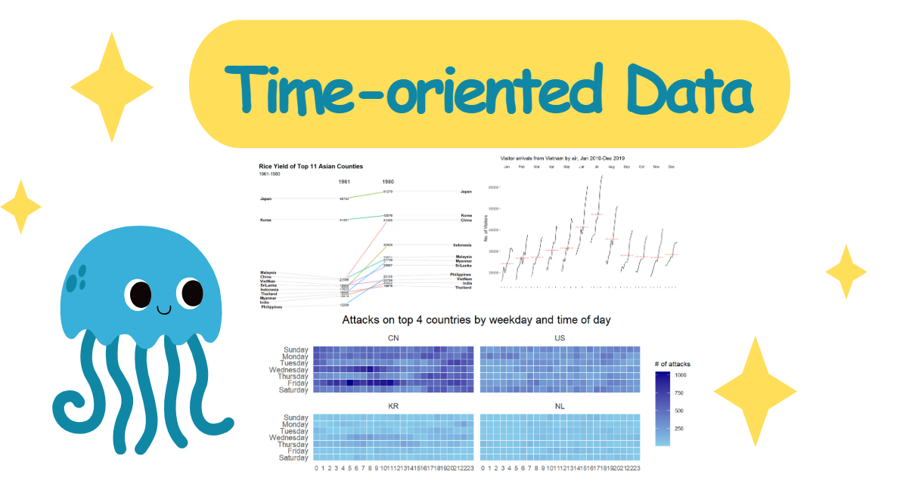

# Visualising and Analysing Time-oriented Data

## Learning Objectives

This document covers creating the following time-oriented data visualisations using R packages:

-   Calendar heatmaps using ggplot2
-   Cycle plots using ggplot2
-   Slopegraphs using CGPfunctions

## Setup and Prerequisites

We need the following R packages: scales, viridis, lubridate, ggthemes, gridExtra, readxl, knitr, data.table and tidyverse.

```{r}
# Load required packages
pacman::p_load(scales, viridis, lubridate, ggthemes, gridExtra, 
               readxl, knitr, data.table, CGPfunctions, ggHoriPlot, tidyverse)

# Ensure date-time formatting uses English display
Sys.setlocale("LC_TIME", "C")
```

> **Note**: If your system language is not English, setting `Sys.setlocale("LC_TIME", "C")` ensures the weekdays() function returns English weekday names.

## 1. Calendar Heatmaps

Calendar heatmaps provide an intuitive way to visualize time patterns, especially when examining data distribution across weekdays and hours of the day.

### 1.1 Data Preparation

We'll use the `eventlog.csv` file containing 199,999 rows of time-series cyber attack records by country.

```{r}
# Import the data
attacks <- read_csv("data/eventlog.csv")

# Examine the data structure
kable(head(attacks))
```

The dataset has three key columns: - *timestamp*: date-time values in POSIXct format - *source_country*: source of the attack in ISO 3166-1 alpha-2 country code - *tz*: time zone of the source IP address

### 1.2 Data Processing

First, we need to derive weekday and hour fields from the timestamps:

```{r}
# Function to extract weekday and hour information
make_hr_wkday <- function(ts, sc, tz) {
  real_times <- ymd_hms(ts, tz = tz[1], quiet = TRUE)
  dt <- data.table(source_country = sc,
                  wkday = weekdays(real_times),
                  hour = hour(real_times))
  return(dt)
}

# Define weekday order levels
wkday_levels <- c('Saturday', 'Friday', 
                 'Thursday', 'Wednesday', 
                 'Tuesday', 'Monday', 
                 'Sunday')

# Process data to extract time components
attacks <- attacks %>%
  group_by(tz) %>%
  do(make_hr_wkday(.$timestamp, 
                   .$source_country, 
                   .$tz)) %>% 
  ungroup() %>% 
  mutate(wkday = factor(wkday, levels = wkday_levels),
         hour = factor(hour, levels = 0:23))
```

> **Important**: We convert *wkday* and *hour* fields to factors with specific level ordering to ensure proper display in our visualizations.

### 1.3 Building a Single Calendar Heatmap

Now we'll create a heatmap showing attacks by weekday and hour:

```{r}
# Aggregate attacks by weekday and hour
grouped <- attacks %>% 
  count(wkday, hour) %>% 
  ungroup() %>%
  na.omit()

# Create the heatmap
ggplot(grouped, aes(hour, wkday, fill = n)) + 
  geom_tile(color = "white", size = 0.1) + 
  theme_tufte(base_family = "Helvetica") + 
  coord_equal() +
  scale_fill_gradient(name = "# of attacks",
                      low = "sky blue", 
                      high = "dark blue") +
  labs(x = NULL, y = NULL, 
       title = "Attacks by weekday and time of day") +
  theme(axis.ticks = element_blank(),
        plot.title = element_text(hjust = 0.5),
        legend.title = element_text(size = 8),
        legend.text = element_text(size = 6))
```

> **Visualization tips:** - `geom_tile()` creates the rectangular heatmap cells - `theme_tufte()` provides a clean, minimal design - `coord_equal()` ensures a 1:1 aspect ratio - The color gradient ranges from light blue (low values) to dark blue (high values)

### 1.4 Multiple Calendar Heatmaps

To compare patterns across different countries, we can create multiple heatmaps for the top attackers:

```{r}
# Identify top 4 countries by attack count
attacks_by_country <- count(attacks, source_country) %>%
  mutate(percent = percent(n/sum(n))) %>%
  arrange(desc(n))

top4 <- attacks_by_country$source_country[1:4]

# Filter data for top 4 countries
top4_attacks <- attacks %>%
  filter(source_country %in% top4) %>%
  count(source_country, wkday, hour) %>%
  ungroup() %>%
  mutate(source_country = factor(source_country, levels = top4)) %>%
  na.omit()

# Create faceted heatmaps
ggplot(top4_attacks, aes(hour, wkday, fill = n)) + 
  geom_tile(color = "white", size = 0.1) + 
  theme_tufte(base_family = "Helvetica") + 
  coord_equal() +
  scale_fill_gradient(name = "# of attacks",
                      low = "sky blue", 
                      high = "dark blue") +
  facet_wrap(~source_country, ncol = 2) +
  labs(x = NULL, y = NULL, 
       title = "Attacks on top 4 countries by weekday and time of day") +
  theme(axis.ticks = element_blank(),
        axis.text.x = element_text(size = 7),
        plot.title = element_text(hjust = 0.5),
        legend.title = element_text(size = 8),
        legend.text = element_text(size = 6))
```

## 2. Cycle Plots

Cycle plots are excellent for visualizing seasonal patterns while also showing the overall trend across multiple time periods.

### 2.1 Data Preparation

We'll use visitor arrival data from Vietnam:

```{r}
# Import air arrivals data
air <- read_excel("data/arrivals_by_air.xlsx")

# Extract month and year from date field
air$month <- factor(month(air$`Month-Year`), 
                    levels=1:12, 
                    labels=month.abb, 
                    ordered=TRUE) 
air$year <- year(ymd(air$`Month-Year`))

# Filter for Vietnam data from 2010 onward
Vietnam <- air %>% 
  select(`Vietnam`, month, year) %>%
  filter(year >= 2010)

# Calculate monthly averages across years
hline.data <- Vietnam %>% 
  group_by(month) %>%
  summarise(avgvalue = mean(`Vietnam`))
```

### 2.2 Creating the Cycle Plot

```{r}
# Generate the cycle plot
ggplot() + 
  geom_line(data=Vietnam,
            aes(x=year, y=`Vietnam`, group=month), 
            colour="black") +
  geom_hline(aes(yintercept=avgvalue), 
             data=hline.data, 
             linetype=6, 
             colour="red", 
             size=0.5) + 
  facet_grid(~month) +
  labs(title = "Visitor arrivals from Vietnam by air, Jan 2010-Dec 2019") +
  xlab("") +
  ylab("No. of Visitors") +
  theme_tufte(base_family = "Helvetica") +
  theme(axis.text.x = element_blank())
```

> **What to look for:** - Each panel represents one month across multiple years - The red horizontal line shows the average for each month - This helps identify both monthly patterns and year-over-year trends

## 3. Slopegraphs

Slopegraphs are effective for comparing changes between two time points across multiple categories.

### 3.1 Data and Implementation

We'll visualize rice yield changes for Asian countries between 1961 and 1980:

```{r}
# Import rice yield data
rice <- read_csv("data/rice.csv")

# Create the slopegraph using CGPfunctions
rice %>% 
  mutate(Year = factor(Year)) %>%
  filter(Year %in% c(1961, 1980)) %>%
  newggslopegraph(Year, Yield, Country,
                 Title = "Rice Yield of Top 11 Asian Counties",
                 SubTitle = "1961-1980",
                 Caption = "Prepared by: Xiaohan")
```

> **Note**: Converting Year to factor type is crucial for proper visualization, as it ensures the years are treated as discrete categories rather than continuous values.

# Summary

## Overview

This document explores various techniques for visualizing and analyzing time-oriented data using R. It covers multiple visualization methods, including calendar heatmaps, cycle plots and slopegraphs, ensuring clear insights into temporal patterns.

## Key Techniques and Findings

### Calendar Heatmaps

-   Used to visualize time patterns, especially distributions across weekdays and hours.\
-   Applied to cyber attack data (`eventlog.csv`), showing attack frequency by time of day.\
-   Key steps:
    -   Extracted `weekday` and `hour` features from timestamps.\
    -   Aggregated attack counts and mapped them onto a heatmap using `ggplot2`.\
    -   Created multiple heatmaps to compare attack patterns across different countries.

### Cycle Plots

-   Useful for identifying seasonal trends while showing long-term variations.\
-   Applied to Vietnam visitor arrival data (`arrivals_by_air.xlsx`).\
-   Key insights:
    -   Monthly visitor trends show seasonal fluctuations.\
    -   The red horizontal line represents the average for each month, helping to identify deviations.

### Slopegraphs

-   Effective for comparing values across two time points.\
-   Used for visualizing changes in rice yield across Asian countries between 1961 and 1980 (`rice.csv`).\
-   Highlights:
    -   Shows variations in rice yield for different countries over two decades.\
    -   Facilitates direct comparisons by plotting slopes between initial and final values.

## Key Takeaways

-   **Visualization Selection Matters:** Different techniques highlight different aspects of temporal data.\
-   **Data Preprocessing is Crucial:** Extracting meaningful time-based features (e.g., weekday, hour, month) enhances interpretability.\
-   **Common Errors & Fixes:** Ensuring correct factor levels, mapping aesthetics properly, and verifying data structure help avoid visualization errors.
