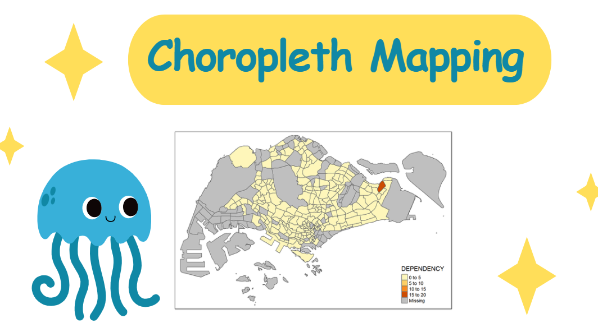

I've worked with R to create choropleth maps, and here's a practical walkthrough of the process using the **tmap** package.

## Overview

Choropleth mapping involves symbolizing enumeration units (countries, provinces, states, counties, census units) using area patterns or graduated colors. For instance, when I needed to portray the spatial distribution of Singapore's aged population by Master Plan 2014 Subzone Boundary, I used a choropleth map.

The **tmap** package in R is excellent for plotting functional and truthful choropleth maps.

It's worth reading the functional description of each function before implementation.

## Getting Started

The key package for this process is [**tmap**](https://cran.r-project.org/web/packages/tmap/). Additionally, I'll use:

-   [**readr**](https://readr.tidyverse.org/) for importing delimited text files
-   [**tidyr**](https://tidyr.tidyverse.org/) for tidying data
-   [**dplyr**](https://dplyr.tidyverse.org/) for wrangling data
-   [**sf**](https://cran.r-project.org/web/packages/sf/index.html) for handling geospatial data

Since **readr**, **tidyr**, and **dplyr** are part of **tidyverse**, I only need to install that package rather than each one individually.

Here's how I install and load these packages:

```{r}
pacman::p_load(sf, tmap, tidyverse)
```

## Importing Data into R

### The Data

For creating the choropleth map, I'll use two datasets:

-   Master Plan 2014 Subzone Boundary (Web) in ESRI shapefile format, downloadable from [data.gov.sg](https://data.gov.sg/). This geospatial data contains Singapore's geographical boundaries at the planning subzone level, based on URA Master Plan 2014.

-   Singapore Residents by Planning Area/Subzone, Age Group, Sex and Type of Dwelling, June 2011-2020 in CSV format from [Department of Statistics, Singapore](https://www.singstat.gov.sg/). While this aspatial data doesn't contain coordinates, its PA and SZ fields can serve as unique identifiers to geocode to the shapefile.

### Importing Geospatial Data into R

I use the *st_read()* function from the **sf** package to import the shapefile:

```{r}
mpsz <- st_read(dsn = "data/geospatial", 
                layer = "MP14_SUBZONE_WEB_PL")
```

Examining the content of `mpsz`:

```{r}
mpsz
```

Note that only the first ten records display by default.

### Importing Attribute Data into R

Next, I import the CSV file using *read_csv()* from the **readr** package:

```{r, echo=TRUE, message=FALSE}
popdata <- read_csv("data/aspatial/respopagesextod2011to2020.csv")
```

### Data Preparation

Before creating the thematic map, I need to prepare a data table with year 2020 values including these variables: PA, SZ, YOUNG, ECONOMY ACTIVE, AGED, TOTAL, and DEPENDENCY.

-   YOUNG: age groups 0-4 through 20-24
-   ECONOMY ACTIVE: age groups 25-29 through 60-64
-   AGED: age group 65 and above
-   TOTAL: all age groups
-   DEPENDENCY: ratio between young and aged against economically active group

#### Data wrangling

For this task, I use these data wrangling and transformation functions:

-   *pivot_wider()* from **tidyr**
-   *mutate()*, *filter()*, *group_by()*, and *select()* from **dplyr**

```{r}
popdata2020 <- popdata %>%
  filter(Time == 2020) %>%
  group_by(PA, SZ, AG) %>%
  summarise(`POP` = sum(`Pop`)) %>%
  ungroup() %>%
  pivot_wider(names_from=AG, 
              values_from=POP) %>%
  mutate(YOUNG = rowSums(.[3:6])
         +rowSums(.[12])) %>%
mutate(`ECONOMY ACTIVE` = rowSums(.[7:11])+
rowSums(.[13:15]))%>%
mutate(`AGED`=rowSums(.[16:21])) %>%
mutate(`TOTAL`=rowSums(.[3:21])) %>%  
mutate(`DEPENDENCY` = (`YOUNG` + `AGED`)
/`ECONOMY ACTIVE`) %>%
  select(`PA`, `SZ`, `YOUNG`, 
       `ECONOMY ACTIVE`, `AGED`, 
       `TOTAL`, `DEPENDENCY`)
```

#### Joining the attribute data and geospatial data

Before performing the georelational join, I need to convert PA and SZ field values to uppercase, as these fields contain mixed case values, while SUBZONE_N and PLN_AREA_N are in uppercase.

```{r}
popdata2020 <- popdata2020 %>%
  mutate_at(.vars = vars(PA, SZ), 
          .funs = funs(toupper)) %>%
  filter(`ECONOMY ACTIVE` > 0)
```

Then I use *left_join()* from **dplyr** to join the geographical data and attribute table using the planning subzone name (SUBZONE_N and SZ) as the common identifier:

```{r}
mpsz_pop2020 <- left_join(mpsz, popdata2020,
                          by = c("SUBZONE_N" = "SZ"))
```

I use *left_join()* with `mpsz` as the left data table to ensure the output remains a simple features data frame.

```{r}
write_rds(mpsz_pop2020, "data/rds/mpszpop2020.rds")
```

## Choropleth Mapping Geospatial Data Using *tmap*

I can create thematic maps using **tmap** in two ways:

-   Quickly plotting with *qtm()*
-   Creating highly customizable thematic maps with tmap elements

### Plotting a choropleth map quickly using *qtm()*

The simplest way to draw a choropleth map with **tmap** is using *qtm()*. It's concise and provides good default visualization:

```{r}
tmap_mode("plot")
qtm(mpsz_pop2020, 
    fill = "DEPENDENCY")
```

-   *tmap_mode()* with "plot" produces a static map. For an interactive map, I'd use "view".
-   The *fill* argument maps the DEPENDENCY attribute.

### Creating a choropleth map using *tmap*'s elements

While *qtm()* is quick, it limits control over individual layer aesthetics. For a high-quality cartographic choropleth map, I use **tmap**'s drawing elements:

```{r}
tm_shape(mpsz_pop2020)+
  tm_fill("DEPENDENCY", 
          style = "quantile", 
          palette = "Blues",
          title = "Dependency ratio") +
  tm_layout(main.title = "Distribution of Dependency Ratio by planning subzone",
            main.title.position = "center",
            main.title.size = 1.2,
            legend.height = 0.45, 
            legend.width = 0.35,
            frame = TRUE) +
  tm_borders(alpha = 0.5) +
  tm_compass(type="8star", size = 2) +
  tm_scale_bar() +
  tm_grid(alpha =0.2) +
  tm_credits("Source: Planning Sub-zone boundary from Urban Redevelopment Authorithy (URA)\n and Population data from Department of Statistics DOS", 
             position = c("left", "bottom"))
```

#### Drawing a base map

The basic building block of **tmap** is *tm_shape()* followed by layer elements like *tm_fill()* and *tm_polygons()*:

```{r}
tm_shape(mpsz_pop2020) +
  tm_polygons()
```

#### Drawing a choropleth map using *tm_polygons()*

To show the geographical distribution of a variable like Dependency by planning subzone, I assign it to *tm_polygons()*:

```{r}
tm_shape(mpsz_pop2020)+
  tm_polygons("DEPENDENCY")
```

This uses the default "pretty" interval binning and the "YlOrRd" ColorBrewer scheme. Missing values appear in grey.

#### Drawing a choropleth map using *tm_fill()* and *tm_border()*

*tm_polygons()* is a wrapper for *tm_fill()* and *tm_border()*. Using *tm_fill()* alone:

```{r}
tm_shape(mpsz_pop2020)+
  tm_fill("DEPENDENCY")
```

Adding boundaries with *tm_borders()*:

```{r}
tm_shape(mpsz_pop2020)+
  tm_fill("DEPENDENCY") +
  tm_borders(lwd = 0.1,  alpha = 1)
```

The *alpha* argument sets transparency between 0 (transparent) and 1 (opaque).

Other *tm_borders()* arguments include: - *col*: border color - *lwd*: border line width (default is 1) - *lty*: border line type (default is "solid")

### Data classification methods in **tmap**

Choropleth maps typically employ data classification to group observations into ranges or classes.

**tmap** offers ten classification methods: *fixed*, *sd*, *equal*, *pretty* (default), *quantile*, *kmeans*, *hclust*, *bclust*, *fisher*, and *jenks*.

These methods are set using the *style* argument in *tm_fill()* or *tm_polygons()*.

#### Plotting choropleth maps with built-in classification methods

Here's a quantile classification with 5 classes:

```{r}
tm_shape(mpsz_pop2020)+
  tm_fill("DEPENDENCY",
          n = 5,
          style = "jenks") +
  tm_borders(alpha = 0.5)
```

Using the *equal* method:

```{r}
tm_shape(mpsz_pop2020)+
  tm_fill("DEPENDENCY",
          n = 5,
          style = "equal") +
  tm_borders(alpha = 0.5)
```

Notice how quantile distribution is more even than equal classification.

> **Warning: Maps Lie!**

It's informative to prepare choropleth maps using different classification methods and compare their differences. Similarly, using the same method with different class numbers (2, 6, 10, 20) can reveal interesting patterns.

#### Plotting choropleth map with custom breaks

For all built-in styles, category breaks are computed internally. To override defaults, I can set explicit breakpoints using the *breaks* argument in *tm_fill()*. Since **tmap** breaks include minimum and maximum values, I need n+1 elements for n categories (in increasing order).

First, I check descriptive statistics:

```{r}
summary(mpsz_pop2020$DEPENDENCY)
```

Based on these results, I set breakpoints at 0.60, 0.70, 0.80, and 0.90, with minimum 0 and maximum 1.00:

```{r}
tm_shape(mpsz_pop2020)+
  tm_fill("DEPENDENCY",
          breaks = c(0, 0.60, 0.70, 0.80, 0.90, 1.00)) +
  tm_borders(alpha = 0.5)
```

### Colour Scheme

**tmap** supports user-defined color ramps or predefined ones from **RColorBrewer**.

#### Using ColourBrewer palette

To change the color, I assign a preferred palette to the *palette* argument:

```{r}
tm_shape(mpsz_pop2020)+
  tm_fill("DEPENDENCY",
          n = 6,
          style = "quantile",
          palette = "Blues") +
  tm_borders(alpha = 0.5)
```

To reverse the color shading, I add a "-" prefix:

```{r}
tm_shape(mpsz_pop2020)+
  tm_fill("DEPENDENCY",
          style = "quantile",
          palette = "-Greens") +
  tm_borders(alpha = 0.5)
```

### Map Layouts

Map layout combines all elements into a cohesive map: the mapped objects, title, scale bar, compass, margins, and aspect ratios.

#### Map Legend

**tmap** provides options to adjust the legend's placement, format, and appearance:

```{r}
tm_shape(mpsz_pop2020)+
  tm_fill("DEPENDENCY", 
          style = "jenks", 
          palette = "Blues", 
          legend.hist = TRUE, 
          legend.is.portrait = TRUE,
          legend.hist.z = 0.1) +
  tm_layout(main.title = "Distribution of Dependency Ratio by planning subzone \n(Jenks classification)",
            main.title.position = "center",
            main.title.size = 1,
            legend.height = 0.45, 
            legend.width = 0.35,
            legend.outside = FALSE,
            legend.position = c("right", "bottom"),
            frame = FALSE) +
  tm_borders(alpha = 0.5)
```

#### Map style

**tmap** allows various layout settings changes via *tmap_style()*. Here, the *classic* style is used:

```{r}
tm_shape(mpsz_pop2020)+
  tm_fill("DEPENDENCY", 
          style = "quantile", 
          palette = "-Greens") +
  tm_borders(alpha = 0.5) +
  tmap_style("classic")
```

#### Cartographic Furniture

**tmap** provides arguments for other map furniture like compass, scale bar, and grid lines:

```{r}
tm_shape(mpsz_pop2020)+
  tm_fill("DEPENDENCY", 
          style = "quantile", 
          palette = "Blues",
          title = "No. of persons") +
  tm_layout(main.title = "Distribution of Dependency Ratio \nby planning subzone",
            main.title.position = "center",
            main.title.size = 1.2,
            legend.height = 0.45, 
            legend.width = 0.35,
            frame = TRUE) +
  tm_borders(alpha = 0.5) +
  tm_compass(type="8star", size = 2) +
  tm_scale_bar(width = 0.15) +
  tm_grid(lwd = 0.1, alpha = 0.2) +
  tm_credits("Source: Planning Sub-zone boundary from Urban Redevelopment Authorithy (URA)\n and Population data from Department of Statistics DOS", 
             position = c("left", "bottom"))
```

To reset to the default style:

```{r}
tmap_style("white")
```

### Drawing Small Multiple Choropleth Maps

Small multiple maps (facet maps) arrange many maps side-by-side and sometimes stacked vertically, showing how spatial relationships change with another variable, like time.

In **tmap**, I can create small multiples in three ways:

-   Assigning multiple values to aesthetic arguments
-   Defining a group-by variable in *tm_facets()*
-   Creating multiple standalone maps with *tmap_arrange()*

#### By assigning multiple values to aesthetic arguments

Creating small multiples by defining ***ncols*** in **tm_fill()**:

```{r}
tm_shape(mpsz_pop2020)+
  tm_fill(c("YOUNG", "AGED"),
          style = "equal", 
          palette = "Blues") +
  tm_layout(legend.position = c("right", "bottom")) +
  tm_borders(alpha = 0.5) +
  tmap_style("white")
```

Creating small multiples by assigning multiple values to aesthetic arguments:

```{r}
tm_shape(mpsz_pop2020)+ 
  tm_polygons(c("DEPENDENCY","AGED"),
          style = c("equal", "quantile"), 
          palette = list("Blues","Greens")) +
  tm_layout(legend.position = c("right", "bottom"))
```

#### By defining a group-by variable in *tm_facets()*

Creating small multiples using **tm_facets()**:

```{r}
tm_shape(mpsz_pop2020) +
  tm_fill("DEPENDENCY",
          style = "quantile",
          palette = "Blues",
          thres.poly = 0) + 
  tm_facets(by="REGION_N", 
            free.coords=TRUE, 
            drop.shapes=FALSE) +
  tm_layout(legend.show = FALSE,
            title.position = c("center", "center"), 
            title.size = 20) +
  tm_borders(alpha = 0.5)
```

#### By creating multiple stand-alone maps with *tmap_arrange()*

Creating small multiples by using **tmap_arrange()**:

```{r}
youngmap <- tm_shape(mpsz_pop2020)+ 
  tm_polygons("YOUNG", 
              style = "quantile", 
              palette = "Blues")

agedmap <- tm_shape(mpsz_pop2020)+ 
  tm_polygons("AGED", 
              style = "quantile", 
              palette = "Blues")

tmap_arrange(youngmap, agedmap, asp=1, ncol=2)
```

### Mapping Spatial Objects Meeting a Selection Criterion

Instead of small multiples, I can use selection functions to map spatial objects meeting specific criteria:

```{r}
tm_shape(mpsz_pop2020[mpsz_pop2020$REGION_N=="CENTRAL REGION", ])+
  tm_fill("DEPENDENCY", 
          style = "quantile", 
          palette = "Blues", 
          legend.hist = TRUE, 
          legend.is.portrait = TRUE,
          legend.hist.z = 0.1) +
  tm_layout(legend.outside = TRUE,
            legend.height = 0.45, 
            legend.width = 5.0,
            legend.position = c("right", "bottom"),
            frame = FALSE) +
  tm_borders(alpha = 0.5)
```

## Reference

### All about **tmap** package

-   [tmap: Thematic Maps in R](https://www.jstatsoft.org/article/view/v084i06)
-   [tmap](https://cran.r-project.org/web/packages/tmap/index.html)
-   [tmap: get started!](https://cran.r-project.org/web/packages/tmap/vignettes/tmap-getstarted.html)
-   [tmap: changes in version 2.0](https://cran.r-project.org/web/packages/tmap/vignettes/tmap-changes-v2.html)
-   [tmap: creating thematic maps in a flexible way (useR!2015)](http://von-tijn.nl/tijn/research/presentations/tmap_user2015.pdf)
-   [Exploring and presenting maps with tmap (useR!2017)](http://von-tijn.nl/tijn/research/presentations/tmap_user2017.pdf)

### Geospatial data wrangling

-   [sf: Simple Features for R](https://cran.r-project.org/web/packages/sf/index.html)
-   [Simple Features for R: StandardizedSupport for Spatial Vector Data](https://journal.r-project.org/archive/2018/RJ-2018-009/RJ-2018-009.pdf)
-   [Reading, Writing and Converting Simple Features](https://cran.r-project.org/web/packages/sf/vignettes/sf2.html)

### Data wrangling

-   [dplyr](https://dplyr.tidyverse.org/)
-   [Tidy data](https://cran.r-project.org/web/packages/tidyr/vignettes/tidy-data.html)
-   [tidyr: Easily Tidy Data with 'spread()' and 'gather()' Functions](https://cran.r-project.org/web/packages/tidyr/tidyr.pdf)
