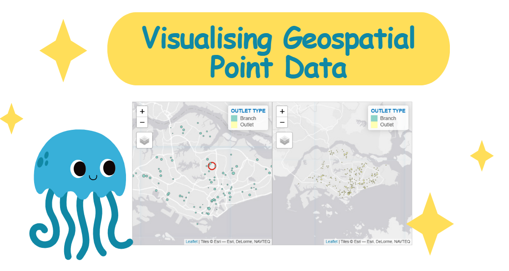

# Visualising Geospatial Point Data



## Overview

Proportional symbol maps use the visual variable of size to represent differences in magnitude of discrete phenomena, such as counts of people. These maps can be either classed (range-graded or graduated symbols) or unclassed (proportional symbols). In this implementation, I'll create a proportional symbol map showing Singapore Pools' outlets' win numbers using the **tmap** package in R.

## Implementation Steps

First, I'll install and load the necessary R packages:

``` r
pacman::p_load(sf, tmap, tidyverse)
```

### Data Preparation

I'll work with the *SGPools_svy21* dataset in CSV format, which contains coordinates of Singapore Pools outlets in the Singapore SVY21 Projected Coordinate System.

``` r
sgpools <- read_csv("data/aspatial/SGPools_svy21.csv")
list(sgpools)
```

Now I'll convert this tibble data frame into a simple feature data frame using the **sf** package:

``` r
sgpools_sf <- st_as_sf(sgpools, 
                     coords = c("XCOORD", "YCOORD"),
                     crs= 3414)
list(sgpools_sf)
```

Note that: - The `coords` argument requires the x-coordinates column first, followed by y-coordinates - The `crs` argument needs the coordinate system in EPSG format (3414 for Singapore SVY21)

### Creating Proportional Symbol Maps

First, I'll switch to the interactive view mode in tmap:

``` r
tmap_mode("view")
```

Starting with a basic point symbol map:

``` r
tm_shape(sgpools_sf)+
tm_bubbles(col = "red",
         size = 1,
         border.col = "black",
         border.lwd = 1)
```

To make it proportional, I'll assign the numerical variable *Gp1Gp2Winnings* to the size attribute:

``` r
tm_shape(sgpools_sf)+
tm_bubbles(col = "red",
         size = "Gp1Gp2 Winnings",
         border.col = "black",
         border.lwd = 1)
```

I can enhance the map by using the *OUTLET_TYPE* variable for color:

``` r
tm_shape(sgpools_sf)+
tm_bubbles(col = "OUTLET TYPE", 
        size = "Gp1Gp2 Winnings",
        border.col = "black",
        border.lwd = 1)
```

An advanced feature is creating faceted maps with synchronized zoom and pan:

``` r
tm_shape(sgpools_sf) +
  tm_bubbles(col = "OUTLET TYPE", 
          size = "Gp1Gp2 Winnings",
          border.col = "black",
          border.lwd = 1) +
  tm_facets(by= "OUTLET TYPE",
            nrow = 1,
            sync = TRUE)
```

Before finishing, I'll switch tmap back to plot mode:

``` r
tmap_mode("plot")
```

## References

For further exploration: - **tmap package**: [tmap: Thematic Maps in R](https://www.jstatsoft.org/article/view/v084i06) - **Geospatial data handling**: [sf: Simple Features for R](https://cran.r-project.org/web/packages/sf/index.html) - **Data wrangling**: [dplyr](https://dplyr.tidyverse.org/)

---
title: "Visualising Geospatial Point Data"
author: "xh.zhang"
date-modified: "last-modified"
execute:
  echo: true
  eval: true
  warning: false
  freeze: true
---

# Overview

I'm working with proportional symbol maps (also known as graduate symbol maps), which use the visual variable of size to represent differences in the magnitude of discrete, abruptly changing phenomena, like counts of people. Similar to choropleth maps, I can create classed or unclassed versions. The classed ones are known as range-graded or graduated symbols, while the unclassed are called proportional symbols, where the area of the symbols are proportional to the values of the attribute being mapped. In this practical workflow, I'll be creating a proportional symbol map showing the number of wins by Singapore Pools' outlets using the **tmap** package in R.

## What I'll accomplish

Through this process, I'll be:

-   Importing an aspatial data file into R
-   Converting it into a simple point feature data frame and assigning an appropriate projection reference
-   Creating interactive proportional symbol maps

# Setting Up the Environment

First, I need to ensure that the **tmap** package and other related R packages are installed and loaded.

```{r}
pacman::p_load(sf, tmap, tidyverse)
```

# Geospatial Data Wrangling

## The data

I'm using a dataset called *SGPools_svy21* in csv format for this visualization.

The data consists of seven columns, with XCOORD and YCOORD representing the x-coordinates and y-coordinates of SingPools outlets and branches. These coordinates are in [Singapore SVY21 Projected Coordinates System](https://www.sla.gov.sg/sirent/CoordinateSystems.aspx).

## Data Import and Preparation

I'll use the *read_csv()* function from the **readr** package to import *SGPools_svy21.csv* into R as a tibble data frame:

```{r}
sgpools <- read_csv("data/aspatial/SGPools_svy21.csv")
```

It's important to check if the data has been imported correctly:

```{r}
list(sgpools) 
```

I note that the *sgpools* data is in tibble data frame format, not the common R data frame.

## Creating a **sf** data frame from an aspatial data frame

Now I'll convert the sgpools data frame into a simple feature data frame using *st_as_sf()* from the **sf** package:

```{r}
sgpools_sf <- st_as_sf(sgpools, 
                       coords = c("XCOORD", "YCOORD"),
                       crs= 3414)
```

Key points about the function arguments:

-   For *coords*, I need to provide the column name of the x-coordinates first, followed by the column name of the y-coordinates
-   The *crs* argument requires the coordinates system in epsg format. [EPSG: 3414](https://epsg.io/3414) is Singapore SVY21 Projected Coordinate System. For other countries' epsg codes, I can refer to [epsg.io](https://epsg.io/)

After conversion, a new column called geometry has been added to the data frame.

I can display the basic information of the newly created sgpools_sf:

```{r}
list(sgpools_sf)
```

The output shows that sgppols_sf is in point feature class with epsg ID 3414. The bbox provides information about the extent of the geospatial data.

# Drawing Proportional Symbol Map

To create an interactive proportional symbol map, I'll use the view mode of tmap:

```{r}
tmap_mode("view")
```

## Starting with an interactive point symbol map

First, I'll create a basic interactive point symbol map:

```{r}
tm_shape(sgpools_sf)+
tm_bubbles(col = "red",
           size = 1,
           border.col = "black",
           border.lwd = 1)
```

## Making it proportional

To create a proportional symbol map, I need to assign a numerical variable to the size visual attribute. I'll use the *Gp1Gp2Winnings* variable:

```{r}
tm_shape(sgpools_sf)+
tm_bubbles(col = "red",
           size = "Gp1Gp2 Winnings",
           border.col = "black",
           border.lwd = 1)
```

## Adding color differentiation

I can improve the map by using the colour visual attribute. Here, I'll use the *OUTLET_TYPE* variable as the colour attribute:

```{r}
tm_shape(sgpools_sf)+
tm_bubbles(col = "OUTLET TYPE", 
          size = "Gp1Gp2 Winnings",
          border.col = "black",
          border.lwd = 1)
```

## Creating faceted maps

An impressive feature of **tmap**'s view mode is that it works with faceted plots. I can use the *sync* argument in *tm_facets()* to produce multiple maps with synchronised zoom and pan settings:

```{r}
tm_shape(sgpools_sf) +
  tm_bubbles(col = "OUTLET TYPE", 
          size = "Gp1Gp2 Winnings",
          border.col = "black",
          border.lwd = 1) +
  tm_facets(by= "OUTLET TYPE",
            nrow = 1,
            sync = TRUE)
```

Before ending the session, it's best to switch **tmap**'s Viewer back to plot mode:

```{r}
tmap_mode("plot")
```

# Reference

## All about **tmap** package

-   [tmap: Thematic Maps in R](https://www.jstatsoft.org/article/view/v084i06)
-   [tmap](https://cran.r-project.org/web/packages/tmap/index.html)
-   [tmap: get started!](https://cran.r-project.org/web/packages/tmap/vignettes/tmap-getstarted.html)
-   [tmap: changes in version 2.0](https://cran.r-project.org/web/packages/tmap/vignettes/tmap-changes-v2.html)
-   [tmap: creating thematic maps in a flexible way (useR!2015)](http://von-tijn.nl/tijn/research/presentations/tmap_user2015.pdf)
-   [Exploring and presenting maps with tmap (useR!2017)](http://von-tijn.nl/tijn/research/presentations/tmap_user2017.pdf)

## Geospatial data wrangling

-   [sf: Simple Features for R](https://cran.r-project.org/web/packages/sf/index.html)
-   [Simple Features for R: StandardizedSupport for Spatial Vector Data](https://journal.r-project.org/archive/2018/RJ-2018-009/RJ-2018-009.pdf)
-   [Reading, Writing and Converting Simple Features](https://cran.r-project.org/web/packages/sf/vignettes/sf2.html)

## Data wrangling

-   [dplyr](https://dplyr.tidyverse.org/)
-   [Tidy data](https://cran.r-project.org/web/packages/tidyr/vignettes/tidy-data.html)
-   [tidyr: Easily Tidy Data with 'spread()' and 'gather()' Functions](https://cran.r-project.org/web/packages/tidyr/tidyr.pdf)
