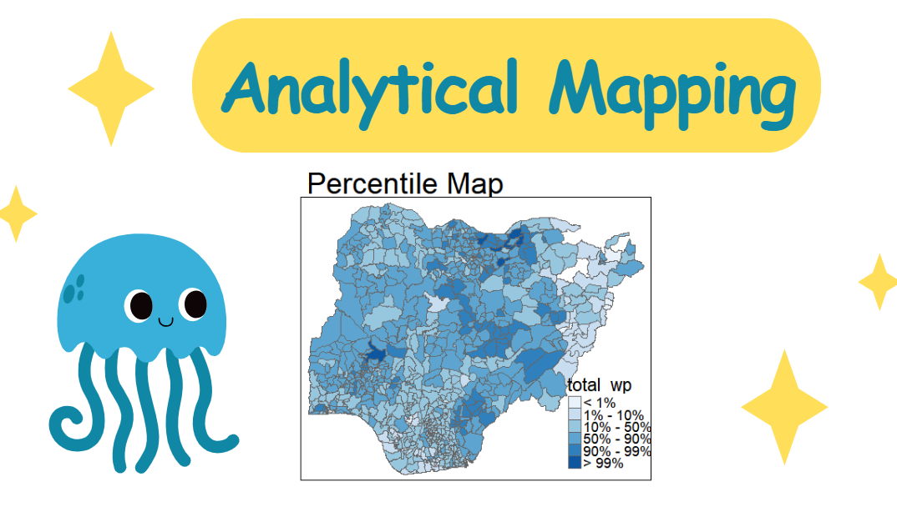

# Analytical Mapping

## Project Goal

In this project, I'll implement appropriate R methods to plot analytical maps. Using tmap and tidyverse functions, I'll perform several mapping tasks:

-   Import geospatial data in rds format
-   Create cartographic quality choropleth maps
-   Generate rate maps
-   Develop percentile maps
-   Produce boxmaps

## Environment Setup

First, I'll install and load the necessary packages:

```{r}
pacman::p_load(tmap, tidyverse, sf, reader)
```

## Data Import

For this analysis, I'm using the *NGA_wp.rds* dataset, which contains polygon feature data on water points in Nigeria at the LGA level.

```{r}
NGA_wp <- read_rds("data/rds/NGA_wp.rds")
```

## Basic Choropleth Mapping

### Distribution of Water Points

Let's visualize the distribution of functional water points by LGA:

```{r}
p1 <- tm_shape(NGA_wp) +
  tm_fill("wp_functional",
          n = 10,
          style = "equal",
          palette = "Blues") +
  tm_borders(lwd = 0.1,
             alpha = 1) +
  tm_layout(main.title = "Distribution of functional water point by LGAs",
            legend.outside = FALSE)
```

And compare it with the distribution of total water points:

```{r}
p2 <- tm_shape(NGA_wp) +
  tm_fill("total_wp",
          n = 10,
          style = "equal",
          palette = "Blues") +
  tm_borders(lwd = 0.1,
             alpha = 1) +
  tm_layout(main.title = "Distribution of total  water point by LGAs",
            legend.outside = FALSE)
```

Arranging both maps side by side for comparison:

```{r}
#| fig-width: 16
tmap_arrange(p2, p1, nrow = 1)
```

## Rate Mapping

It's important to map rates rather than counts since water points aren't equally distributed in space. Otherwise, we'd be mapping total water point size rather than our specific topic of interest.

### Calculating Functional Water Point Proportions

I'll calculate the proportion of functional and non-functional water points in each LGA:

```{r}
NGA_wp <- NGA_wp %>%
  mutate(pct_functional = wp_functional/total_wp) %>%
  mutate(pct_nonfunctional = wp_nonfunctional/total_wp)
```

### Visualization of Functional Water Point Rates

Now I'll create a choropleth map showing the percentage of functional water points by LGA:

```{r}
tm_shape(NGA_wp) +
  tm_fill("pct_functional",
          n = 10,
          style = "equal",
          palette = "Blues",
          legend.hist = TRUE) +
  tm_borders(lwd = 0.1,
             alpha = 1) +
  tm_layout(main.title = "Rate map of functional water point by LGAs",
            legend.outside = TRUE)
```

## Extreme Value Mapping

Extreme value maps are variations of choropleth maps designed to highlight outliers at both ends of the scale. They add spatial features to common non-spatial EDA approaches (Anselin 1994).

### Percentile Mapping

A percentile map uses six specific categories: 0-1%, 1-10%, 10-50%, 50-90%, 90-99%, and 99-100%. I'll prepare the data and create customized classifications.

#### Data Preparation

First, I'll exclude records with NA values:

```{r}
NGA_wp <- NGA_wp %>%
  drop_na()
```

Next, I'll create customized classification and extract values:

```{r}
percent <- c(0,.01,.1,.5,.9,.99,1)
var <- NGA_wp["pct_functional"] %>%
  st_set_geometry(NULL)
quantile(var[,1], percent)
```

When variables are extracted from an sf data.frame, the geometry is extracted as well. For functions like `quantile()` that can't handle geometry, I use `st_set_geometry(NULL)` to drop the geometry field.

#### Function Development

Writing functions offers several advantages: - Descriptive names make code more understandable - Updates only need to be made in one place - Reduces errors from copy-pasting

Here's a function to extract variables from an sf data.frame:

```{r}
get.var <- function(vname,df) {
  v <- df[vname] %>% 
    st_set_geometry(NULL)
  v <- unname(v[,1])
  return(v)
}
```

Now I'll create a percentile mapping function:

```{r}
percentmap <- function(vnam, df, legtitle=NA, mtitle="Percentile Map"){
  percent <- c(0,.01,.1,.5,.9,.99,1)
  var <- get.var(vnam, df)
  bperc <- quantile(var, percent)
  tm_shape(df) +
  tm_polygons() +
  tm_shape(df) +
     tm_fill(vnam,
             title=legtitle,
             breaks=bperc,
             palette="Blues",
          labels=c("< 1%", "1% - 10%", "10% - 50%", "50% - 90%", "90% - 99%", "> 99%"))  +
  tm_borders() +
  tm_layout(main.title = mtitle, 
            title.position = c("right","bottom"))
}
```

Let's implement this function:

```{r}
percentmap("total_wp", NGA_wp)
```

### Box Mapping

A box map is an augmented quartile map with additional lower and upper categories, applying boxplot principles to choropleth maps.

First, let's examine the data distribution:

```{r}
#| fig-width: 4
ggplot(data = NGA_wp,
       aes(x = "",
           y = wp_nonfunctional)) +
  geom_boxplot()
```

I'll create a function that establishes break points for a box map:

```{r}
boxbreaks <- function(v,mult=1.5) {
  qv <- unname(quantile(v))
  iqr <- qv[4] - qv[2]
  upfence <- qv[4] + mult * iqr
  lofence <- qv[2] - mult * iqr
  # initialize break points vector
  bb <- vector(mode="numeric",length=7)
  # logic for lower and upper fences
  if (lofence < qv[1]) {  # no lower outliers
    bb[1] <- lofence
    bb[2] <- floor(qv[1])
  } else {
    bb[2] <- lofence
    bb[1] <- qv[1]
  }
  if (upfence > qv[5]) { # no upper outliers
    bb[7] <- upfence
    bb[6] <- ceiling(qv[5])
  } else {
    bb[6] <- upfence
    bb[7] <- qv[5]
  }
  bb[3:5] <- qv[2:4]
  return(bb)
}
```

I've already defined a function to extract variables, but here it is again for reference:

```{r}
get.var <- function(vname,df) {
  v <- df[vname] %>% st_set_geometry(NULL)
  v <- unname(v[,1])
  return(v)
}
```

Let's test these functions:

```{r}
var <- get.var("wp_nonfunctional", NGA_wp) 
boxbreaks(var)
```

Now I'll create a box map function:

```{r}
boxmap <- function(vnam, df, 
                   legtitle=NA,
                   mtitle="Box Map",
                   mult=1.5){
  var <- get.var(vnam,df)
  bb <- boxbreaks(var)
  tm_shape(df) +
    tm_polygons() +
  tm_shape(df) +
     tm_fill(vnam,title=legtitle,
             breaks=bb,
             palette="Blues",
          labels = c("lower outlier", 
                     "< 25%", 
                     "25% - 50%", 
                     "50% - 75%",
                     "> 75%", 
                     "upper outlier"))  +
  tm_borders() +
  tm_layout(main.title = mtitle, 
            title.position = c("left",
                               "top"))
}
```

Finally, I'll implement the box map:

```{r}
tmap_mode("plot")
boxmap("wp_nonfunctional", NGA_wp)
```
