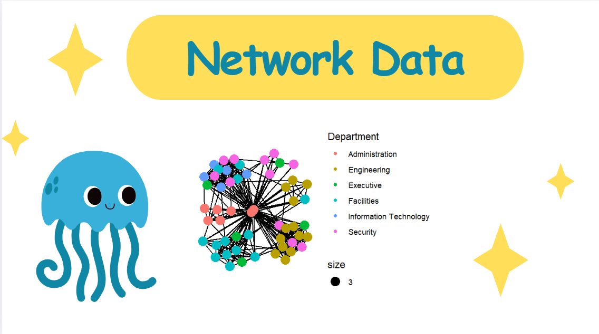

## Overview

In this hands-on exercise, I learned how to model, analyse and visualise network data using R.

By the end of this hands-on exercise, I was able to:

-   create graph object data frames, manipulating them using appropriate functions of *dplyr*, *lubridate*, and *tidygraph*,
-   build network graph visualisation using appropriate functions of *ggraph*,
-   compute network geometrics using *tidygraph*,
-   build advanced graph visualisation by incorporating the network geometrics, and
-   build interactive network visualisation using *visNetwork* package.

## Getting Started

### Installing and launching R packages

In this hands-on exercise, I installed and launched four network data modelling and visualisation packages. They included igraph, tidygraph, ggraph and visNetwork. Besides these four packages, I also installed tidyverse and lubridate, an R package specially designed to handle and wrangle time data.

The code chunk:

```{r}
pacman::p_load(igraph, tidygraph, ggraph, 
               visNetwork, lubridate, clock,
               tidyverse, graphlayouts)
```

## The Data

The data sets I used in this hands-on exercise were from an oil exploration and extraction company. There were two data sets. One contained the nodes data and the other contained the edges (also known as link) data.

### The edges data

-   *GAStech-email_edges.csv* which consists of two weeks of 9063 emails correspondances between 55 employees.

### The nodes data

-   *GAStech_email_nodes.csv* which consist of the names, department and title of the 55 employees.

### Importing network data from files

In this step, I imported GAStech_email_node.csv and GAStech_email_edges-v2.csv into the RStudio environment by using `read_csv()` of **readr** package.

```{r}
GAStech_nodes <- read_csv("data/GAStech_email_node.csv")
GAStech_edges <- read_csv("data/GAStech_email_edge-v2.csv")
```

### Reviewing the imported data

Next, I examined the structure of the data frame using *glimpse()* of **dplyr**.

```{r}
glimpse(GAStech_edges)
```

::: callout-warning
The output report of GAStech_edges revealed that the *SentDate* was treated as "Character" data type instead of *date* data type. This was an error! Before continuing, it was important to change the data type of *SentDate* field back to "Date" data type.
:::

### Wrangling time

The code chunk below was used to perform the changes.

```{r}
GAStech_edges <- GAStech_edges %>%
  mutate(SendDate = dmy(SentDate)) %>%
  mutate(Weekday = wday(SentDate,
                        label = TRUE,
                        abbr = FALSE))
```

::: callout-tip
## Things to learn from the code chunk above

-   both *dmy()* and *wday()* are functions of **lubridate** package. [lubridate](cran.r-project.org/web/packages/lubridate/vignettes/lubridate.html) is an R package that makes it easier to work with dates and times.
-   *dmy()* transforms the SentDate to Date data type.
-   *wday()* returns the day of the week as a decimal number or an ordered factor if label is TRUE. The argument abbr is FALSE keep the day spells in full, i.e. Monday. The function creates a new column in the data.frame i.e. Weekday and the output of *wday()* is saved in this newly created field.
-   the values in the *Weekday* field are in ordinal scale.
:::

### Reviewing the revised date fields

```{r}
#| echo: false
glimpse(GAStech_edges)
```

### Wrangling attributes

A close examination of *GAStech_edges* data.frame revealed that it consisted of individual e-mail flow records. This was not very useful for visualisation.

In view of this, I aggregated the individual records by date, senders, receivers, main subject and day of the week.

The code chunk:

```{r}
GAStech_edges_aggregated <- GAStech_edges %>%
  filter(MainSubject == "Work related") %>%
  group_by(source, target, Weekday) %>%
    summarise(Weight = n()) %>%
  filter(source!=target) %>%
  filter(Weight > 1) %>%
  ungroup()
```

::: callout-tip
## Things to learn from the code chunk above:

-   four functions from **dplyr** package were used. They are: *filter()*, *group()*, *summarise()*, and *ungroup()*.
-   The output data.frame is called **GAStech_edges_aggregated**.
-   A new field called *Weight* has been added in GAStech_edges_aggregated.
:::

### Reviewing the revised edges file

```{r}
#| echo: false
glimpse(GAStech_edges_aggregated)
```

## Creating network objects using **tidygraph**

In this section, I learned how to create a graph data model by using **tidygraph** package. It provides a tidy API for graph/network manipulation. While network data itself is not tidy, it can be envisioned as two tidy tables, one for node data and one for edge data.

### The **tbl_graph** object

Two functions of **tidygraph** package can be used to create network objects:

-   [`tbl_graph()`](https://tidygraph.data-imaginist.com/reference/tbl_graph.html) creates a **tbl_graph** network object from nodes and edges data.

-   [`as_tbl_graph()`](https://tidygraph.data-imaginist.com/reference/tbl_graph.html) converts network data and objects to a **tbl_graph** network.

### The **dplyr** verbs in **tidygraph**

-   *activate()* verb from **tidygraph** serves as a switch between tibbles for nodes and edges.

### Using `tbl_graph()` to build tidygraph data model.

```{r}
GAStech_graph <- tbl_graph(nodes = GAStech_nodes,
                           edges = GAStech_edges_aggregated, 
                           directed = TRUE)
```

### Reviewing the output tidygraph's graph object

```{r}
GAStech_graph
```

### Changing the active object

```{r}
#| eval: false
GAStech_graph %>%
  activate(edges) %>%
  arrange(desc(Weight))
```

## Plotting Static Network Graphs with **ggraph** package

### Plotting a basic network graph

```{r}
ggraph(GAStech_graph) +
  geom_edge_link() +
  geom_node_point()
```

### Changing the default network graph theme

```{r}
g <- ggraph(GAStech_graph) + 
  geom_edge_link(aes()) +
  geom_node_point(aes())

g + theme_graph()
```

### Changing the coloring of the plot

```{r}
g <- ggraph(GAStech_graph) + 
  geom_edge_link(aes(colour = 'grey50')) +
  geom_node_point(aes(colour = 'grey40'))

g + theme_graph(background = 'grey10',
                text_colour = 'white')
```

### Fruchterman and Reingold layout

```{r}
g <- ggraph(GAStech_graph, 
            layout = "fr") +
  geom_edge_link(aes()) +
  geom_node_point(aes())

g + theme_graph()
```

### Modifying network nodes

```{r}
g <- ggraph(GAStech_graph, 
            layout = "nicely") + 
  geom_edge_link(aes()) +
  geom_node_point(aes(colour = Department, 
                      size = 3))

g + theme_graph()
```

### Modifying edges

```{r}
g <- ggraph(GAStech_graph, 
            layout = "nicely") +
  geom_edge_link(aes(width=Weight), 
                 alpha=0.2) +
  scale_edge_width(range = c(0.1, 5)) +
  geom_node_point(aes(colour = Department), 
                  size = 3)

g + theme_graph()
```

## Creating facet graphs

### Working with *facet_edges()*

```{r}
set_graph_style()

g <- ggraph(GAStech_graph, 
            layout = "nicely") + 
  geom_edge_link(aes(width=Weight), 
                 alpha=0.2) +
  scale_edge_width(range = c(0.1, 5)) +
  geom_node_point(aes(colour = Department), 
                  size = 2)

g + facet_edges(~Weekday)
```

### Working with *facet_edges()* with legend repositioning

```{r}
set_graph_style()

g <- ggraph(GAStech_graph, 
            layout = "nicely") + 
  geom_edge_link(aes(width=Weight), 
                 alpha=0.2) +
  scale_edge_width(range = c(0.1, 5)) +
  geom_node_point(aes(colour = Department), 
                  size = 2) +
  theme(legend.position = 'bottom')
  
g + facet_edges(~Weekday)
```

### A framed facet graph

```{r}
set_graph_style() 

g <- ggraph(GAStech_graph, 
            layout = "nicely") + 
  geom_edge_link(aes(width=Weight), 
                 alpha=0.2) +
  scale_edge_width(range = c(0.1, 5)) +
  geom_node_point(aes(colour = Department), 
                  size = 2)
  
g + facet_edges(~Weekday) +
  th_foreground(foreground = "grey80",  
                border = TRUE) +
  theme(legend.position = 'bottom')
```

### Working with *facet_nodes()*

```{r}
set_graph_style()

g <- ggraph(GAStech_graph, 
            layout = "nicely") + 
  geom_edge_link(aes(width=Weight), 
                 alpha=0.2) +
  scale_edge_width(range = c(0.1, 5)) +
  geom_node_point(aes(colour = Department), 
                  size = 2)
  
g + facet_nodes(~Department)+
  th_foreground(foreground = "grey80",  
                border = TRUE) +
  theme(legend.position = 'bottom')
```

## Network Metrics Analysis

### Computing centrality indices

```{r}
g <- GAStech_graph %>%
  mutate(betweenness_centrality = centrality_betweenness()) %>%
  ggraph(layout = "fr") + 
  geom_edge_link(aes(width=Weight), 
                 alpha=0.2) +
  scale_edge_width(range = c(0.1, 5)) +
  geom_node_point(aes(colour = Department,
            size=betweenness_centrality))
g + theme_graph()
```

### Visualising network metrics

```{r}
g <- GAStech_graph %>%
  ggraph(layout = "fr") + 
  geom_edge_link(aes(width=Weight), 
                 alpha=0.2) +
  scale_edge_width(range = c(0.1, 5)) +
  geom_node_point(aes(colour = Department, 
                      size = centrality_betweenness()))
g + theme_graph()
```

### Visualising Community

```{r}
g <- GAStech_graph %>%
  mutate(community = as.factor(group_edge_betweenness(weights = Weight, directed = TRUE))) %>%
  ggraph(layout = "fr") + 
  geom_edge_link(aes(width=Weight), 
                 alpha=0.2) +
  scale_edge_width(range = c(0.1, 5)) +
  geom_node_point(aes(colour = community))  

g + theme_graph()
```

## Building Interactive Network Graph with visNetwork

### Data preparation

```{r}
GAStech_edges_aggregated <- GAStech_edges %>%
  left_join(GAStech_nodes, by = c("sourceLabel" = "label")) %>%
  rename(from = id) %>%
  left_join(GAStech_nodes, by = c("targetLabel" = "label")) %>%
  rename(to = id) %>%
  filter(MainSubject == "Work related") %>%
  group_by(from, to) %>%
    summarise(weight = n()) %>%
  filter(from!=to) %>%
  filter(weight > 1) %>%
  ungroup()
```

### Plotting the first interactive network graph

```{r eval=FALSE}
visNetwork(GAStech_nodes, 
           GAStech_edges_aggregated)
```

### Working with layout

```{r}
visNetwork(GAStech_nodes,
           GAStech_edges_aggregated) %>%
  visIgraphLayout(layout = "layout_with_fr") 
```

### Working with visual attributes - Nodes

```{r}
GAStech_nodes <- GAStech_nodes %>%
  rename(group = Department) 

visNetwork(GAStech_nodes,
           GAStech_edges_aggregated) %>%
  visIgraphLayout(layout = "layout_with_fr") %>%
  visLegend() %>%
  visLayout(randomSeed = 123)
```

### Working with visual attributes - Edges

```{r}
visNetwork(GAStech_nodes,
           GAStech_edges_aggregated) %>%
  visIgraphLayout(layout = "layout_with_fr") %>%
  visEdges(arrows = "to", 
           smooth = list(enabled = TRUE, 
                         type = "curvedCW")) %>%
  visLegend() %>%
  visLayout(randomSeed = 123)
```

### Interactivity

```{r}
visNetwork(GAStech_nodes,
           GAStech_edges_aggregated) %>%
  visIgraphLayout(layout = "layout_with_fr") %>%
  visOptions(highlightNearest = TRUE,
             nodesIdSelection = TRUE) %>%
  visLegend() %>%
  visLayout(randomSeed = 123)
```
